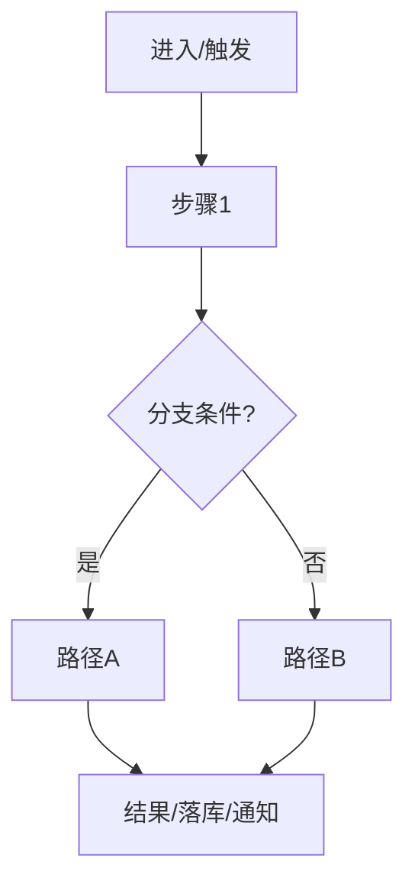

# PRD-通用框架模板（可复用、与业务无关）

> 使用方式：复制本模板，按需删减章节。建议“先写清楚目标与范围，再写流程与规则，最后补齐验收与数据”。

---

## 文档信息

| 字段 | 内容 |
|---|---|
| **PRD编号** | PRD-x.x |
| **产品/项目** |  |
| **模块/功能名称** |  |
| **文档版本** | V0.1 |
| **编制日期** | YYYY-MM-DD |
| **编制人** |  |
| **评审人** |  |
| **所属阶段/里程碑** |  |
| **关联文档** | 需求总览、交互稿、视觉稿、接口文档、埋点文档等 |

---

## 0. 摘要（1页内）

### 0.1 背景与问题

- **现状**：
- **核心问题**（用用户可感知的语言描述）：
- **为什么现在做**：

### 0.2 目标与非目标

- **目标（Goals）**：
  - G1：
  - G2：
- **非目标（Non-goals）**（明确不做，防止范围膨胀）：
  - NG1：

### 0.3 范围（Scope）

- **本期包含**：
- **本期不包含**：
- **边界条件**（哪些情况由其他模块/系统处理）：

### 0.4 成功指标（Success Metrics）

| 指标类型 | 指标 | 口径/说明 | 目标值 |
|---|---|---|---|
| 体验 | 页面加载/响应时间 |  |  |
| 质量 | 成功率/失败率 |  |  |
| 业务 | 转化/留存/使用率 |  |  |
| 成本 | 人工耗时降低 |  |  |

---

## 1. 用户与场景

### 1.1 目标用户

- **用户画像**：角色/职责/频率/专业度
- **权限与身份**：游客/登录用户/组织成员/管理员等

### 1.2 核心场景（按优先级排序）

| 场景ID | 场景名称 | 触发时机 | 用户目标 | 成功判定 |
|---|---|---|---|---|
| S-01 |  |  |  |  |

### 1.3 用户故事（User Story）

> 作为【角色】，我想要【能力】，以便【收益】。

- US-01：
- US-02：

---

## 2. 需求分析

### 2.1 痛点与机会点

| 痛点/机会点 | 现状描述 | 影响 | 解决思路（概述） |
|---|---|---|---|
|  |  |  |  |

### 2.2 需求优先级（建议P0/P1/P2 + 阶段）

| 需求项 | 用户价值 | 实现成本/风险 | 优先级 | 阶段 |
|---|---|---|---|---|
|  |  |  | P0 | 一期 |

### 2.3 依赖与约束

- **上游依赖**：账号/组织、数据源、文件/对象存储、搜索、消息等
- **并行/共用模块**：复用页面/组件/规则的模块
- **下游使用方**：报表、导出、其他业务流程
- **合规/安全/隐私约束**：数据隔离、访问控制、审计等
- **技术约束**：平台、浏览器、客户端、第三方SDK等

---

## 3. 功能全景

### 3.1 功能地图（可用树状/Plain图）

```plain
模块/功能
├─ 1. 子模块A
│  ├─ 功能点A1
│  └─ 功能点A2
└─ 2. 子模块B
   └─ 功能点B1
```

### 3.2 功能清单（清点用）

| 功能模块 | 功能点 | 描述 | 优先级 | 备注/关联文档 |
|---|---|---|---|---|
|  |  |  | P0 |  |

---

## 4. 用户流程与业务流程

### 4.1 端到端流程（推荐先画再写）



### 4.2 关键状态机/状态流转（如适用）

| 状态 | 定义 | 进入条件 | 退出条件 | 用户可见提示 |
|---|---|---|---|---|
|  |  |  |  |  |

---

## 5. 信息架构与导航（如适用）

### 5.1 全局导航/入口

- **入口位置**：侧边栏/顶部导航/快捷卡片/深链
- **选中态/高亮规则**：
- **跨模块跳转规则**：

### 5.2 页面列表与层级

| 页面ID | 页面名称 | 层级 | 入口 | 退出/返回规则 |
|---|---|---|---|---|
| P-01 |  |  |  |  |

---

## 6. 页面与交互说明（核心章节）

> 写法建议：先“整体布局”，再按“区域/组件”逐个说明：作用、内容、交互、业务规则、验收标准、异常处理。

### 6.1 页面：{页面名称/页面ID}

#### 6.1.1 功能概述

- **用户故事/目标**：
- **前置条件**：
- **触发条件**：
- **输出/结果**（落库、跳转、消息等）：

#### 6.1.2 页面整体布局

```plain
┌───────────────────────────────┐
│ 顶部栏/导航                    │
├───────────────┬───────────────┤
│ 左侧区域       │ 右侧区域       │
├───────────────┴───────────────┤
│ 底部固定操作区                 │
└───────────────────────────────┘
```

#### 6.1.3 区域/组件详述

##### A. {区域/组件名称}

- **作用**：
- **内容**：
- **交互**：
- **业务规则**：
  - 规则1：
  - 规则2（排序/默认值/分页/缓存/记忆用户选择等）：
- **权限与可见性**：
- **验收标准**（Given/When/Then）：
  - Given … When … Then …
- **异常处理**（加载失败、为空、超时、权限不足等）：

##### B. {区域/组件名称}

（同上结构）

#### 6.1.4 文案与反馈（建议集中管理）

| 场景 | 文案/提示 | 级别（info/warn/error） | 触发条件 |
|---|---|---|---|
|  |  |  |  |

#### 6.1.5 空状态/无权限/无数据

- **空状态触发条件**：
- **引导动作**（按钮/链接）：
- **是否阻断流程**：

---

## 7. 规则与逻辑（可独立成章，避免散落）

### 7.1 核心业务规则清单

| 规则ID | 规则描述 | 优先级 | 影响范围 | 例子 |
|---|---|---|---|---|
| R-01 |  | 高 |  |  |

### 7.2 统计口径/汇总逻辑（如有“状态卡片/概览”）

- **统计字段定义**：
  - `passCount`：
  - `failCount`：
  - `warningCount`：
  - `pendingCount`：
  - `skipCount`：
- **整体状态判断优先级**（示例）：

| 优先级 | 状态 | 判断条件 | 提示文案 | 统计文案模板 | 备注 |
|---|---|---|---|---|---|
| 1 |  |  |  |  |  |

### 7.3 排序/筛选/搜索规则

- **默认筛选**：
- **排序字段与优先级**：
- **搜索匹配规则**（模糊/分词/高亮）：

---

## 8. 数据与接口（按需）

### 8.1 数据模型（核心实体）

#### 8.1.1 实体：{EntityName}

| 字段名 | 类型 | 必填 | 说明 | 示例 |
|---|---:|---:|---|---|
| id | string | 是 | 主键 | "xxx" |

#### 8.1.2 枚举与字典

- **状态枚举**：
- **类型枚举**：

### 8.2 接口（前后端约定）

| 接口 | 方法 | 入参 | 出参 | 错误码 | 备注 |
|---|---|---|---|---|---|
| `/api/...` | GET |  |  |  |  |

### 8.3 数据隔离与权限

- **隔离维度**：用户/组织/项目/租户
- **读写权限矩阵**：

| 角色 | 读 | 写 | 删除 | 导出 | 管理 |
|---|---:|---:|---:|---:|---:|
|  |  |  |  |  |  |

---

## 9. 非功能性需求（NFR）

### 9.1 性能

- **首屏/关键交互**：< 1s / < 200ms 等
- **大列表/长文本/大文件**：分页/虚拟滚动/异步加载

### 9.2 可靠性与容错

- **重试策略**：
- **超时策略**：
- **可恢复性**（失败后如何继续/回滚）：

### 9.3 兼容性

- **浏览器/客户端**：
- **分辨率/适配**：

### 9.4 安全与合规

- **权限校验点**：
- **审计日志**：
- **敏感信息脱敏**：

---

## 10. 埋点与监控（建议必写）

### 10.1 埋点事件表

| 事件名 | 触发时机 | 属性（props） | 用途/指标 | 备注 |
|---|---|---|---|---|
|  |  |  |  |  |

### 10.2 监控与告警

- **关键接口成功率**：
- **耗时P95/P99**：
- **错误码分布**：

---

## 11. 验收与测试计划

### 11.1 验收范围

- **必须通过（Blocking）**：
- **可接受风险（Non-blocking）**：

### 11.2 验收用例（Given/When/Then）

- Given … When … Then …
- Given … When … Then …

### 11.3 测试数据与账号

- **测试数据准备**：
- **测试账号/角色**：

---

## 12. 发布与运营

### 12.1 发布策略

- **灰度/开关**：
- **回滚策略**：

### 12.2 用户教育与引导

- **新手引导/空状态引导**：
- **帮助中心/FAQ**：

---

## 13. 风险与待定（Risks & Open Questions）

### 13.1 风险清单

| 风险 | 影响 | 概率 | 应对措施 | Owner |
|---|---|---|---|---|
|  |  |  |  |  |

### 13.2 待定问题（Open Questions）

- OQ-01：
- OQ-02：

---

## 版本历史

| 版本 | 日期 | 修改内容 | 修改人 |
|---|---|---|---|
| V0.1 | YYYY-MM-DD | 初始化模板 |  |

