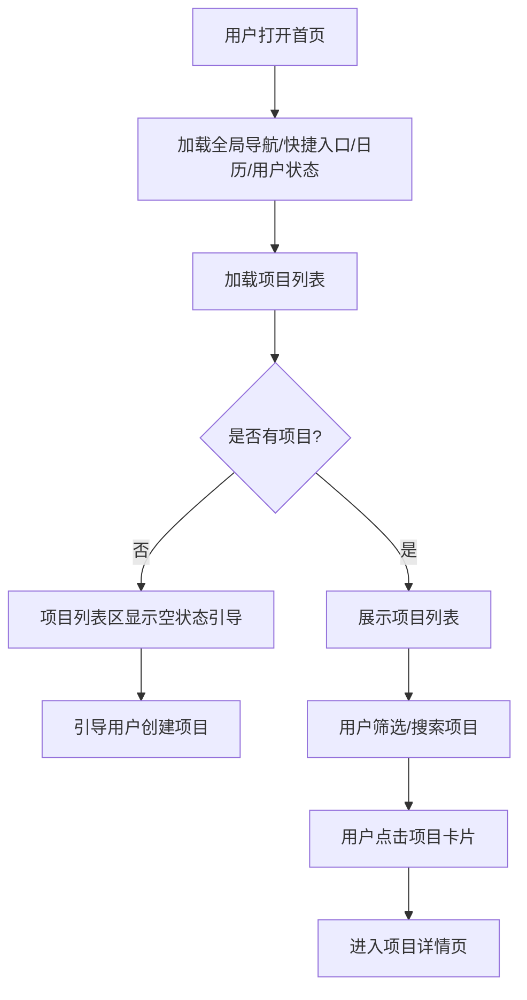

#### 3.2.1 功能:首页(含项目列表)

## 一、功能概述

**用户故事**:  
作为标书制作人员,我想要在首页通过全局导航和快捷入口切换功能、查看投标日历与登录状态,并快速查看我的所有项目及其状态,以便了解每个项目的进展情况并快速进入需要处理的项目。

**前置条件**:  
- 用户已登录企业空间

**触发条件**:  
- 用户打开标书检查产品首页

---

## 二、页面整体布局

首页由以下五个区域组成,各区域同时加载,项目列表可独立出现空状态:

```
┌─────────────────────────────────────────────────────────────┐
│  [全局导航]  │  [全局搜索]                   [通知][用户登录状态] │
│              │  [         功能快捷入口       ]  [  投标日历   ] │ 
│              │  [           项目列表        ]                 │
└─────────────────────────────────────────────────────────────┘
```

**区域说明**:
1. **全局导航** - 左侧
2. **功能快捷入口** - 右侧上方
3. **项目列表** - 功能快捷入口下方左侧
4. **投标日历** - 功能快捷入口右侧
5. **用户登录状态** - 右上角

---

## 三、各区域功能详述

### 3.1 全局导航

**作用**: 在不同产品/模块间切换,标明当前所在模块。

**内容**: 
- 产品主菜单,至少包含「首页、AI编标、标书检查、标讯、项目管理、电子证照库、我的素材、企业信息」
- 当前模块(首页)高亮或选中态

**交互**: 
- 点击菜单项跳转至对应产品或模块
- 支持收起/展开(若为侧边栏形态)

**验收标准**:
- Given 用户已登录 When 用户打开首页 Then 页面展示产品主菜单且「标书检查」为当前选中/高亮
- 点击其他菜单项可跳转至对应模块

---

### 3.2 功能快捷入口

**作用**: 在首页即可执行高频操作,无需进入二级页。

**内容**: 
- 卡片或按钮形式
- **大卡片**: 「创建项目」
- **小卡片**: 「清标工具、素材市场、AI招标文件解析、模拟开标、交易智库、标桥百科」
- 可与项目列表区同一行或上方独立一行

**交互**: 
- 「创建项目」进入创建项目流程
- 「我的项目」可滚动至项目列表或保持当前列表筛选

**验收标准**:
- Given 用户打开首页 Then 展示「创建项目」「我的项目」「帮助中心」等快捷入口
- 点击「创建项目」进入创建项目流程

---

### 3.3 用户登录状态

**作用**: 让用户明确当前登录身份与企业空间,并提供退出等操作。

**内容**: 
- 展示当前用户信息(头像、昵称或账号)
- 当前所在企业/空间名称(若有多企业切换)
- 下拉或点击展开菜单,内含「切换企业」「账号设置」「退出登录」等

**交互**: 
- 点击头像或昵称展开菜单
- 退出登录后跳转至登录页
- 数据与权限按当前登录身份隔离

**验收标准**:
- Given 用户已登录 When 用户打开首页 Then 右上角(或导航区)展示当前用户头像/昵称及企业空间信息
- 点击可展开菜单并支持退出登录

---

### 3.4 项目列表(主区域)

#### 3.4.1 列表内容

**项目卡片包含**:
- **项目名称**(点击进入详情)
- **项目状态**: 已创建、标书制作中、检查中、已提交、已开标、已中标/未中标
- **关键时间节点**: 显示最近的时间节点(投标截止或开标时间)
- **检查进度**: 资信标✓/⚠、技术标✓/⚠、经济标✓/⚠
- **操作按钮**: [查看详情]

#### 3.4.2 筛选与搜索

**状态筛选**:
- 全部、进行中、已完成、已归档

**时间筛选**:
- 近7天、近30天、自定义时间范围

**搜索**:
- 按项目名称模糊搜索

#### 3.4.3 空状态

```
┌────────────────────────────────┐
│                                │
│        📋                       │
│                                │
│    还没有创建项目               │
│    创建项目开始您的标书检查之旅  │
│                                │
│      [+ 创建项目]               │
│                                │
└────────────────────────────────┘
```

#### 3.4.4 业务规则

1. **排序规则**: 按"最近更新时间"倒序排列(最新的在最上面)
2. **默认显示**: 显示"进行中"的项目(状态为: 已创建、标书制作中、检查中、已提交、已开标)
3. **归档项目**: "已归档"的项目默认隐藏,需切换Tab才能查看
4. **分页加载**: 每页显示20个项目,支持滚动加载更多
5. **数据隔离**: 用户只能看到自己创建的项目

#### 3.4.5 验收标准

- Given 用户已创建10个项目 When 用户打开首页 Then 项目列表显示10个项目,按更新时间倒序排列
- Given 用户已创建100个项目 When 用户打开首页 Then 项目列表加载时间<1秒
- Given 用户筛选"检查中"状态 When 用户点击状态筛选 Then 只显示状态为"检查中"的项目
- Given 用户搜索"项目A" When 用户在搜索框输入"项目A" Then 只显示名称包含"项目A"的项目
- Given 用户已登录但未创建任何项目 When 用户打开首页 Then 项目列表区显示空状态引导及「+ 创建项目」按钮

---

### 3.5 投标日历

#### 3.5.1 功能概述

**用户故事**:  
作为标书制作人员,我想要在日历上直观地看到所有项目的关键时间节点,并提前收到提醒,以避免错过投标截止时间或开标时间。

**前置条件**:  
- 用户已创建项目,且设置了时间节点(投标截止时间、开标时间)

**触发条件**:  
- 用户打开首页,日历默认显示
- 或点击右侧日历区域

#### 3.5.2 界面设计

##### 日历区域整体布局

**位置**: 位于首页独立区块,与项目列表并排

**标题栏**:
- 左侧:「投标日历」
- 右侧: 视图切换按钮「[月] [周] 」、「[今]」

**说明**: 月/周视图切换仅改变日历的展示方式,方便用户跨周查看日期。点击日期、标记完成、提醒等功能在两种视图下保持一致。点击[今]，回到选中今天的状态

---

##### 月视图(默认)

**日历网格**:
- **月份导航**: 顶部显示当前年月(如「2026年2月」)及左右箭头用于切换月份
- **表头**: 周一到周日
- **日期展示**:
  - 当前日期高亮选中
  - 有时间节点的日期用图标标记(如🔴表示投标截止,🔵表示开标,🟡表示自定义提醒)
  - 一个日期有多个时间节点，只显示时间最早的标记
- **底部图例**: 说明各图标含义(如🔴表示投标截止,🔵表示开标,🟡表示自定义提醒)

**交互**: 点击任意日期,切换下方的当日待办

---

##### 周视图

**日历网格**:
- **周导航**: 顶部显示「← x月 第X周 →」,左右箭头切换周
- **表头**: 显示一周日期(如「2/9 2/10 2/11...」)及对应星期(周日 周一 周二...)
- **日期展示**:
  - 当前日期高亮选中
  - 有时间节点的日期用图标标记(如🔴表示投标截止,🔵表示开标,🟡表示自定义提醒)
  - 一个日期有多个时间节点，只显示时间最早的标记
- **底部提示**: 说明各图标含义(如🔴表示投标截止,🔵表示开标,🟡表示自定义提醒)

**交互**: 点击任意日期,切换下方的当日待办

---

##### 当日待办

**位置**: 位于日历下方

**内容**:
- 标题「今日待办」
- 列表展示今天和未来3天内的时间节点,按时间顺序排列
- 每项可点击进入对应项目详情

---

##### 点击当日待办条目

**弹窗内容**:
- **标题**: 「X月X日的项目」,右上角关闭按钮
- **项目列表**:
  - 项目名称
  - 时间节点类型与具体时间(如「投标截止: 17:00」)
  - 操作按钮「关闭」「标记为已完成」


#### 3.5.3 时间节点类型

| 节点类型 | 图标 | 颜色 | 来源 |
|---------|------|------|------|
| 投标截止 | 🔴 | 红色 | 项目创建时填写或AI提取 |
| 开标时间 | 🔵 | 蓝色 | 项目创建时填写或AI提取 |
| 自定义提醒 | 🟡 | 黄色 | 用户手动添加 |

#### 3.5.4 业务规则

1. **时间节点显示**:
   - 一个日期可能有多个项目的时间节点,只显示时间最早的标记
   - 点击日期,弹窗显示所有项目列表

2. **月/周视图切换**:
   - 默认显示月视图
   - 切换后,用户的选择会被记住(下次打开仍是上次的视图)
   - **重要**: 视图切换仅改变日历的展示方式,不影响其他功能:
     - 点击日期弹窗内容相同
     - 标记完成功能相同
     - 站内信提醒规则相同
     - 数据来源相同

3. **时间节点颜色优先级**:
   - 投标截止:红色(最重要)
   - 开标时间:蓝色(次重要)
   - 自定义提醒:黄色

4. **标记为已完成**:
   - 投标截止节点 → 自动标记项目为"已提交"
   - 开标时间节点 → 自动标记项目为"已开标"
   - 自定义提醒节点 → 仅隐藏该提醒,不影响项目状态

5. **数据隔离**:
   - 日历数据与当前用户项目数据一致,仅展示本人项目的关键日期

#### 3.5.5 站内信提醒规则

**提醒时机与内容**:

| 提醒时机 | 提醒内容 | 操作 |
|---------|---------|------|
| 投标截止前3天 | "项目[XX]将于3天后(2月10日 17:00)截止投标,请尽快完成检查" | [查看项目] [标记为已完成] |
| 投标截止前1天 | "项目[XX]将于明天(2月10日 17:00)截止投标,请确保已提交" | [查看项目] [标记为已完成] |
| 投标截止当天 | "项目[XX]今天17:00截止投标,请立即提交!" | [查看项目] [标记为已完成] |
| 开标时间前1天 | "项目[XX]将于明天(2月11日 09:00)开标" | [查看项目] |
| 开标时间当天 | "项目[XX]今天09:00开标,请关注开标结果" | [查看项目] |

**提醒发送逻辑**:
- 每天早上8:00统一发送当天的提醒
- 投标截止前3天、1天、当天各发送一次
- 用户标记"已完成"后,不再发送该节点的提醒

#### 3.5.6 异常处理

- **未设置时间节点**: 日历上不显示该项目
- **时间节点已过**: 日历上显示为灰色,标记"已过期"

#### 3.5.7 验收标准

- Given 用户有项目且存在投标截止或开标日 When 用户打开首页 Then 日历上展示当月视图且关键日期有标记
- Given 今日待办有内容 When 用户查看 Then 可点击进入对应项目
- Given 用户有2个项目,投标截止时间都是2月10日 When 用户查看日历 Then 2月10日显示🔴2
- Given 用户点击2月10日 When 弹窗显示 Then 列出2个项目及其投标截止时间
- Given 用户在月视图点击日期 When 弹窗显示 Then 弹窗内容与周视图点击日期完全一致
- Given 用户切换到周视图 When 点击日期标记为已完成 Then 功能与月视图完全一致,项目状态正确更新
- Given 距离投标截止还有3天 When 每天早上8:00 Then 发送站内信提醒"项目[XX]将于3天后截止投标"(与视图无关)
- Given 用户点击"标记为已完成"(投标截止节点) When 确认操作 Then 项目状态自动更新为"已提交",不再发送该节点的提醒

---

## 四、业务流程

### 4.1 首页加载流程



### 4.2 投标日历交互流程

```mermaid
graph TD
    A[用户打开首页] --> B[加载投标日历]
    B --> C[默认显示月视图]
    C --> D{用户操作}
    D -->|切换到周视图| E[显示本周日历]
    D -->|点击某个日期| F[显示当天项目列表]
    D -->|点击项目| G[跳转项目详情]
    D -->|标记为已完成| H[标记时间节点]
    E --> D
    F --> D
    G --> I[用户在项目中操作]
    H --> J[更新项目状态]
```



---

## 五、全局业务规则

1. **页面加载**: 首页各区域(导航、快捷入口、日历、用户状态、项目列表)随页面加载同时展示
2. **权限控制**: 未登录用户访问首页时跳转登录页
3. **数据隔离**: 所有数据按当前登录用户隔离,仅显示本人相关数据

---

## 六、异常处理

- **网络异常**: 显示"加载失败,请刷新重试"
- **数据为空**: 显示空状态引导
- **加载超时**(>5秒): 显示"加载中,请稍候..."并继续等待


