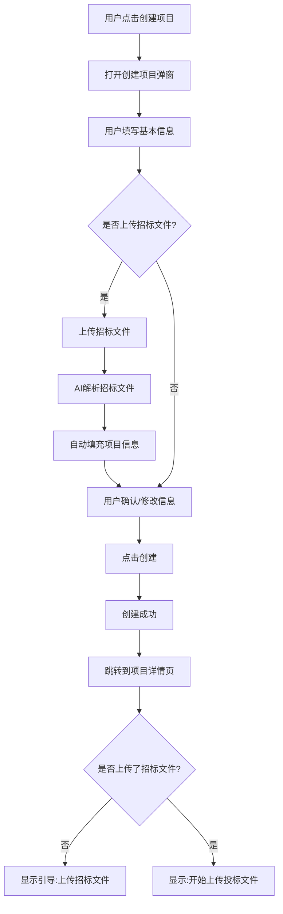

#### 3.2.2 功能:创建项目

## 一、功能概述

**用户故事**:
作为标书制作人员,我想要快速创建一个投标项目并上传招标文件,以便系统帮我自动提取项目信息和检查规则,减少手动填写的工作量。

**前置条件**:
- 用户已登录企业空间

**触发条件**:
- 用户点击首页"创建项目"按钮
- 或点击项目列表右上角"+ 新建项目"按钮

---

## 二、界面设计

### 2.1 创建项目弹窗

```
┌────────────────────────────────────────┐
│  创建项目                        [X]   │
├────────────────────────────────────────┤
│                                        │
│  项目名称 *                            │
│  ┌──────────────────────────────────┐ │
│  │ 请输入项目名称                    │ │
│  └──────────────────────────────────┘ │
│                                        │
│  所属地区 *                            │
│  ┌──────────────────────────────────┐ │
│  │ 请选择 ▼                          │ │
│  └──────────────────────────────────┘ │
│  (江苏、安徽、山东...)                 │
│                                        │
│  招标文件 (推荐上传,可自动提取信息)    │
│  ┌──────────────────────────────────┐ │
│  │ 📎 点击上传或拖拽文件到此处        │ │
│  │    支持PDF、zf格式,≤200MB      │ │
│  └──────────────────────────────────┘ │
│                                        │
│  投标截止时间                          │
│  ┌──────────────────────────────────┐ │
│  │ 选择日期和时间 📅                 │ │
│  └──────────────────────────────────┘ │
│                                        │
│  开标时间                              │
│  ┌──────────────────────────────────┐ │
│  │ 选择日期和时间 📅                 │ │
│  └──────────────────────────────────┘ │
│                                        │
│              [取消]  [创建项目]         │
└────────────────────────────────────────┘
```

### 2.2 AI解析中状态

```
┌────────────────────────────────────────┐
│  创建项目                              │
├────────────────────────────────────────┤
│                                        │
│        🔄 正在解析招标文件...          │
│                                        │
│  AI正在提取项目信息,请稍候             │
│  • 项目名称                            │
│  • 投标截止时间                        │
│  • 开标时间                            │
│  • 评标规则                            │
│                                        │
│              预计需要10-30秒            │
└────────────────────────────────────────┘
```

### 2.3 解析完成,自动填充

```
┌────────────────────────────────────────┐
│  创建项目                              │
├────────────────────────────────────────┤
│  ✓ 招标文件解析完成                    │
│                                        │
│  项目名称 *                            │
│  ┌──────────────────────────────────┐ │
│  │ XX市政道路改造工程              │ │ (AI提取)
│  └──────────────────────────────────┘ │
│                                        │
│  所属地区 *                            │
│  ┌──────────────────────────────────┐ │
│  │ 江苏 ▼                            │ │ (AI提取)
│  └──────────────────────────────────┘ │
│                                        │
│  招标文件                              │
│  ✓ XX招标文件.pdf (已上传)             │
│                                        │
│  投标截止时间                          │
│  ┌──────────────────────────────────┐ │
│  │ 2026-02-10 17:00                 │ │ (AI提取)
│  └──────────────────────────────────┘ │
│                                        │
│  开标时间                              │
│  ┌──────────────────────────────────┐ │
│  │ 2026-02-11 09:00                 │ │ (AI提取)
│  └──────────────────────────────────┘ │
│                                        │
│  💡 以上信息已由AI自动提取,请核对      │
│                                        │
│              [取消]  [创建项目]         │
└────────────────────────────────────────┘
```

---

## 三、业务规则

### 3.1 必填项
- 项目名称（必填）
- 所属地区（必填）

### 3.2 招标文件
- **可选项**,但强烈推荐上传
- **支持格式**: PDF、zf
- **文件大小**: ≤200MB
- **自动触发**: 如果上传,自动触发AI解析

### 3.3 AI解析
- **解析内容**: 项目名称、所属地区、投标截止时间、开标时间
- **解析时间**: 10-30秒
- **解析失败**: 提示用户手动填写,不阻塞项目创建流程

### 3.4 时间节点
- 投标截止时间、开标时间为**可选项**
- 如果AI解析失败或未上传招标文件,用户可手动填写
- **时间格式**: YYYY-MM-DD HH:mm

### 3.5 项目创建成功后
**项目状态**:
- 如果上传了招标文件 → "标书制作中"
- 如果未上传招标文件 → "已创建"

**页面跳转**:
- 跳转到项目详情页
- 显示操作引导

---

## 四、业务流程



---

## 五、异常处理

| 异常场景 | 处理方式 |
|---------|---------|
| 文件上传失败 | 提示"上传失败,请检查网络后重试",允许重新上传 |
| AI解析失败 | 提示"招标文件解析失败,请手动填写项目信息",字段置空,用户手动填写 |
| AI解析超时(>60秒) | 提示"解析超时,建议手动填写",字段置空 |
| 必填项未填 | 点击"创建项目"时,标红提示"请填写项目名称" |
| 文件格式错误 | 提示"仅支持PDF、zf格式" |
| 文件过大 | 提示"文件大小不能超过200MB" |

---

## 六、验收标准

- Given 用户填写了项目名称和所属地区
  When 用户点击"创建项目"(未上传招标文件)
  Then 项目创建成功,状态为"已创建",跳转到项目详情页

- Given 用户上传了招标文件
  When AI解析成功
  Then 自动填充项目名称、投标截止时间、开标时间,准确率≥85%

- Given 用户上传了招标文件
  When AI解析失败
  Then 提示用户手动填写,不阻塞项目创建流程

- Given 用户未填写必填项
  When 用户点击"创建项目"
  Then 标红提示缺失字段,不允许提交

- Given 用户上传了非PDF/zf格式的文件
  When 文件上传
  Then 提示"仅支持PDF、zf格式",不允许上传

- Given 用户上传了超过200MB的文件
  When 文件上传
  Then 提示"文件大小不能超过200MB",不允许上传
