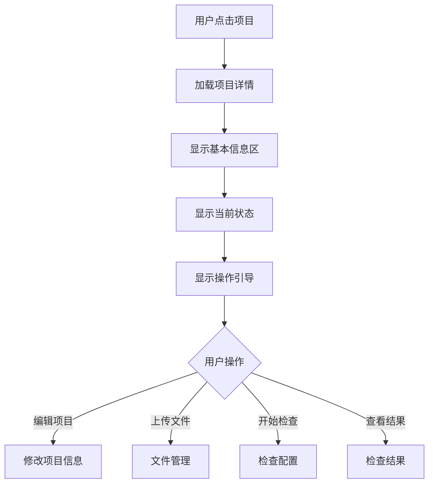
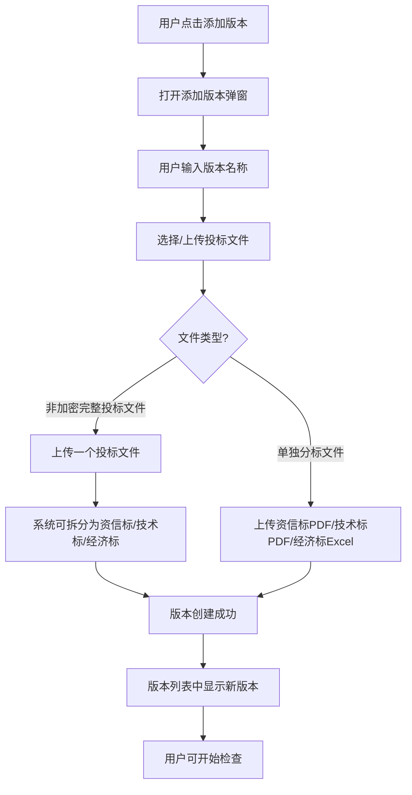

#### 3.2.3 功能:项目详情页

## 一、功能概述

**用户故事**:
作为标书制作人员,我想要在项目详情页清晰地看到项目的基本信息、管理所有文件版本、查看检查结果,以便全面掌握项目情况并高效完成标书检查工作。

**前置条件**:
- 用户已创建项目

**触发条件**:
- 用户从项目列表点击项目卡片

---

## 二、页面整体布局

项目详情页由以下三个区域组成,自上而下排列:

```
┌──────────────────────────────────────────────────────────┐
│  ← 返回项目列表        XX市政道路改造工程          [编辑] │
├──────────────────────────────────────────────────────────┤
│                                                          │
│  [1. 项目基本信息区]                                      │
│  ┌────────────────────────────────────────────────────┐  │
│  │ 项目名称、所属地区、时间节点、当前状态、整体进度    │  │
│  │ 风险提示、操作引导                                  │  │
│  └────────────────────────────────────────────────────┘  │
│                                                          │
│  [2. 文件管理区]                                          │
│  ┌────────────────────────────────────────────────────┐  │
│  │ 招标文件、控制价文件、投标文件版本管理              │  │
│  └────────────────────────────────────────────────────┘  │
│                                                          │
│  [3. 检查结果区]                                          │
│  ┌────────────────────────────────────────────────────┐  │
│  │ 资信标检查、技术标检查、经济标检查、多版本对比      │  │
│  └────────────────────────────────────────────────────┘  │
│                                                          │
└──────────────────────────────────────────────────────────┘
```

---

## 三、各区域功能详述

### 3.1 项目基本信息区

#### 3.1.1 界面设计

```
┌──────────────────────────────────────────────────────────┐
│  [项目基本信息]                                          │
│  ┌────────────────────────────────────────────────────┐  │
│  │ 项目名称: XX市政道路改造工程                       │  │
│  │ 所属地区: 江苏                                     │  │
│  │ 投标截止: 2026-02-10 17:00 (还剩7天) 🔴           │  │
│  │ 开标时间: 2026-02-11 09:00                         │  │
│  │ 创建时间: 2026-02-03 10:30                         │  │
│  │ 最近更新: 2026-02-03 14:20                         │  │
│  │                                                    │  │
│  │ 当前状态: [检查中]                                 │  │
│  │ 整体进度: ████████░░ 80%                          │  │
│  │                                                    │  │
│  │ 风险提示: ⚠ 技术标检查发现2个问题,建议处理       │  │
│  └────────────────────────────────────────────────────┘  │
│                                                          │
│  [操作引导]                                              │
│  💡 下一步建议: 处理技术标问题后重新检查               │
│  [查看问题详情] [开始修复]                               │
└──────────────────────────────────────────────────────────┘
```

#### 3.1.2 基本信息字段

| 字段名 | 说明 | 是否可编辑 |
|--------|------|-----------|
| 项目名称 | 项目的名称 | 是 |
| 所属地区 | 项目所在地区 | 是 |
| 投标截止时间 | 投标截止时间,同时显示倒计时 | 是 |
| 开标时间 | 开标时间 | 是 |
| 创建时间 | 系统自动记录 | 否 |
| 最近更新时间 | 系统自动更新 | 否 |

#### 3.1.3 当前状态

**状态标签**:
- 已创建（灰色）
- 标书制作中（蓝色）
- 检查中（橙色）
- 已提交（绿色）
- 已开标（紫色）
- 已中标（绿色加粗）
- 未中标（灰色）

#### 3.1.4 整体进度

**进度条计算逻辑**:
- 已上传招标文件: +20%
- 已上传投标文件(资信标、技术标、经济标): +30%
- 资信标检查完成: +15%
- 技术标检查完成: +15%
- 经济标检查完成: +15%
- 所有检查通过: +5%

#### 3.1.5 风险提示

根据检查结果自动生成:
- "⚠ 资信标检查发现3个不符合项,可能导致废标"
- "✓ 所有检查已通过,可以提交投标文件"
- "⚠ 距离投标截止还有1天,请尽快完成检查"

#### 3.1.6 操作引导

根据当前状态和检查结果,智能提示用户下一步操作:
- 状态为"已创建" → "💡 下一步建议:上传招标文件,系统将自动提取项目信息"
- 状态为"标书制作中" → "💡 下一步建议:上传投标文件,开始检查"
- 状态为"检查中" → "💡 检查进行中,预计还需5分钟"
- 有检查问题 → "💡 下一步建议:处理检查问题后重新检查"

#### 3.1.7 业务规则

1. **编辑权限**:
   - 状态为"已创建"、"标书制作中"、"检查中":可以编辑基本信息
   - 状态为"已提交"、"已开标"、"已中标/未中标":不可编辑基本信息(防止误操作)
   - 已归档项目:只读,不可编辑

2. **倒计时显示**:
   - 距离投标截止≤3天:红色高亮显示
   - 距离投标截止>3天:正常显示
   - 已过投标截止时间:显示"已截止"

3. **状态徽章**:
   - 实时更新,根据文件上传和检查情况自动流转

---

### 3.2 文件管理区

#### 3.2.1 界面设计

```
┌──────────────────────────────────────────────────────────┐
│  [文件管理]                                              │
│                                                          │
│  [招标文件]                                              │
│  ┌────────────────────────────────────────────────────┐  │
│  │ ✓ XX招标文件.pdf (12.5MB)                          │  │
│  │    上传时间: 2026-02-03 10:35                      │  │
│  │    [下载] [替换] [预览]                            │  │
│  └────────────────────────────────────────────────────┘  │
│                                                          │
│  [控制价文件] (可选)                                     │
│  ┌────────────────────────────────────────────────────┐  │
│  │ 📎 点击上传控制价文件                              │  │
│  │    支持Excel格式,≤50MB                            │  │
│  └────────────────────────────────────────────────────┘  │
│                                                          │
│  [投标文件版本]                          [+ 添加版本]   │
│  ┌────────────────────────────────────────────────────┐  │
│  │ 📦 投标文件-1                          [操作 ▼]    │  │
│  │    备注: 第一次编写的版本                          │  │
│  │    上传时间: 2026-02-03 14:20                      │  │
│  │                                                    │  │
│  │    文件列表:                                       │  │
│  │    • 资信标.pdf (5.2MB)                           │  │
│  │    • 技术标.pdf (8.7MB)                           │  │
│  │    • 经济标.xlsx (2.1MB)                          │  │
│  │                                                    │  │
│  │    检查状态:                                       │  │
│  │    资信标: ✓ 通过  技术标: ⚠ 有问题  经济标: ○ 未检查│  │
│  │                                                    │  │
│  │    [查看检查结果] [开始检查]                       │  │
│  └────────────────────────────────────────────────────┘  │
│                                                          │
│  💡 可以添加多个版本用于对比分析或保存历史记录          │
└──────────────────────────────────────────────────────────┘
```

#### 3.2.2 招标文件区块

**有文件时**:
- 展示文件名、文件大小、上传时间
- 提供操作按钮:「下载」「替换」「预览」
- 已上传状态用勾选图标标识

**无文件时**:
- 展示上传入口
- 说明:支持PDF、zf格式,≤200MB

#### 3.2.3 控制价文件区块

**标注**: 「(可选)」

**上传入口**:
- 点击上传控制价文件
- 说明:支持Excel格式,≤50MB

#### 3.2.4 投标文件版本区块

**区块标题**: 「投标文件版本」,右侧主操作按钮「+ 添加版本」

**展示形式**: 以“版本列表 + 可展开手风琴(Accordion)”展现多个版本。每个版本为一条列表项,支持展开查看详情。

**默认规则**:
- 默认全部折叠
- 支持同时展开多个版本(多开)。如需降低页面高度/干扰,可在实现时提供“只允许展开一个”的配置开关(默认多开)
- 列表排序: 按上传时间倒序(最新在最上)

**折叠态(列表项摘要区)展示字段**:
- 版本名称(如「投标文件-1」)
- 可选备注(最多展示1行,超出省略号)
- 上传时间
- 检查状态摘要(按文件类型展示:资信标/技术标/经济标)
  - 通过:「通过」(✓)
  - 有问题:「有问题」(⚠) + 问题数(如「有问题 3」,问题数取该文件类型下未解决问题数;若暂不可得可先不展示数量)
  - 未检查:「未检查」(○)
  - 检查中:「检查中」(⏳,展示进度/阶段则附带百分比或文案)
  - 无文件:「未上传」(—,仅当该版本允许缺失某类文件时出现)
- 右侧: 展开/收起箭头(点击切换),以及「操作▼」入口

**展开态(详情区)内容**:
- 文件列表(固定三类分组/行展示:资信标/技术标/经济标)
  - 每一类展示: 文件名、大小、最近上传时间(可复用版本上传时间或展示文件自身上传时间,优先文件自身)
  - 缺失文件时: 展示「未上传」并提供快捷入口「上传/补充」
- 操作按钮区:
  - 「查看检查结果」: 当该版本至少有一个文件存在检查结果或检查完成时可用;否则置灰并提示原因(如“该版本尚未生成检查结果”)
  - 「开始检查」: 当至少上传了可检查文件且当前不在检查中时可用;检查中状态置灰并显示“检查中…”
  - (可选)「继续检查/重新检查」: 当替换文件导致结果清空或上次检查失败/中断时出现,具体见业务规则
- （可选）检查概览补充信息:
  - 最近一次检查时间/检查耗时
  - 总体状态(若需要): 通过/有问题/检查中/未检查(取三类文件状态的汇总规则,见下)

**交互说明**:
- 点击列表项摘要区(除「操作▼」与按钮)均可展开/收起
- 展开/收起动画时长建议 200-300ms,保持信息层级清晰
- 切换展开状态不应触发页面跳转;展开后详情区应在当前列表项下方展开

**状态汇总口径(可用于概览/排序/筛选,如产品需要)**:
- 若任一文件类型为「检查中」→ 汇总为「检查中」
- 否则若任一文件类型为「有问题」→ 汇总为「有问题」
- 否则若全部已检查且均通过 → 汇总为「通过」
- 否则 → 汇总为「未检查」

**空态与异常态**:
- 无任何版本: 展示空态说明“可添加多个版本用于对比分析或保存历史记录”,并突出「+ 添加版本」
- 版本过多: 列表支持滚动;当版本数>10时(可配置)支持折叠分页/“加载更多”
- 数据加载中: 列表骨架屏;展开态的文件列表可按需懒加载,避免一次性拉取全部版本详情

**版本操作菜单**(点击"操作▼"按钮):
- **重命名**:修改版本名称和备注
- **替换文件**:替换资信标/技术标/经济标中的某个文件
- **下载文件**:下载该版本的所有文件(打包为ZIP)
- **删除版本**:删除该版本(需二次确认)

#### 3.2.5 添加版本(批量导入)

- **入口**
  - 通过「投标文件版本」区块右侧主按钮「+ 添加版本」进入。

- **上传投标文件区域**
  - 说明文案:「上传非加密的投标文件,一次可上传多份,系统将自动为每份文件生成一个版本。」
  - 上传控件:
    - 支持多文件选择(多选/拖拽)。
    - 文件类型限制:与系统支持的投标文件格式保持一致(具体格式在技术文档中细化)。
    - 文件大小限制:与单文件上传规则保持一致。
  - 校验规则:
    - 若检测到文件为**加密文件**、不合法格式或超出大小限制的文件:
      - 给出对应错误提示,不纳入导入列表。
  - 待导入文件列表展示:
    - 每个待导入文件展示:文件名、文件大小、上传结果状态(可导入/加密/格式不支持/超出大小等)。

- **版本命名与备注规则**
  - 版本命名:
    - 默认规则:基于文件名自动生成版本名称。
    - 示例:直接使用`文件名`,如有重名则自动追加序号:`文件名-1`、`文件名-2`。
    - 要求:同一项目下版本名称**全局唯一**。
  - 备注规则(可选):
    - 提供一个统一的备注输入框,用于给本次批量导入的所有版本设置相同备注(如「来自XX招标文件批量导入」)。
    - 若不填写,则各版本备注为空,后续可在版本操作中单独编辑。

- **操作按钮**
  - 「取消」:关闭弹窗,不产生任何新版本。
  - 「导入版本」:
    - 触发前校验至少存在 1 个**可导入的合法文件**。
    - 若仅有无效/加密文件,则按钮置灰或点击后提示「当前没有可导入的合法投标文件」。

- **异常与边界情况**
  - 全部文件不合法/加密:
    - 点击「导入版本」时提示「当前没有可导入的合法投标文件,请重新选择文件」,不创建任何版本。
  - 部分文件合法,部分文件不合法:
    - 仅对合法文件创建版本,不合法文件在弹窗内列表中保留错误状态提示。
  - 多次批量导入:
    - 多次执行批量导入不会覆盖已有版本,而是在原有版本列表基础上新增多条版本记录。
  - 重复导入同一文件:
    - 不强制去重,但需通过自动追加序号等方式保证版本名称唯一,避免命名冲突。

#### 3.2.6 业务规则

1. **版本管理**:
   - 每个项目可以添加多个版本(建议≤10个,避免混乱)
   - 版本之间独立,互不影响
   - 每个版本必须包含:资信标、技术标、经济标(至少上传一个文件)

2. **版本命名**:
   - 如果用户未填写版本名称,系统在用户提供的文件名后增加版本序号,如"投标文件-1"、"投标文件-2"
   - 版本名称不可重复

3. **文件要求**:
   - 资信标:PDF格式,≤50MB
   - 技术标:PDF格式,≤100MB
   - 经济标:Excel格式(.xlsx/.xls),≤50MB

4. **替换文件**:
   - 替换文件后,该版本的检查结果自动清空
   - 需要重新触发检查

5. **删除版本**:
   - 删除版本时,提示"删除后无法恢复,确定删除吗?"
   - 如果该版本有检查结果,额外提示"该版本的检查结果也将被删除"

6. **弱化"多单位"概念**:
   - 使用"版本"而非"投标单位"
   - 默认名称为"文件名-1"、"文件名-2"等,而非"单位A"、"单位B"
   - 备注引导用户描述"修改了什么",而非"哪个单位"

---

### 3.3 检查结果区

#### 3.3.1 界面设计

```
┌──────────────────────────────────────────────────────────┐
│  [检查结果]                                              │
│  ┌────────────────────────────────────────────────────┐  │
│  │ 单文件检查 - 投标文件-1                            │  │
│  ├────────────────────────────────────────────────────┤  │
│  │ 📋 资信标检查                       [查看详情]     │  │
│  │    状态: ✓ 通过                                    │  │
│  │    检查项: 10/10项通过                             │  │
│  │    最近检查: 2026-02-03 15:30                      │  │
│  ├────────────────────────────────────────────────────┤  │
│  │ 📄 技术标检查                       [查看详情]     │  │
│  │    状态: ⚠ 有问题                                  │  │
│  │    暗标格式: 2个错误                               │  │
│  │    敏感信息: 发现公司名称1处                       │  │
│  │    最近检查: 2026-02-03 15:45                      │  │
│  │    [开始修复]                                      │  │
│  ├────────────────────────────────────────────────────┤  │
│  │ 💰 经济标检查                       [查看详情]     │  │
│  │    状态: ○ 未检查                                  │  │
│  │    [开始检查]                                      │  │
│  └────────────────────────────────────────────────────┘  │
│                                                          │
│  ┌────────────────────────────────────────────────────┐  │
│  │ 多版本对比                          [查看详情]     │  │
│  ├────────────────────────────────────────────────────┤  │
│  │ 已上传2个版本:投标文件-1、投标文件-2               │  │
│  │ [开始对比分析]                                     │  │
│  └────────────────────────────────────────────────────┘  │
│                                                          │
│  [导出完整检查报告]  (预留入口,暂未实现)              │
└──────────────────────────────────────────────────────────┘
```

#### 3.3.2 检查状态定义

| 状态 | 图标 | 颜色 | 说明 | 操作按钮 |
|------|------|------|------|---------|
| ✓ 通过 | ✓ | 绿色 | 所有检查项都通过,无问题 | [查看详情] |
| ⚠ 有问题 | ⚠ | 橙色 | 发现问题,但不是致命错误 | [查看详情] [开始修复] |
| ✗ 不通过 | ✗ | 红色 | 发现致命错误,可能导致废标 | [查看详情] [立即修复] |
| 🔄 检查中 | 🔄 | 蓝色 | 检查任务正在进行 | [查看进度] |
| ○ 未检查 | ○ | 灰色 | 尚未启动检查 | [开始检查] |

#### 3.3.3 检查结果汇总规则

**资信标检查**:
- 显示:检查项数量(如:10/10项通过)
- 如果有问题,列出问题类型(如:营业执照过期、业绩不符合要求)

**技术标检查**:
- 显示:暗标格式错误数量、敏感信息数量
- 如果有问题,列出主要问题(如:字体不符合要求、包含公司名称)

**经济标检查**:
- 显示:清单符合性、计算错误、限价检查结果
- 如果有问题,列出主要问题(如:超过控制价、清单项缺失)

#### 3.3.4 业务规则

1. **检查结果缓存**:
   - 检查结果持久化存储,用户关闭页面后再打开,仍能看到之前的结果
   - 如果用户替换了文件,检查结果自动清空,需要重新检查

2. **检查进度实时更新**:
   - 检查任务进行中时,每隔5秒刷新一次进度
   - 检查完成后,自动刷新结果

3. **多版本结果独立**:
   - 每个版本的检查结果独立存储
   - 版本切换时,显示对应版本的检查结果

4. **导出报告**(阶段一预留入口,阶段二实现):
   - 点击"导出完整检查报告"时,提示"功能开发中,敬请期待"

---

## 四、业务流程

### 4.1 项目详情页加载流程



### 4.2 添加版本流程



---

## 五、异常处理

| 异常场景 | 处理方式 |
|---------|---------|
| 项目加载失败 | 提示"项目加载失败,请刷新重试" |
| 编辑保存失败 | 提示"保存失败,请检查网络后重试",不关闭编辑弹窗 |
| 文件上传失败 | 提示"上传失败,请检查网络后重试",允许重新上传 |
| 文件格式错误 | 提示"资信标和技术标仅支持PDF格式,经济标仅支持Excel格式" |
| 文件过大 | 提示"文件大小超过限制,请压缩后重试" |
| 必传文件缺失 | 点击"添加版本"时,如果三个文件未全部上传,提示"请上传资信标、技术标、经济标" |
| 检查任务失败 | 显示"检查失败,请重试",提供[重新检查]按钮 |
| 检查超时(>10分钟) | 提示"检查超时,请联系客服",同时提供[重新检查]按钮 |

---

## 六、验收标准

### 6.1 基本信息区

- Given 用户打开项目详情页
  When 项目状态为"检查中"且有检查问题
  Then 显示风险提示和操作引导

- Given 用户点击"编辑"按钮
  When 项目状态为"已提交"
  Then 提示"项目已提交,不可编辑基本信息"

- Given 距离投标截止还有2天
  When 用户打开项目详情页
  Then 投标截止时间红色高亮显示"还剩2天"

### 6.2 文件管理区

- Given 用户点击"添加版本"
  When 用户未填写版本名称,直接上传了三个文件
  Then 版本自动命名为在用户文件名后增加版本序号(如"投标文件-1"、"投标文件-2")

- Given 用户已添加了一个版本
  When 用户点击"替换文件" → 替换技术标
  Then 该版本的检查结果清空,提示用户重新检查

- Given 用户点击"删除版本"
  When 该版本有检查结果
  Then 提示"删除后无法恢复,该版本的检查结果也将被删除,确定删除吗?"

- Given 用户上传了PDF格式的经济标
  When 点击"添加版本"
  Then 提示"经济标仅支持Excel格式"

### 6.3 检查结果区

- Given 用户完成了资信标、技术标、经济标检查
  When 用户打开项目详情页
  Then 一屏内显示所有检查结果,无需滚动查看多个Tab

- Given 技术标检查发现2个暗标格式错误
  When 用户查看检查结果
  Then 显示"⚠ 有问题 - 暗标格式:2个错误",提供[开始修复]按钮

- Given 检查任务正在进行
  When 用户打开项目详情页
  Then 显示"🔄 检查中",进度条实时更新

- Given 用户替换了技术标文件
  When 文件替换成功
  Then 技术标检查结果清空,显示"○ 未检查"
