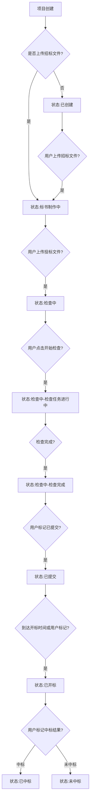
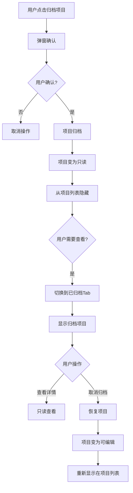

#### 3.2.5 & 3.2.7 功能:项目状态管理

## 一、功能概述

**用户故事**:
作为标书制作人员,我希望系统能够自动判断项目当前所处的阶段,并在项目完成后能够归档保存,这样可以节省时间、避免遗漏,同时保持项目列表的整洁。

**前置条件**:
- 项目已创建

**触发条件**:
- 用户上传文件(自动流转)
- 检查任务完成(自动流转)
- 用户手动标记状态
- 用户点击归档项目

---

## 二、状态流转设计

### 2.1 状态定义

| 状态 | 定义 | 自动流转条件 | 手动操作 | 下一状态 |
|------|------|-------------|---------|---------|
| **已创建** | 项目刚创建,无任何文件 | - | 上传招标文件 | → 标书制作中 |
| **标书制作中** | 已上传招标文件,但未上传投标文件 | 用户上传招标文件 | 上传投标文件 | → 检查中 |
| **检查中** | 已上传投标文件,正在进行或已完成检查 | 用户上传投标文件 | 标记为已提交 | → 已提交 |
| **已提交** | 用户已提交投标文件(线下提交) | 用户点击"标记为已提交" | 标记为已开标 | → 已开标 |
| **已开标** | 项目已开标 | 到达开标时间或用户标记 | 标记中标结果 | → 已中标/未中标 |
| **已中标** | 项目中标 | 用户点击"标记为已中标" | 归档项目 | → (归档) |
| **未中标** | 项目未中标 | 用户点击"标记为未中标" | 归档项目 | → (归档) |

### 2.2 详细流转逻辑

#### 2.2.1 已创建 → 标书制作中
- **触发条件**: 用户上传招标文件
- **自动执行**: 无需用户手动操作

#### 2.2.2 标书制作中 → 检查中
- **触发条件**: 用户上传至少一个版本的投标文件(包含资信标、技术标、经济标)
- **自动执行**: 无需用户手动操作

#### 2.2.3 检查中(内部子状态)
检查中的细分:
- **检查中 - 未检查**: 已上传投标文件,但未启动检查
- **检查中 - 检查进行中**: 检查任务正在执行
- **检查中 - 检查完成**: 所有检查任务完成

注: 这些子状态对用户透明,统一显示为"检查中",但影响操作引导的内容

#### 2.2.4 检查中 → 已提交
- **触发条件**: 用户点击"标记为已提交"按钮
- **手动操作**: 需要用户确认
- **确认弹窗**: "确认已在线下提交投标文件?标记后项目将进入只读状态,无法编辑。"

#### 2.2.5 已提交 → 已开标
- **触发条件1(自动)**: 系统检测到当前时间≥开标时间
- **触发条件2(手动)**: 用户点击"标记为已开标"按钮
- **优先级**: 手动>自动(用户可提前标记)

#### 2.2.6 已开标 → 已中标/未中标
- **触发条件**: 用户点击"标记为已中标"或"标记为未中标"按钮
- **手动操作**: 需要用户确认
- **确认弹窗**: "确认项目中标结果?标记后建议归档项目。"

### 2.3 界面设计

#### 2.3.1 状态标签显示

位于项目基本信息区:

```
当前状态: [检查中]
```

**状态颜色**:
- 已创建: 灰色
- 标书制作中: 蓝色
- 检查中: 橙色
- 已提交: 绿色
- 已开标: 紫色
- 已中标: 绿色加粗
- 未中标: 灰色

#### 2.3.2 手动操作按钮

根据状态显示不同按钮:

```
状态为"检查中":
  [标记为已提交]

状态为"已提交":
  [标记为已开标]

状态为"已开标":
  [标记为已中标] [标记为未中标]
```

#### 2.3.3 状态流转日志(可选)

在项目详情页底部显示:

```
┌────────────────────────────────────────────────────────┐
│ 状态变更记录                                           │
├────────────────────────────────────────────────────────┤
│ 2026-02-03 10:30  项目创建 → 已创建                    │
│ 2026-02-03 10:35  上传招标文件 → 标书制作中           │
│ 2026-02-03 14:20  上传投标文件(投标文件-1) → 检查中   │
│ 2026-02-04 09:30  用户标记 → 已提交                   │
│ 2026-02-11 09:00  系统自动 → 已开标                   │
│ 2026-02-11 15:00  用户标记 → 已中标                   │
└────────────────────────────────────────────────────────┘
```

### 2.4 业务规则

1. **状态流转方向**: 单向流转,不允许回退(防止数据混乱)
   - 例外: 管理员可以手动回退状态(技术后台功能)

2. **只读状态**:
   - 状态为"已提交"、"已开标"、"已中标"、"未中标"时,项目基本信息不可编辑
   - 但仍可查看检查结果、下载文件

3. **自动vs手动**:
   - 前3个状态(已创建→标书制作中→检查中): 完全自动
   - 后4个状态(检查中→已提交→已开标→已中标/未中标): 需要用户手动触发

4. **状态持久化**: 每次状态变更都记录日志,便于追溯

---

## 三、项目归档设计

### 3.1 归档功能

#### 3.1.1 归档条件
- 只有状态为"已中标"或"未中标"的项目才能归档
- 其他状态的项目,归档按钮置灰,提示"请先标记项目中标结果"

#### 3.1.2 界面设计

**归档按钮**(位于项目详情页右上角):

```
┌──────────────────────────────────────────────────────────┐
│  ← 返回     XX市政道路改造工程      [编辑] [归档项目]   │
└──────────────────────────────────────────────────────────┘
```

**归档确认弹窗**:

```
┌────────────────────────────────────────┐
│  归档项目                        [X]   │
├────────────────────────────────────────┤
│                                        │
│  确认归档"XX市政道路改造工程"?         │
│                                        │
│  归档后:                               │
│  • 项目将从项目列表中隐藏              │
│  • 项目信息和检查结果变为只读          │
│  • 可以随时取消归档恢复项目            │
│                                        │
│              [取消]  [确认归档]         │
└────────────────────────────────────────┘
```

#### 3.1.3 归档后变化
- 项目从"进行中"列表隐藏
- 项目信息变为只读,不可编辑
- 检查结果仍可查看
- 文件仍可下载

### 3.2 取消归档

#### 3.2.1 功能说明
- 点击"取消归档"后,项目恢复到归档前的状态
- 项目重新显示在"进行中"列表
- 项目信息变为可编辑(但状态仍保持"已中标/未中标")

#### 3.2.2 界面设计

**已归档Tab**(位于项目列表顶部):

```
┌──────────────────────────────────────────────────────────┐
│  [进行中] [已归档]                                       │
├──────────────────────────────────────────────────────────┤
│  已归档的项目 (3个)                                      │
│  ┌────────────────────────────────────────────────────┐  │
│  │ 📦 XX市政道路改造工程                              │  │
│  │    归档时间: 2026-02-11 16:00                      │  │
│  │    结果: 已中标                                    │  │
│  │    [查看详情] [取消归档]                           │  │
│  └────────────────────────────────────────────────────┘  │
└──────────────────────────────────────────────────────────┘
```

### 3.3 业务规则

1. **归档项目的显示**:
   - 默认隐藏,需切换到"已归档"Tab才能查看
   - 按归档时间倒序排列(最近归档的在最上面)

2. **归档与状态的关系**:
   - 归档是项目的一个属性,不是状态
   - 归档后,项目状态仍保持"已中标"或"未中标"

---

## 四、业务流程

### 4.1 状态自动流转流程



### 4.2 项目归档流程



---

## 五、异常处理

| 异常场景 | 处理方式 |
|---------|---------|
| 用户误操作标记状态 | 提供"联系客服撤销"的提示(技术后台可回退) |
| 开标时间未设置 | 无法自动流转到"已开标",只能手动标记 |
| 网络异常导致归档失败 | 提示"归档失败,请检查网络后重试" |

---

## 六、验收标准

### 6.1 状态流转

- Given 用户创建项目但未上传招标文件
  When 项目创建成功
  Then 状态为"已创建"

- Given 用户上传了招标文件
  When 文件上传成功
  Then 状态自动流转为"标书制作中"

- Given 用户上传了投标文件
  When 文件上传成功
  Then 状态自动流转为"检查中"

- Given 用户点击"标记为已提交"
  When 用户确认
  Then 状态流转为"已提交",项目基本信息变为只读

- Given 当前时间≥开标时间
  When 系统定时任务检测
  Then 状态自动流转为"已开标"

- Given 用户点击"标记为已中标"
  When 用户确认
  Then 状态流转为"已中标",建议用户归档项目

### 6.2 项目归档

- Given 项目状态为"已中标"
  When 用户点击"归档项目"并确认
  Then 项目从"进行中"列表消失,在"已归档"Tab中显示

- Given 项目已归档
  When 用户打开项目详情页
  Then 项目信息为只读,不显示编辑按钮,但可查看检查结果和下载文件

- Given 项目已归档
  When 用户点击"取消归档"
  Then 项目恢复到"进行中"列表,项目信息变为可编辑

- Given 项目状态为"检查中"
  When 用户尝试归档
  Then 归档按钮置灰,提示"请先标记项目中标结果"
