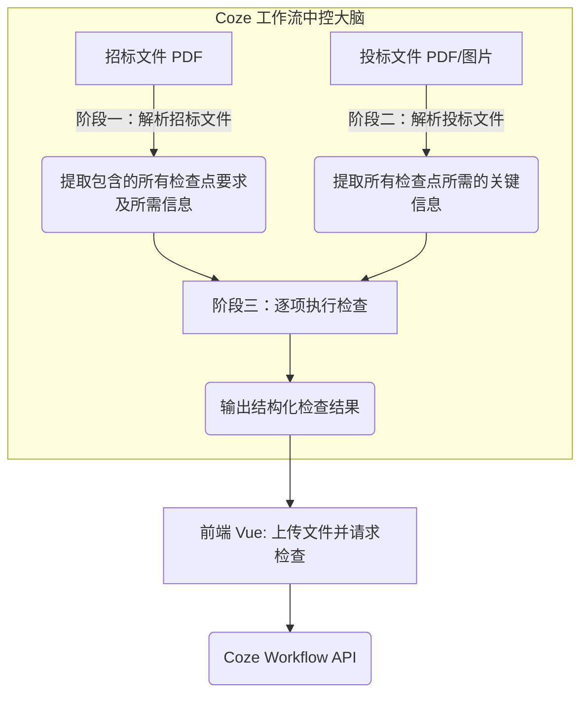

# 资信标检查技术方案大纲

## 1. 概述

本模块旨在实现资信标的自动化检查。考虑到快速开发与低维护成本，本技术方案采用 **Coze (扣子)** 作为核心的业务逻辑编排与 AI 调度引擎。前端负责交互与文件上传，由 Coze 工作流负责从招标文件中提取各项评审规则，从投标文件中提取对应的关键响应信息，并通过工作流内的代码节点与 AI 大模型进行交叉比对，最终输出每个检查点的核对结果给前端。

目前规划实现阶段一核心检查点（10个）：
- CP-001：投标人名称一致性检查
- CP-002：营业执照检查
- CP-003：资质等级检查
- CP-004：安全生产许可证检查
- CP-005：投标保证金检查
- CP-006：报价唯一性检查
- CP-007：业绩要求检查
- CP-008：人员资质检查
- CP-009：工期符合性检查
- CP-010：盖章签字完整性检查

---

## 2. 整体架构 — 基于 Coze 的三阶段流水线

整个检查流程采用统一的“三阶段流水线”架构。前端（Vue）将文件发送至 Coze Webhook / API，Coze 内部通过 Workflow 完成所有解析与判定逻辑。



- **架构优势**：免除传统的重度后端微服务开发，利用 Coze 丰富的插件生态（文档解析、多模态视觉大模型、OCR 等）及低代码编排能力，前端仅需接入一个 API 即可获取最终结果。

---

## 3. 阶段一：解析招标文件（通用）

**处理逻辑**：在 Coze 工作流中读取招标文件，自动分析其中的资质要求、评分标准及否决性条款，并将这些信息转化为结构化的检查点清单。

- **工作流编排提取要求**：
  - **文档读取节点**：使用 Coze 的 Document Reader 插件读取招标文件 PDF。
  - **大模型 (LLM) 节点**：编写系统 Prompt，“请从上述文档中提取资信标审查涉及的要求清单及每一项的核对目标，严格按照规定的 JSON 格式输出。”推荐使用 Kimi 或智谱 GLM-4 等长文本模型插件。
  - **解析节点**：使用 JSON 解析或代码节点，将大模型的回答解析成结构化数组。
- **阶段输出**：每个检查点需包含：`point_id`, `point_name`, `requirements`, `source_location`, `required_bid_infos` (执行该检查点需要从投标文件获取的字段列表), `is_reject_item`。
- **提示词**：
# 角色定义
你是一个资深招投标审查专家。

# 任务目标
你的唯一任务是审阅**已整理好的招标文件文本内容**，精准提取**仅限“资信标”**（资格门槛、商务资质等）审查涉及的要求及否决条款。当发现条款中存在对其他章节的引用（如“符合第二章1.4.1要求”），必须去文中对应的位置找到原文并一并提取。最后转化为结构化的检查点（Checkpoints）JSON 数组。

# 资信标范围边界 (CRITICAL)
**必须提取（资信标）**：营业执照、资质等级、安全生产许可证、保证金、业绩、人员资格、财务/社保、信誉、盖章签字等资格要求相关的定性门槛。
**严禁提取（技术标/经济标）**：施工组织设计/技术方案打分、报价评审计算、偏差率扣分、清单计价造价规则等依据优劣给分的标准。

# 解析与溯源要求（特别注意引用的条款）
如果在评标标准中看到类似于“满足前附表第X项要求”、“符合第二章投标人须知X.X款要求”、“按招标公告要求”的内容，**不能仅仅把这句话作为要求提取**，你必须：
1. 在全文中去寻找被引用的那个章节（如前附表第X项、第二章X.X款）。
2. 将找到的具体规定内容提取出来，放入最终结果中，作为实际的审查依据。
3. 原始引用的那句话也需要保留。

# JSON 字段定义
对于你发现的每一个检查点，提取并输出 7 个字段：
1. `point_id` (String): 唯一编号，如 "CP-001"，递增。
2. `point_name` (String): 检查点名称（例如"投标人名称一致性"）。
3. `requirements` (String): 审查标准与要求。直接引用评标方法中该项的原文，**严禁对原文作任何修改**（例如：“符合第二章投标人须知1.4.1及招标公告要求”）。
4. `referenced_content` (String | null): 被引用的具体内容。当 `requirements` 中出现跨章节引用时，在此提供你从全文其他地方找到的被引述的原文（如列出1.4.1条款里的资质等级具体要求）。如果没有引用情况，填 `null`。
5. `source_location` (String): 来源位置。在原文中的具体位置（如"第三章 评标办法"）。
6. `required_bid_infos` (Array of Strings): 验证要求所需的投标文件字段。（例如 `["营业执照_企业名称", "安全许可证_有限期"]`）。拆分具体。
7. `is_reject_item` (Boolean): 是否为废标项。明确指出“不满足将被否决投标”填 `true`；仅扣分不废标填 `false`。

# 输出绝对约束 (CRITICAL)
- 仅输出一个**纯 JSON 数组 (JSON Array)**。
- 严禁包含说明文字、问候语或思考过程。
- 严禁使用 Markdown 代码块（不加 ```json），直接输出由 `[` 开始，以 `]` 结束。
- 确保 JSON 格式 100% 正确，属性名和字符串必须使用双引号 `""`。

# 示例期望输出
[
  {
    "point_id": "CP-001",
    "point_name": "资质等级要求",
    "requirements": "投标人资质条件、能力和信誉符合第二章“投标人须知”第 1.4.1 项规定。",
    "referenced_content": "1.4.1 投标人资质要求：具备建设行政主管部门颁发的有效建筑工程施工总承包贰级及以上资质。",
    "source_location": "第三章 评标办法 第一节 2.1 资格评审标准",
    "required_bid_infos": ["建筑业企业资质证书_资质类别及等级"],
    "is_reject_item": true
  }
]
---

## 4. 阶段二：解析投标文件（通用）

**处理逻辑**：根据阶段一产出的 `required_bid_infos`，在投标文件中寻找并提取对应的事实信息。在 Coze 中根据文件形态调用不同的插件策略。

- **工作流编排提取证据**：
  - **常规文本提取**（投标函、保证金承诺等）：读取投标文件 PDF，进入大模型节点，“根据阶段一的要求清单，从该投标文件中找出对应的数值或文字内容。”
  - **证照图像扫描件提取**（营业执照、资质等级等）：**调用多模态大模型节点（如 GPT-4o 或专属视觉模型插件）**，直接将图片输入并提示“提取该图片中的企业名称、统一社会信用代码、有效期”；或调用专门的**阿里云/腾讯云卡证 OCR 插件**，确保高精度的字段抓取。
- **阶段输出**：结构化的投标关键事实字典。
  - 示例：`{"company_name": "某某建设工程有限公司", "license_valid_date": "2027-10-01", ...}`
  - 保留原始页码或切片索引以供问题定位。

---

## 5. 阶段三：逐项执行检查（通用）

**处理逻辑**：将前两阶段得出的“招标要求规则”与“投标实际情况”进行比对验证。为防止大模型判断产生“幻觉”，本阶段必须进行精确控制。

- **工作流编排判定逻辑**：
  - **确定性判定 -> 代码节点 (Code Node)**：对于逻辑明确的规则（如名称是否一致、金额/日期比较），**严禁直接交给 LLM 判断**。将阶段一和阶段二的数据作为输入，传给 Coze 的代码节点（Node.js / Python），执行严格运算（去除空格、格式转换、全半角判定、A === B）。
  - **语义级判定 -> 领域 LLM 节点**：对于规则模糊、有包含关系的情况（如资质类型匹配），调用大模型节点结合限定词库进行推理判定。
- **阶段输出格式**：工作流最终输出 JSON 结构：
  - `status`: 检查状态（通过 / 不通过 / 警告 / 待人工填写 / 跳过）
  - `reason`: 判定原因说明
  - `location`: 发现问题的内容页码与对应章节

---

## 6. 案例演示：以 CP-001 投标人名称一致性检查为例

**【阶段一在 Coze 中解析招标文件】**
- **LLM 节点输出**：识别出需要“名称一致性检查”。输出 `required_bid_infos`: `[投标函_企业名称, 营业执照_企业名称, 资质证书_企业名称, 安全许可证_企业名称]`

**【阶段二在 Coze 中解析投标文件】**
- **文本及视觉模型提取**：
  - 投标函：LLM 分析文本，提取 `投标函_企业名称` = "中建一局有限公司"
  - 营业执照：多模态节点分析图片，提取 `营业执照_企业名称` = "中建一局有限公司"
  - 资质证书：多模态节点分析图片，提取 `资质证书_企业名称` = "中建一局（集团）有限公司"

**【阶段三在 Coze 的代码节点中执行检查】**
- **代码节点 (Python/JS) 行为**：
  - 将 4 个名称进行预处理（去不可见字符、全角转半角大写）。
  - 执行严格的字符串相等比对。
  - 逻辑拦截：发现“资质证书_企业名称”包含多余的“(集团)”字样，`A !== B`。
- **Coze 工作流最终响应前端**：
  - `status`: 不通过
  - `reason`: "资质证书上的企业名称(中建一局(集团)有限公司)与投标人名称(中建一局有限公司)不一致"

---

## 7. 异常处理机制（通用）

1. **OCR 或提取彻底失败**：多模态模型返回提取失败或置信度低时，代码节点捕获该状态，输出 `待人工填写` 或 `跳过`。前端据此提示：“证照图片模糊无法识别，需人工核对”。
2. **所需依赖信息缺失**：如招标文件要求列表为空，工作流条件分支直接跳过对应比对节点。
3. **未发现对应扫描件（严重类）**：如阶段二未能找到对应的图片源，直接判定该检查点为 `不通过`。

## 8. 实施路径与建议

- **研发重心转移**：采用此架构后，研发团队的核心精力应放在 Coze 工作流的节点编排（调试 Prompt、编写核对逻辑的 Python 脚本节点）上，前端只需完善 PDF 传参和 JSON 结果渲染。
- **工具链搭配**：
  - 预处理：可利用专门的转 MD 插件（如 Docling 等）提升长文本输入大模型的质量。
  - 视觉能力：涉及印章、公章提取时，优先寻找腾讯/阿里的细分 OCR 插件替代普通多模态模型，保障识别率。
