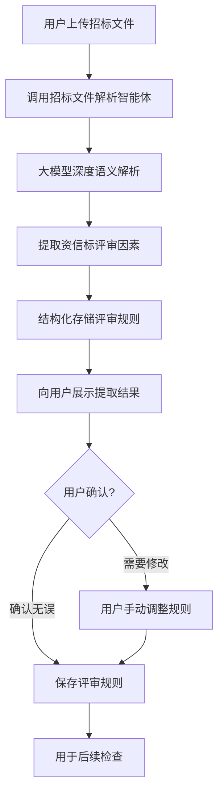
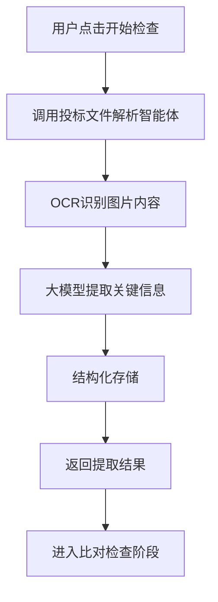
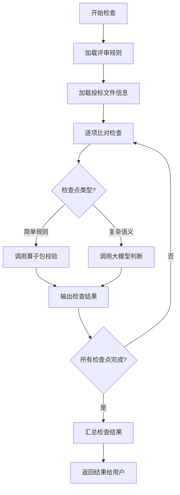

# PRD-1.2: 资信标检查模块


---

## 1. 模块概述

### 1.1 模块定位与价值

**定位**: 基于大语言模型的智能初步评审,自动检查投标文件资格部分的合规性,降低因资格问题导致的废标风险。

**核心价值**:
1. **降低废标率**: 资质标废标占比77%以上,本模块重点解决此痛点
2. **提升检查效率**: 人工检查耗时长且易疏漏,AI自动检查可节省80%时间
3. **精准定位问题**: 不仅告知"有问题",还精确定位到原文位置和具体条款
4. **智能理解招标要求**: 通过大模型语义理解,自动提取招标文件中的评审规则

### 1.2 目标用户与场景

**主要用户**: 投标企业的标书制作人员

**核心场景**:
- **场景1 - 小微企业基础检查**: 专业能力不足,需要系统帮助检查必要文件是否齐全、是否过期
- **场景2 - 大中企业合规检查**: 项目多、材料更新频繁,需要系统快速检查资质、业绩、人员等材料的符合性
- **场景3 - 疏漏防范**: 人工检查易疲劳出错,需要系统作为"第二道防线"

### 1.3 与其他模块的关系

**上游依赖**:
- **项目管理模块**: 提供项目上下文、招标文件、投标文件
- **招标文件解析智能体**: 提供招标文件的评审规则提取

**下游支撑**:
- **检查结果展示**: 向项目管理模块提供检查结果数据
- **多版本比对模块**: 提供资信标关键信息用于查重

### 1.4 成功指标

**阶段一目标**:
- [ ] 实现不少于10个资信标检查点
- [ ] 检查准确率 ≥ 90%
- [ ] 单份标书检查时间 < 5分钟

---

## 2. 需求分析

### 2.1 用户调研摘要

**用户痛点**:
> "有一次营业执照刚过期3天,我们没注意到,结果废标了,损失了20多万的投入。"  
> —— 小型建筑企业标书制作人员

> "我们公司同时有10多个项目,每个项目的资质要求都不一样,人工对比太费时间,而且容易出错。"  
> —— 大型建筑企业项目经理


### 2.3 需求优先级矩阵

| 需求 | 用户价值 | 实现难度 | 优先级 | 阶段 |
|------|----------|----------|--------|------|
| 营业执照有效期检查 | 极高 | 低 | P0 | 阶段一 |
| 资质等级检查 | 极高 | 中 | P0 | 阶段一 |
| 投标保证金检查 | 高 | 低 | P0 | 阶段一 |
| 报价唯一性检查 | 高 | 低 | P0 | 阶段一 |
| 业绩要求检查 | 高 | 高 | P0 | 阶段一 |
| 人员资质检查 | 高 | 中 | P0 | 阶段一 |
| 安全许可证检查 | 高 | 低 | P0 | 阶段一 |
| 工期符合性检查 | 中高 | 中 | P0 | 阶段一 |
| 质量标准符合性检查 | 中高 | 中 | P0 | 阶段一 |
| 盖章签字完整性检查 | 中 | 中 | P0 | 阶段一 |
| 授权书检查 | 中 | 低 | P1 | 阶段一 |
| 开标一览表检查 | 中 | 低 | P1 | 阶段一 |
| 投标函检查 | 中 | 低 | P1 | 阶段一 |
| 信誉要求检查 | 中 | 中 | P1 | 阶段二 |
| 不良信用记录查询 | 中 | 高 | P1 | 阶段二 |
| 商务响应情况检查 | 中 | 中 | P1 | 阶段二 |
| 货物类项目特定检查点 | 中 | 中 | P2 | 阶段三 |
| 服务类项目特定检查点 | 中 | 中 | P2 | 阶段三 |

---

## 3. 功能设计

### 3.1 功能清单

| 功能模块 | 功能点 | 描述 | 优先级 | 验收标准 |
|----------|--------|------|--------|----------|
| **招标文件解析** | 自动提取评审规则 | 通过大模型解析招标文件,提取资信标评审因素 | P0 | 提取准确率≥85% |
| | 评审规则结构化存储 | 将评审规则存储为结构化数据 | P0 | 支持后续调用 |
| | 评审规则展示与确认 | 向用户展示提取的评审规则,允许修改 | P1 | 用户可编辑规则 |
| **投标文件解析** | 提取投标方响应内容 | 解析投标文件,提取资信标关键信息 | P0 | 提取准确率≥85% |
| | 关键信息结构化 | 提取企业名称、证照信息、业绩、人员等 | P0 | 覆盖10+检查点所需信息 |
| **智能评审** | 自动比对与检查 | 将投标内容与招标要求比对,输出结果 | P0 | 检查准确率≥90% |
| | 问题定位 | 定位问题到具体页码、段落、原文 | P0 | 100%的问题都有定位 |
| | 原因说明 | 说明为何判定为问题 | P0 | 100%的问题都有原因 |
| | 建议提供 | 提供修复建议 | P1 | 覆盖主要问题类型 |
| **检查点实现** | 营业执照检查 | 检查有效期、名称一致性 | P0 | 准确率≥95% |
| | 资质证书检查 | 检查有效期、等级、名称一致性 | P0 | 准确率≥95% |
| | 安全许可证检查 | 检查有效期、名称一致性 | P0 | 准确率≥95% |
| | 业绩要求检查 | 检查时间、金额、规模 | P0 | 准确率≥90% |
| | 人员资质检查 | 检查证书有效期、等级、社保 | P0 | 准确率≥90% |
| | 投标保证金检查 | 检查金额、形式 | P0 | 准确率≥95% |
| | 报价唯一性检查 | 检查是否有多个报价 | P0 | 准确率≥95% |
| | 工期检查 | 检查是否符合要求 | P0 | 准确率≥90% |
| | 质量标准检查 | 检查是否符合要求 | P0 | 准确率≥90% |
| | 盖章签字检查 | 检查完整性 | P0 | 准确率≥90% |
| **检查结果管理** | 结果汇总展示 | 显示检查项统计(通过/不通过) | P0 | 清晰展示整体情况 |
| | 问题列表 | 详细列出所有问题 | P0 | 支持按严重程度排序 |
| | 问题详情 | 展示问题位置、原因、建议 | P0 | 支持跳转到原文 |
| | 检查报告导出 | 导出PDF报告(预留) | P1 | 阶段二实现 |

---

### 3.2 核心功能详细设计

#### 3.2.1 功能:招标文件智能解析

**用户故事**:  
作为标书制作人员,我希望系统能自动理解招标文件中的评审规则,而不需要我手动配置每个检查项,这样可以节省时间并避免配置错误。

**前置条件**:  
- 用户已上传招标文件(PDF/Word格式)

**触发条件**:  
- 用户在项目中上传招标文件后,自动触发解析
- 或用户在检查配置页点击"重新解析招标文件"

**业务流程**:



**界面设计**:

```
┌──────────────────────────────────────────────────────────┐
│  招标文件解析结果                              [重新解析] │
├──────────────────────────────────────────────────────────┤
│  📄 已解析招标文件: XX市政道路改造工程招标文件.pdf      │
│  解析时间: 2026-02-03 10:40                              │
│                                                          │
│  提取到的资信标评审规则:                                 │
│  ┌────────────────────────────────────────────────────┐  │
│  │ ✓ 投标人名称                                       │  │
│  │   要求: 与营业执照、资质证书、安全生产许可证一致   │  │
│  │   来源: 招标文件 第二章 1.4.1项                    │  │
│  │   [编辑规则]                                       │  │
│  ├────────────────────────────────────────────────────┤  │
│  │ ✓ 营业执照                                         │  │
│  │   要求: 1. 存在                                    │  │
│  │        2. 有效期晚于投标截止日期                   │  │
│  │        3. 企业名称与投标人名称一致                 │  │
│  │   来源: 招标文件 第二章 1.4.2项                    │  │
│  │   [编辑规则]                                       │  │
│  ├────────────────────────────────────────────────────┤  │
│  │ ✓ 资质等级                                         │  │
│  │   要求: 具备有效的资质证书且资质等级≥市政公用工程  │  │
│  │        施工总承包贰级                              │  │
│  │   来源: 招标文件 第二章 1.4.1项                    │  │
│  │   [编辑规则]                                       │  │
│  ├────────────────────────────────────────────────────┤  │
│  │ ✓ 业绩要求                                         │  │
│  │   要求: 近3年(2023-2025年)完成过类似工程,         │  │
│  │        合同金额≥500万元                            │  │
│  │   来源: 招标文件 第二章 1.4.3项                    │  │
│  │   [编辑规则]                                       │  │
│  └────────────────────────────────────────────────────┘  │
│                                                          │
│  💡 共提取到12个评审规则,准确率预估:90%                 │
│  建议: 请仔细核对,如有遗漏或错误,请手动调整            │
│                                                          │
│                    [确认规则] [添加自定义规则]           │
└──────────────────────────────────────────────────────────┘
```

**提取的评审规则数据结构**:

```json
{
  "project_id": "proj_12345678",
  "tender_doc_file_id": "file_招标文件",
  "extraction_time": "2026-02-03 10:40",
  "rules": [
    {
      "rule_id": "rule_001",
      "check_point": "投标人名称",
      "requirements": [
        "与营业执照一致",
        "与资质证书一致",
        "与安全生产许可证一致"
      ],
      "source": "招标文件 第二章 1.4.1项",
      "source_page": 15,
      "is_mandatory": true,
      "user_confirmed": true
    },
    {
      "rule_id": "rule_002",
      "check_point": "营业执照",
      "requirements": [
        "营业执照存在",
        "有效期必须晚于2026-02-10(投标截止日期)",
        "企业名称与投标人名称一致"
      ],
      "source": "招标文件 第二章 1.4.2项",
      "source_page": 15,
      "is_mandatory": true,
      "user_confirmed": true
    }
  ]
}
```

**业务规则**:
1. **自动触发**: 上传招标文件后,自动触发解析,无需用户手动操作
2. **解析时间**: 通常10-30秒,复杂招标文件可能需要1-2分钟
3. **提取内容**:
   - 检查点名称
   - 具体要求(以列表形式)
   - 来源(章节、页码)
   - 是否为否决性条款
4. **用户确认**:
   - 提取后向用户展示结果,用户可修改或添加规则
   - 用户确认后,规则用于后续检查
5. **规则优先级**:
   - 否决性条款优先级最高
   - 用户手动添加的规则优先级高于自动提取
6. **重新解析**:
   - 用户可随时重新解析
   - 重新解析会覆盖之前的结果(需二次确认)

**异常处理**:
- **解析失败**: 提示"招标文件解析失败,请检查文件格式或手动配置检查规则"
- **提取结果为空**: 提示"未提取到评审规则,请手动添加",提供空白模板
- **文件格式不支持**: 提示"仅支持PDF、Word格式"

**验收标准**:
- Given 用户上传了标准格式的招标文件  
  When 解析完成  
  Then 提取准确率≥85%,至少提取到8个核心检查点
  
- Given 用户对提取结果不满意  
  When 用户点击"编辑规则"  
  Then 可以修改要求内容、添加新要求、删除错误要求
  
- Given 招标文件为扫描件(图片PDF)  
  When 解析时  
  Then 先OCR识别文字,再进行语义解析

---

#### 3.2.2 功能:投标文件智能解析

**用户故事**:  
作为系统,我需要从投标文件中自动提取企业名称、证照信息、业绩、人员等关键信息,以便与招标要求进行比对。

**前置条件**:  
- 用户已上传投标文件(资信标部分)

**触发条件**:  
- 用户点击"开始检查"时,先触发投标文件解析

**业务流程**:



**提取的关键信息**:

| 信息类型 | 提取内容 | 用途 |
|---------|---------|------|
| **企业基本信息** | 企业名称、统一社会信用代码 | 名称一致性检查 |
| **营业执照** | 企业名称、有效期、经营范围 | 有效期检查、名称一致性 |
| **资质证书** | 证书名称、等级、有效期、企业名称 | 资质等级检查、有效期检查 |
| **安全许可证** | 许可证号、有效期、企业名称 | 有效期检查、名称一致性 |
| **业绩证明** | 项目名称、合同金额、签订日期、竣工日期 | 业绩要求检查 |
| **人员信息** | 姓名、证书类型、证书等级、有效期、社保 | 人员资质检查 |
| **投标保证金** | 金额、形式(保函/转账) | 投标保证金检查 |
| **报价信息** | 投标总价 | 报价唯一性、限价检查 |
| **工期承诺** | 承诺工期(天数) | 工期符合性检查 |
| **质量标准** | 承诺质量标准 | 质量检查 |
| **盖章签字** | 法人签字、企业盖章位置 | 完整性检查 |

**数据结构示例**:

```json
{
  "version_id": "ver_12345678",
  "extraction_time": "2026-02-03 15:05",
  "extracted_info": {
    "enterprise": {
      "name": "XX建筑工程有限公司",
      "credit_code": "91XXXXXXXXXXXXXX",
      "source_page": 3
    },
    "business_license": {
      "enterprise_name": "XX建筑工程有限公司",
      "valid_until": "2027-05-20",
      "business_scope": "建筑工程施工...",
      "source_page": 5,
      "source_position": "第一章 资格证明文件"
    },
    "qualification_certificates": [
      {
        "cert_name": "建筑工程施工总承包",
        "cert_level": "贰级",
        "valid_until": "2026-12-31",
        "enterprise_name": "XX建筑工程有限公司",
        "source_page": 7
      }
    ],
    "safety_license": {
      "license_no": "(苏)JZ安许证字[2024]XXXXX号",
      "valid_until": "2027-03-15",
      "enterprise_name": "XX建筑工程有限公司",
      "source_page": 9
    },
    "performance": [
      {
        "project_name": "XX市道路改造工程",
        "contract_amount": 8500000,
        "contract_date": "2023-06-15",
        "completion_date": "2024-05-20",
        "source_page": 12
      }
    ],
    "personnel": [
      {
        "name": "张三",
        "role": "项目经理",
        "cert_type": "建造师",
        "cert_level": "一级",
        "cert_valid_until": "2027-09-30",
        "social_security": "已提供近6个月社保证明",
        "source_page": 15
      }
    ],
    "bid_bond": {
      "amount": 200000,
      "form": "银行保函",
      "source_page": 20
    },
    "bid_price": {
      "total_price": 12500000,
      "price_in_words": "壹仟贰佰伍拾万元整",
      "source_page": 25
    },
    "duration": {
      "promised_days": 180,
      "source_page": 28
    },
    "quality_standard": {
      "promised_standard": "合格",
      "source_page": 28
    },
    "seals_signatures": {
      "legal_rep_signature": true,
      "enterprise_seal": true,
      "pages_with_seal": [3, 5, 25, 28]
    }
  }
}
```

**业务规则**:
1. **自动提取**: 检查开始时自动触发,无需用户干预
2. **OCR+语义理解**: 
   - 先OCR识别图片中的文字(证照通常是图片)
   - 再通过大模型理解文本语义,提取关键信息
3. **位置记录**: 记录每个信息的来源页码和位置,便于定位问题
4. **容错机制**: 如果某些信息提取失败,不阻塞整体检查,标记为"未提取到"

**异常处理**:
- **图片模糊无法识别**: 标记为"OCR失败,请提供清晰图片"
- **信息缺失**: 标记为"未在投标文件中找到该信息"
- **格式异常**: 标记为"信息格式异常,无法识别"

**验收标准**:
- Given 投标文件包含营业执照图片  
  When 解析完成  
  Then 准确提取企业名称、有效期,准确率≥85%
  
- Given 投标文件包含业绩证明  
  When 解析完成  
  Then 准确提取项目名称、合同金额、日期,准确率≥80%

---

#### 3.2.3 功能:智能比对与检查

**用户故事**:  
作为系统,我需要将投标文件提取的信息与招标文件的要求进行比对,判断是否符合要求,并输出检查结果。

**前置条件**:  
- 招标文件解析完成,已获取评审规则
- 投标文件解析完成,已提取关键信息

**触发条件**:  
- 用户点击"开始检查"

**业务流程**:



**检查逻辑示例**:

**检查点1: 营业执照有效期检查**

```
输入:
- 招标要求: "有效期必须晚于投标截止日期(2026-02-10)"
- 投标文件: "营业执照有效期: 2027-05-20"

比对逻辑:
1. 提取投标截止日期: 2026-02-10
2. 提取营业执照有效期: 2027-05-20
3. 调用算子包: date_compare(2027-05-20, 2026-02-10)
4. 结果: 2027-05-20 > 2026-02-10 → 符合要求

输出:
{
  "check_point": "营业执照有效期",
  "result": "通过",
  "reason": "营业执照有效期(2027-05-20)晚于投标截止日期(2026-02-10)",
  "source_page": 5,
  "source_position": "第一章 资格证明文件"
}
```

**检查点2: 资质等级检查**

```
输入:
- 招标要求: "具备有效的资质证书且资质等级≥市政公用工程施工总承包贰级"
- 投标文件: "建筑工程施工总承包 贰级"

比对逻辑:
1. 提取招标要求的资质类型: "市政公用工程施工总承包"
2. 提取招标要求的等级: "贰级"
3. 提取投标文件的资质类型: "建筑工程施工总承包"
4. 提取投标文件的等级: "贰级"
5. 调用大模型判断: qualification_match("市政公用工程", "建筑工程")
6. 大模型返回: 不匹配,资质类型不符

输出:
{
  "check_point": "资质等级",
  "result": "不通过",
  "reason": "投标人提供的资质为'建筑工程施工总承包',不符合招标要求的'市政公用工程施工总承包'",
  "severity": "致命错误",
  "suggestion": "请提供符合要求的市政公用工程施工总承包资质证书",
  "source_page": 7,
  "source_position": "第一章 资格证明文件"
}
```

**检查点3: 业绩要求检查**

```
输入:
- 招标要求: "近3年(2023-2025年)完成过类似工程,合同金额≥500万元"
- 投标文件: 
  业绩1: "XX市道路改造工程, 850万元, 2023-06-15签订, 2024-05-20竣工"

比对逻辑:
1. 提取时间范围: 2023-01-01 ~ 2025-12-31
2. 提取金额要求: ≥500万元
3. 检查业绩1:
   - 合同签订日期: 2023-06-15 → 在范围内 ✓
   - 合同金额: 850万元 → ≥500万元 ✓
   - 是否竣工: 已竣工 ✓
4. 结果: 符合要求

输出:
{
  "check_point": "业绩要求",
  "result": "通过",
  "reason": "投标人提供的业绩'XX市道路改造工程'(合同金额850万元,2023年签订,已竣工)满足招标要求",
  "source_page": 12,
  "source_position": "第二章 业绩证明"
}
```

**调用大模型Tool Calling示例**:

```json
{
  "model": "claude-sonnet-4-20250514",
  "messages": [
    {
      "role": "user",
      "content": "请判断投标人的资质等级是否符合招标要求。\n招标要求: 市政公用工程施工总承包贰级及以上\n投标人资质: 建筑工程施工总承包贰级"
    }
  ],
  "tools": [
    {
      "name": "qualification_level_compare",
      "description": "比较两个资质等级的高低",
      "input_schema": {
        "type": "object",
        "properties": {
          "required_qual": {"type": "string"},
          "provided_qual": {"type": "string"}
        }
      }
    }
  ]
}
```

**大模型返回**:

```json
{
  "result": "不符合",
  "reason": "资质类型不匹配。招标要求'市政公用工程施工总承包',但投标人提供的是'建筑工程施工总承包',两者不是同一类型资质。",
  "severity": "致命错误"
}
```

**业务规则**:
1. **检查优先级**: 先检查否决性条款,再检查一般条款
2. **问题严重程度**:
   - 致命错误: 违反否决性条款,必须修复
   - 警告: 不符合一般要求,建议修复
   - 提示: 信息缺失或格式异常
3. **问题定位**: 所有问题都必须标注来源页码和位置
4. **检查缓存**: 检查结果持久化存储,避免重复检查

**异常处理**:
- **大模型调用失败**: 降级为规则引擎检查,或标记为"无法判断,请人工复核"
- **算子包调用失败**: 记录错误日志,标记为"检查失败"
- **投标文件信息缺失**: 标记为"未提供该信息"

**验收标准**:
- Given 营业执照有效期晚于投标截止日期  
  When 检查完成  
  Then 检查结果为"通过"
  
- Given 资质等级不符合要求  
  When 检查完成  
  Then 检查结果为"不通过",标注为"致命错误",提供修改建议
  
- Given 所有检查点都通过  
  When 检查完成  
  Then 整体结果为"通过",无问题列表

---

#### 3.2.4 功能:阶段一核心检查点实现

基于Charter中的评分点频次统计,阶段一优先实现以下10个核心检查点:

**CP-001: 投标人名称一致性检查**

| 属性 | 内容 |
|------|------|
| 检查点名称 | 投标人名称一致性检查 |
| 检查内容 | 投标人名称与营业执照、资质证书、安全生产许可证一致 |
| 检查方式 | 文本完全匹配(忽略空格、标点) |
| 输入 | 投标文件中的投标人名称、营业执照企业名称、资质证书企业名称、安全许可证企业名称 |
| 输出 | 通过/不通过 + 不一致的证照列表 |
| 业务规则 | 1. 名称必须完全一致<br>2. 忽略空格、全角半角差异<br>3. 不允许简称 |
| 异常情况 | 证照图片模糊无法识别 → 标记"无法识别,请提供清晰图片" |
| 优先级 | P0 |
| 准确率目标 | ≥95% |

**CP-002: 营业执照检查**

| 属性 | 内容 |
|------|------|
| 检查点名称 | 营业执照检查 |
| 检查内容 | 1. 营业执照存在<br>2. 有效期晚于投标截止日期<br>3. 企业名称与投标人名称一致 |
| 检查方式 | OCR识别 + 日期比较算子 + 文本匹配 |
| 输入 | 营业执照图片、投标截止日期、投标人名称 |
| 输出 | 通过/不通过 + 具体问题 |
| 业务规则 | 1. 有效期必须晚于投标截止日期至少1天<br>2. 长期有效视为符合要求 |
| 异常情况 | 图片模糊 → OCR失败<br>未提供营业执照 → 不通过 |
| 优先级 | P0 |
| 准确率目标 | ≥95% |

**CP-003: 资质等级检查**

| 属性 | 内容 |
|------|------|
| 检查点名称 | 资质等级检查 |
| 检查内容 | 1. 资质证书存在<br>2. 资质类型符合要求<br>3. 资质等级≥招标要求<br>4. 有效期晚于投标截止日期<br>5. 企业名称一致 |
| 检查方式 | OCR + 大模型语义判断 + 等级比较算子 |
| 输入 | 资质证书图片、招标要求的资质类型和等级、投标截止日期 |
| 输出 | 通过/不通过 + 具体问题 |
| 业务规则 | 1. 资质类型必须完全匹配或包含关系<br>2. 等级: 特级>壹级>贰级>叁级 |
| 异常情况 | 资质类型无法匹配 → 调用大模型判断相似度 |
| 优先级 | P0 |
| 准确率目标 | ≥90% |

**CP-004: 安全生产许可证检查**

| 属性 | 内容 |
|------|------|
| 检查点名称 | 安全生产许可证检查 |
| 检查内容 | 1. 安全生产许可证存在<br>2. 有效期晚于投标截止日期<br>3. 企业名称一致 |
| 检查方式 | OCR + 日期比较 + 文本匹配 |
| 输入 | 安全许可证图片、投标截止日期、投标人名称 |
| 输出 | 通过/不通过 + 具体问题 |
| 业务规则 | 同营业执照检查 |
| 异常情况 | 同营业执照检查 |
| 优先级 | P0 |
| 准确率目标 | ≥95% |

**CP-005: 投标保证金检查**

| 属性 | 内容 |
|------|------|
| 检查点名称 | 投标保证金检查 |
| 检查内容 | 投标保证金金额和形式符合招标文件要求 |
| 检查方式 | 文本提取 + 金额比较算子 |
| 输入 | 投标保证金金额、形式,招标文件要求的金额和形式 |
| 输出 | 通过/不通过 + 具体问题 |
| 业务规则 | 1. 金额必须完全一致<br>2. 形式: 银行保函/转账凭证/其他 |
| 异常情况 | 未找到保证金信息 → 不通过 |
| 优先级 | P0 |
| 准确率目标 | ≥95% |

**CP-006: 报价唯一性检查**

| 属性 | 内容 |
|------|------|
| 检查点名称 | 报价唯一性检查 |
| 检查内容 | 投标文件中只能有一个有效报价 |
| 检查方式 | 文本提取 + 数量统计 |
| 输入 | 投标文件全文 |
| 输出 | 通过/不通过 + 发现的报价数量 |
| 业务规则 | 1. 只允许有1个报价<br>2. 大写金额与小写金额必须一致 |
| 异常情况 | 发现多个报价 → 不通过,列出所有报价位置 |
| 优先级 | P0 |
| 准确率目标 | ≥95% |

**CP-007: 业绩要求检查**

| 属性 | 内容 |
|------|------|
| 检查点名称 | 业绩要求检查 |
| 检查内容 | 1. 业绩时间在招标要求的年限内<br>2. 业绩金额≥招标要求<br>3. 提供了合同关键信息(双方名称、金额、日期) |
| 检查方式 | 大模型提取 + 日期比较 + 金额比较 |
| 输入 | 业绩证明文件、招标要求的时间范围和金额 |
| 输出 | 通过/不通过 + 具体问题 |
| 业务规则 | 1. 合同签订日期或竣工日期在要求范围内<br>2. 合同金额≥要求金额 |
| 异常情况 | 业绩证明不完整 → 标记缺失信息 |
| 优先级 | P0 |
| 准确率目标 | ≥85% |

**CP-008: 人员资质检查**

| 属性 | 内容 |
|------|------|
| 检查点名称 | 人员资质检查 |
| 检查内容 | 1. 人员证书有效期晚于投标截止日期<br>2. 证书等级≥招标要求<br>3. 提供了社保证明 |
| 检查方式 | OCR + 等级比较 + 文本检索 |
| 输入 | 人员证书图片、社保证明、招标要求 |
| 输出 | 通过/不通过 + 具体问题 |
| 业务规则 | 1. 证书等级: 高级>中级>初级<br>2. 社保需近6个月连续缴纳 |
| 异常情况 | 证书图片模糊 → OCR失败 |
| 优先级 | P0 |
| 准确率目标 | ≥90% |

**CP-009: 工期符合性检查**

| 属性 | 内容 |
|------|------|
| 检查点名称 | 工期符合性检查 |
| 检查内容 | 投标函中承诺的工期符合招标文件要求 |
| 检查方式 | 文本提取 + 数值比较 |
| 输入 | 投标函中的工期承诺、招标文件要求的工期 |
| 输出 | 通过/不通过 + 具体问题 |
| 业务规则 | 1. 承诺工期≤要求工期<br>2. 单位统一(天/月) |
| 异常情况 | 未找到工期承诺 → 不通过 |
| 优先级 | P0 |
| 准确率目标 | ≥90% |

**CP-010: 盖章签字完整性检查**

| 属性 | 内容 |
|------|------|
| 检查点名称 | 盖章签字完整性检查 |
| 检查内容 | 按照招标文件要求完成盖章和签字 |
| 检查方式 | 图像识别(检测印章和签名) |
| 输入 | 投标文件PDF、招标文件要求的盖章签字位置 |
| 输出 | 通过/不通过 + 缺失位置列表 |
| 业务规则 | 1. 必须有法人签字<br>2. 必须有企业公章<br>3. 关键页面都需盖章(如:投标函、开标一览表) |
| 异常情况 | 电子签章 → 检测算法需适配 |
| 优先级 | P0 |
| 准确率目标 | ≥85% |

---

#### 3.2.5 功能:检查结果展示

**用户故事**:  
作为标书制作人员,我希望检查结果清晰地告诉我哪些地方有问题、问题在哪里、为什么是问题、怎么修复,而不是只给我一个"不通过"的结论。

**前置条件**:  
- 检查任务已完成

**触发条件**:  
- 检查完成后自动展示
- 或用户点击"查看检查结果"

**界面设计**:

**结果汇总页**:

```
┌──────────────────────────────────────────────────────────┐
│  资信标检查结果 - 初稿版                                 │
├──────────────────────────────────────────────────────────┤
│  检查时间: 2026-02-03 15:30                              │
│  检查状态: ⚠ 发现问题                                    │
│                                                          │
│  ┌────────────────────────────────────────────────────┐  │
│  │ 检查项汇总                                         │  │
│  │ ✓ 通过: 7项                                        │  │
│  │ ⚠ 有问题: 2项                                      │  │
│  │ ✗ 致命错误: 1项                                    │  │
│  │ ○ 未检查: 0项                                      │  │
│  └────────────────────────────────────────────────────┘  │
│                                                          │
│  ┌────────────────────────────────────────────────────┐  │
│  │ ✗ 致命错误 (必须修复,否则将导致废标)               │  │
│  ├────────────────────────────────────────────────────┤  │
│  │ • 资质等级不符合要求                               │  │
│  │   位置: 第7页 "第一章 资格证明文件"                │  │
│  │   问题: 投标人提供的资质为"建筑工程施工总承包",   │  │
│  │        不符合招标要求的"市政公用工程施工总承包"   │  │
│  │   建议: 请提供符合要求的市政公用工程施工总承包     │  │
│  │        资质证书                                    │  │
│  │   [查看详情] [定位原文]                            │  │
│  └────────────────────────────────────────────────────┘  │
│                                                          │
│  ┌────────────────────────────────────────────────────┐  │
│  │ ⚠ 警告 (建议修复)                                  │  │
│  ├────────────────────────────────────────────────────┤  │
│  │ • 业绩证明信息不完整                               │  │
│  │   位置: 第12页 "第二章 业绩证明"                   │  │
│  │   问题: 缺少竣工验收日期                           │  │
│  │   建议: 补充竣工验收日期证明材料                   │  │
│  │   [查看详情]                                       │  │
│  ├────────────────────────────────────────────────────┤  │
│  │ • 人员社保证明月份不足                             │  │
│  │   位置: 第18页 "第三章 拟派人员"                   │  │
│  │   问题: 仅提供了4个月社保,要求至少6个月            │  │
│  │   建议: 补充至少2个月的社保证明                    │  │
│  │   [查看详情]                                       │  │
│  └────────────────────────────────────────────────────┘  │
│                                                          │
│  ┌────────────────────────────────────────────────────┐  │
│  │ ✓ 通过的检查项 (7项)              [展开/收起]      │  │
│  └────────────────────────────────────────────────────┘  │
│                                                          │
│              [导出检查报告] [重新检查]                   │
└──────────────────────────────────────────────────────────┘
```

**问题详情页** (点击"查看详情"后):

```
┌──────────────────────────────────────────────────────────┐
│  ← 返回               资质等级检查 - 问题详情            │
├──────────────────────────────────────────────────────────┤
│  检查点: 资质等级检查                                    │
│  检查结果: ✗ 不通过(致命错误)                            │
│                                                          │
│  ┌────────────────────────────────────────────────────┐  │
│  │ 招标文件要求                                       │  │
│  │ 来源: 招标文件 第二章 1.4.1项 (第15页)            │  │
│  │                                                    │  │
│  │ "投标人须具备有效的市政公用工程施工总承包贰级     │  │
│  │  及以上资质..."                                   │  │
│  │                                                    │  │
│  │ 提取的要求:                                        │  │
│  │ • 资质类型: 市政公用工程施工总承包                 │  │
│  │ • 资质等级: 贰级及以上                             │  │
│  └────────────────────────────────────────────────────┘  │
│                                                          │
│  ┌────────────────────────────────────────────────────┐  │
│  │ 投标文件提供                                       │  │
│  │ 来源: 投标文件 第7页 "第一章 资格证明文件"        │  │
│  │                                                    │  │
│  │ [资质证书图片预览]                                 │  │
│  │                                                    │  │
│  │ 提取的信息:                                        │  │
│  │ • 资质类型: 建筑工程施工总承包                     │  │
│  │ • 资质等级: 贰级                                   │  │
│  │ • 有效期: 2026-12-31                               │  │
│  └────────────────────────────────────────────────────┘  │
│                                                          │
│  ┌────────────────────────────────────────────────────┐  │
│  │ 问题分析                                           │  │
│  │                                                    │  │
│  │ 资质类型不匹配:                                    │  │
│  │ • 要求: 市政公用工程施工总承包                     │  │
│  │ • 实际: 建筑工程施工总承包                         │  │
│  │                                                    │  │
│  │ 结论: 两者不是同一类型资质,不符合招标要求         │  │
│  └────────────────────────────────────────────────────┘  │
│                                                          │
│  ┌────────────────────────────────────────────────────┐  │
│  │ 修复建议                                           │  │
│  │                                                    │  │
│  │ 1. 请提供"市政公用工程施工总承包"资质证书         │  │
│  │ 2. 确认资质等级为贰级或以上                        │  │
│  │ 3. 确认资质有效期晚于2026-02-10(投标截止日期)     │  │
│  └────────────────────────────────────────────────────┘  │
│                                                          │
│              [定位到原文] [标记为已修复]                 │
└──────────────────────────────────────────────────────────┘
```

**业务规则**:
1. **问题分级显示**: 
   - 致命错误优先显示,折叠通过项
   - 按严重程度排序: 致命错误 > 警告 > 提示
2. **问题定位**:
   - 必须提供页码
   - 尽可能提供章节名称
   - 如果能定位到具体段落,提供文字预览
3. **原因说明**:
   - 用对比的方式说明(要求vs实际)
   - 用用户能理解的语言,避免技术术语
4. **修复建议**:
   - 提供具体的、可操作的建议
   - 如果有多种修复方案,列出所有选项

**异常处理**:
- **检查部分失败**: 标记为"部分检查失败,请重试",但仍展示已完成的检查结果
- **无法定位问题**: 至少提供页码范围

**验收标准**:
- Given 检查发现3个问题(1个致命、2个警告)  
  When 用户查看结果  
  Then 致命错误优先显示,所有问题都有位置、原因、建议
  
- Given 用户点击"定位到原文"  
  When 系统跳转  
  Then 跳转到PDF的对应页码,并高亮相关区域(如果支持)
  
- Given 用户点击"标记为已修复"  
  When 标记成功  
  Then 该问题从列表中移除,或标记为"已修复(待重新检查)"

---

## 4. 数据模型

### 4.1 核心实体

#### 4.1.1 评审规则(EvaluationRule)

| 字段名 | 类型 | 必填 | 说明 | 示例 |
|--------|------|------|------|------|
| rule_id | String | 是 | 规则ID | "rule_001" |
| project_id | String | 是 | 所属项目ID | "proj_12345678" |
| check_point | String | 是 | 检查点名称 | "营业执照有效期" |
| requirements | JSON | 是 | 具体要求(数组) | ["有效期晚于投标截止日期"] |
| source | String | 是 | 来源章节 | "招标文件 第二章 1.4.2项" |
| source_page | Integer | 否 | 来源页码 | 15 |
| is_mandatory | Boolean | 是 | 是否为否决性条款 | true |
| extraction_method | Enum | 是 | 提取方式 | "ai_extracted" |
| user_confirmed | Boolean | 是 | 用户是否已确认 | true |
| created_at | DateTime | 是 | 创建时间 | "2026-02-03 10:40" |

**提取方式枚举**:
- `ai_extracted`: AI自动提取
- `user_added`: 用户手动添加
- `template`: 来自地区模板

#### 4.1.2 投标信息(BidInfo)

| 字段名 | 类型 | 必填 | 说明 | 示例 |
|--------|------|------|------|------|
| info_id | String | 是 | 信息ID | "info_12345678" |
| version_id | String | 是 | 所属版本ID | "ver_12345678" |
| info_type | Enum | 是 | 信息类型 | "business_license" |
| extracted_data | JSON | 是 | 提取的结构化数据 | {...} |
| source_page | Integer | 否 | 来源页码 | 5 |
| source_position | String | 否 | 来源位置描述 | "第一章 资格证明文件" |
| extraction_confidence | Float | 是 | 提取置信度(0-1) | 0.92 |
| extraction_method | Enum | 是 | 提取方式 | "ocr_plus_ai" |
| created_at | DateTime | 是 | 创建时间 | "2026-02-03 15:05" |

**信息类型枚举**:
- `enterprise_basic`: 企业基本信息
- `business_license`: 营业执照
- `qualification_cert`: 资质证书
- `safety_license`: 安全许可证
- `performance`: 业绩证明
- `personnel`: 人员信息
- `bid_bond`: 投标保证金
- `bid_price`: 投标报价
- `duration`: 工期承诺
- `quality`: 质量标准
- `seals_signatures`: 盖章签字

#### 4.1.3 检查结果(InspectionResult)

| 字段名 | 类型 | 必填 | 说明 | 示例 |
|--------|------|------|------|------|
| result_id | String | 是 | 结果ID | "res_12345678" |
| task_id | String | 是 | 所属检查任务ID | "task_12345678" |
| rule_id | String | 是 | 对应的评审规则ID | "rule_001" |
| check_point | String | 是 | 检查点名称 | "营业执照有效期" |
| result_status | Enum | 是 | 检查结果 | "passed" |
| severity | Enum | 否 | 严重程度 | "fatal" |
| reason | String | 否 | 判定原因 | "营业执照有效期..." |
| suggestion | String | 否 | 修复建议 | "请更换有效的营业执照" |
| source_page | Integer | 否 | 问题位置页码 | 5 |
| source_position | String | 否 | 问题位置描述 | "第一章 资格证明文件" |
| evidence | JSON | 否 | 证据数据 | {...} |
| is_fixed | Boolean | 是 | 用户是否标记为已修复 | false |
| created_at | DateTime | 是 | 创建时间 | "2026-02-03 15:30" |

**检查结果枚举**:
- `passed`: 通过
- `warning`: 警告(有问题但不致命)
- `failed`: 不通过(致命错误)
- `info`: 提示(信息缺失)
- `skipped`: 跳过(无法检查)

**严重程度枚举**:
- `fatal`: 致命错误(导致废标)
- `major`: 严重警告(建议修复)
- `minor`: 一般提示(可选修复)

---

## 5. 接口设计

### 5.1 API清单

| 接口名称 | 方法 | 路径 | 说明 |
|---------|------|------|------|
| 解析招标文件 | POST | /api/v1/projects/:id/parse-tender-doc | 解析招标文件,提取评审规则 |
| 获取评审规则 | GET | /api/v1/projects/:id/evaluation-rules | 获取项目的评审规则列表 |
| 更新评审规则 | PUT | /api/v1/evaluation-rules/:id | 用户修改评审规则 |
| 添加评审规则 | POST | /api/v1/projects/:id/evaluation-rules | 用户手动添加评审规则 |
| 解析投标文件 | POST | /api/v1/versions/:id/parse-bid-doc | 解析投标文件,提取关键信息 |
| 获取投标信息 | GET | /api/v1/versions/:id/bid-info | 获取版本的投标信息 |
| 启动资信标检查 | POST | /api/v1/versions/:id/inspect/qualification | 启动资信标检查 |
| 获取检查进度 | GET | /api/v1/inspection-tasks/:id/progress | 获取检查任务进度 |
| 获取检查结果 | GET | /api/v1/inspection-tasks/:id/results | 获取检查结果列表 |
| 获取检查结果详情 | GET | /api/v1/inspection-results/:id | 获取单个检查结果详情 |
| 标记问题已修复 | POST | /api/v1/inspection-results/:id/mark-fixed | 用户标记问题已修复 |

---

### 5.2 关键接口规格

#### 5.2.1 解析招标文件

**请求**:
```http
POST /api/v1/projects/:id/parse-tender-doc
Content-Type: application/json

{
  "file_id": "file_招标文件"
}
```

**响应**:
```json
{
  "code": 200,
  "message": "解析成功",
  "data": {
    "task_id": "parse_task_12345",
    "status": "processing",
    "estimated_time": 30
  }
}
```

**轮询获取解析结果**:
```http
GET /api/v1/parse-tasks/:task_id

响应:
{
  "code": 200,
  "message": "解析完成",
  "data": {
    "status": "completed",
    "rules": [
      {
        "rule_id": "rule_001",
        "check_point": "营业执照",
        "requirements": ["营业执照存在", "有效期晚于投标截止日期"],
        "source": "招标文件 第二章 1.4.2项",
        "source_page": 15,
        "is_mandatory": true
      }
    ],
    "extraction_accuracy": 0.9
  }
}
```

---

#### 5.2.2 启动资信标检查

**请求**:
```http
POST /api/v1/versions/:id/inspect/qualification
Content-Type: application/json

{
  "check_config": {
    "mode": "recommended",  // "recommended" | "fast" | "custom"
    "custom_rules": []  // 如果mode为custom,指定检查点
  }
}
```

**响应**:
```json
{
  "code": 200,
  "message": "检查任务已创建",
  "data": {
    "task_id": "task_12345678",
    "status": "running",
    "estimated_time": 300,  // 秒
    "check_points_count": 10
  }
}
```

---

#### 5.2.3 获取检查结果

**请求**:
```http
GET /api/v1/inspection-tasks/:task_id/results
```

**响应**:
```json
{
  "code": 200,
  "message": "成功",
  "data": {
    "task_id": "task_12345678",
    "status": "completed",
    "summary": {
      "total_checks": 10,
      "passed": 7,
      "warnings": 2,
      "failed": 1,
      "skipped": 0
    },
    "results": [
      {
        "result_id": "res_001",
        "check_point": "资质等级",
        "result_status": "failed",
        "severity": "fatal",
        "reason": "投标人提供的资质为'建筑工程施工总承包',不符合招标要求的'市政公用工程施工总承包'",
        "suggestion": "请提供符合要求的市政公用工程施工总承包资质证书",
        "source_page": 7,
        "source_position": "第一章 资格证明文件"
      },
      {
        "result_id": "res_002",
        "check_point": "营业执照有效期",
        "result_status": "passed",
        "reason": "营业执照有效期(2027-05-20)晚于投标截止日期(2026-02-10)",
        "source_page": 5
      }
    ]
  }
}
```
