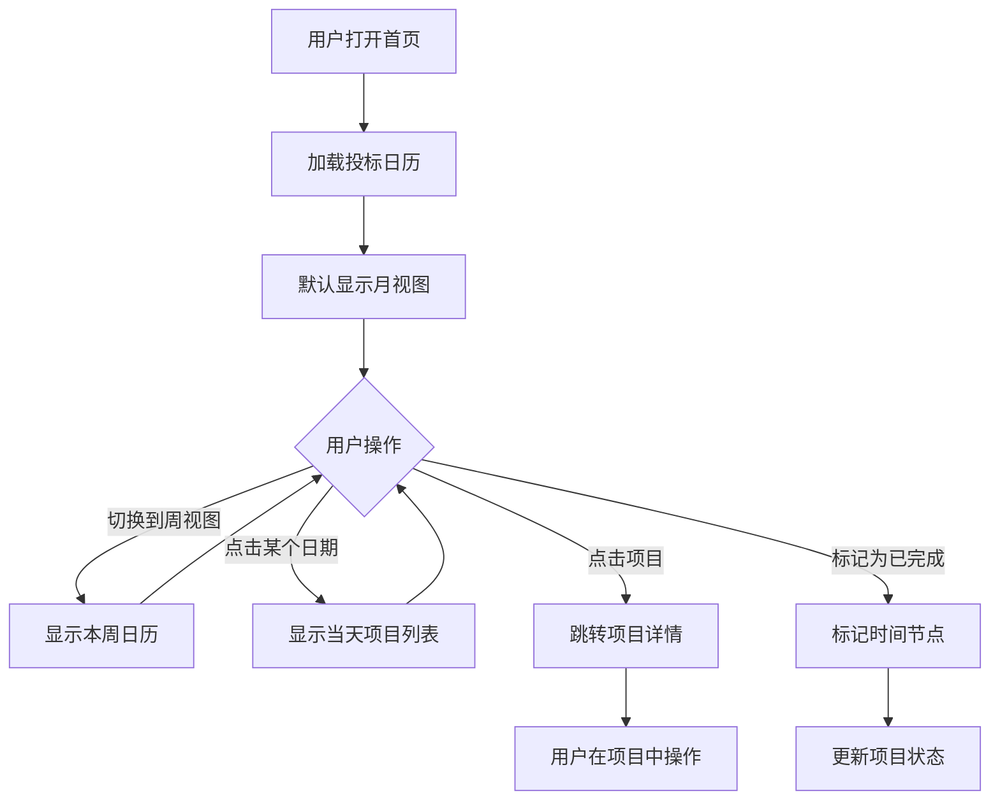
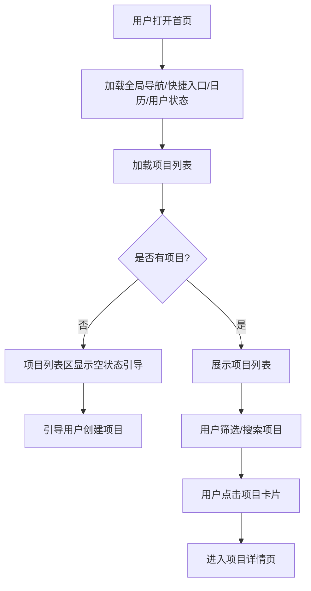
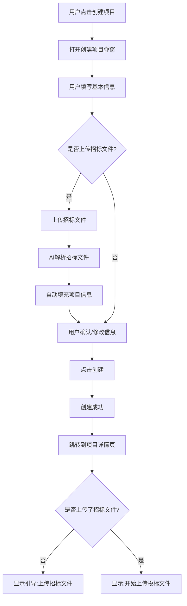
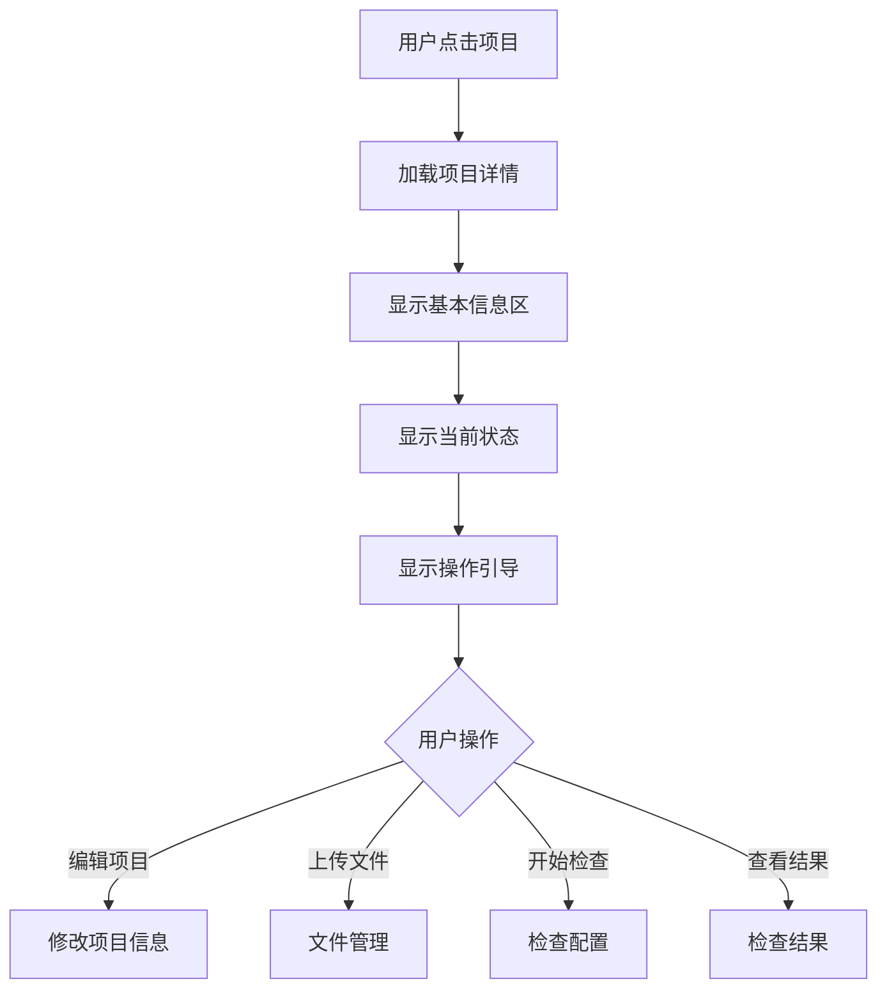
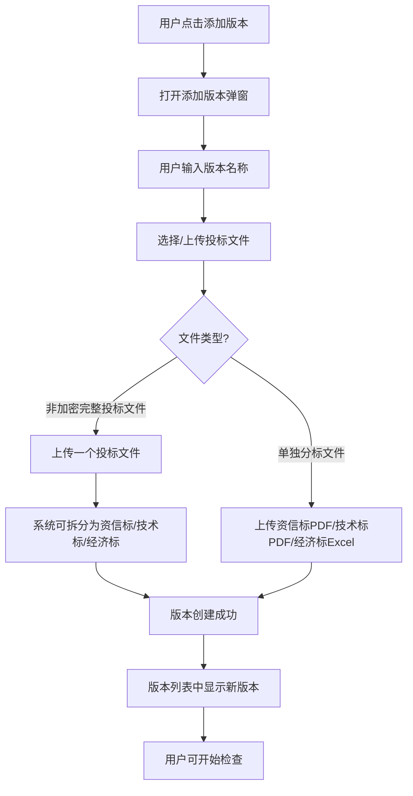
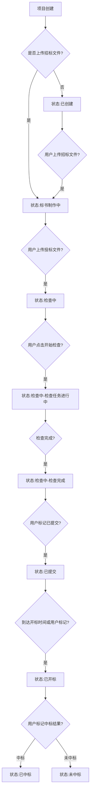
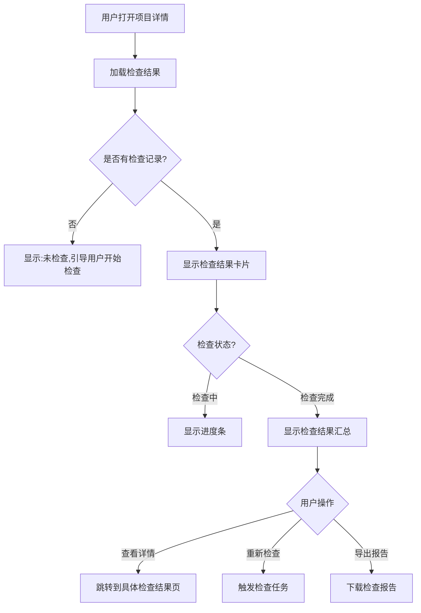
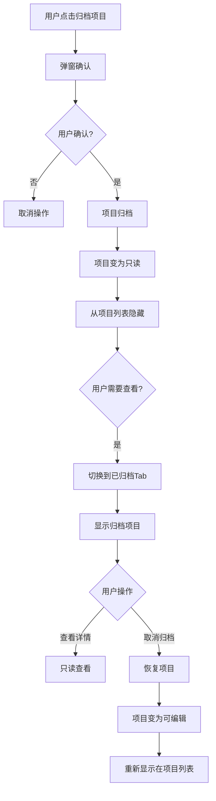

根据截图,我看到首页布局包含:
- 左侧:**产品主菜单**(导航栏)
- 中间上方:**功能入口**(快捷操作卡片)
- 中间下方:**项目列表**(核心工作区)
- 右侧:**投标日历**(时间节点提醒)

这个布局非常合理!现在让我开始编写PRD文档:

---

# PRD-1.1: 基础平台与项目管理

## 文档信息
- **PRD编号**: PRD-1.1
- **产品名称**: 标书检查系统 - 项目管理模块
- **文档版本**: V1.0
- **编制日期**: 2026年2月3日
- **编制人**: [产品经理]
- **所属阶段**: 阶段一

---

## 1. 模块概述

### 1.1 模块定位与价值

**定位**: 项目管理模块是标书检查系统的核心枢纽,提供以项目为中心的投标文件全生命周期管理能力。

**核心价值**:
1. **降低废标风险**: 通过项目级的文件组织和检查管理,确保投标文件的完整性和合规性
2. **提升工作效率**: 集中管理招标文件、投标文件、检查结果,避免信息分散
3. **时间节点把控**: 通过投标日历和状态流转,帮助用户避免错过关键时间点
4. **规避围标嫌疑**: 采用文件版本管理模式,弱化多单位概念,降低合规风险

### 1.2 目标用户与场景

**主要用户**: 投标企业的标书制作人员(包括小微企业和大中企业)

**核心场景**:
- **场景1 - 小微企业单项目管理**: 标书编制人员管理1-3个投标项目,需要简单清晰的项目状态跟踪
- **场景2 - 大中企业多项目管理**: 标书编制人员同时管理10-20个项目,需要高效的项目列表和日历提醒
- **场景3 - 文件版本对比**: 用户需要对比不同版本的投标文件,或参考竞争对手标书,进行查重和风险分析

### 1.3 与其他模块的关系

**上游依赖**:
- **企业空间**: 项目管理是企业空间的核心功能模块,依赖企业空间提供用户认证和数据隔离
- **企业素材库**: 项目创建时可从素材库快速调用企业资质证书等材料(后续版本)

**下游支撑**:
- **资信标检查模块**: 为检查提供项目上下文和招标文件
- **技术标检查模块**: 提供检查配置和文件管理能力
- **经济标检查模块**: 管理工程量清单和控制价文件
- **多版本比对模块**: 组织多个文件版本进行对比分析

**横向集成**:
- **AI编标**: 提供功能入口,实现引流
- **标讯**: 未来可从标讯一键创建项目(阶段二)

### 1.4 成功指标

**功能完整性指标**:
- [ ] 支持项目CRUD操作
- [ ] 支持招标文件、投标文件、控制价文件的上传和管理
- [ ] 支持项目状态自动流转(6个状态)
- [ ] 支持投标日历展示和时间节点提醒
- [ ] 支持检查结果聚合展示

**用户体验指标**:
- 项目列表加载时间 < 1秒(100个项目)
- 文件上传成功率 > 99%
- 用户满意度 ≥ 4.0/5.0

**业务指标**:
- 项目创建率 ≥ 80%(注册用户中创建项目的比例)
- 项目完成率 ≥ 60%(创建项目中标记为"已提交"或"已归档"的比例)
- 日历使用率 ≥ 40%(使用日历功能的用户比例)

---

## 2. 需求分析

### 2.1 用户痛点

**痛点1 - 项目状态不清晰**
> "我有时候不记得哪个项目检查过了,哪个还没检查,要一个个点开看,很浪费时间。"  
> —— 小型劳务公司标书制作人员

**解决方案**: 项目列表显示实时状态,支持状态筛选;项目卡片显示检查进度(如:"资信标✓ 技术标⚠ 经济标未检查")

**痛点2 - 忘记关键时间节点**
> "有一次因为忘记了投标截止时间,项目准备好了但没来得及提交,直接废标了,损失了10多万的投入。"  
> —— 个体投标人

**解决方案**: 投标日历+站内信提醒,提前3天提醒关键节点;支持用户自定义提醒时间

**痛点3 - 检查结果分散**
> "资信标检查报告在一个地方,技术标的又在另一个地方,我要汇总起来给领导看很麻烦。"  
> —— 中型建筑企业项目经理

**解决方案**: 卡片聚合模式,在项目详情页集中展示所有检查结果;支持一键导出完整检查报告

**期望功能**:
- "希望能看到历史项目的检查结果,方便复盘和学习" → 支持项目归档但保留查看权限
- "希望能快速找到某个时间段的项目" → 支持按时间筛选、搜索项目名称
- "希望系统能智能提醒我下一步该做什么" → 项目详情页提供操作引导(如:"未上传投标文件,请先上传")

### 2.2 需求优先级矩阵

| 需求 | 用户价值 | 实现难度 | 优先级 | 阶段 |
|------|----------|----------|--------|------|
| 项目CRUD | 极高 | 低 | P0 | 阶段一 |
| 招标文件上传与解析 | 极高 | 中 | P0 | 阶段一 |
| 投标文件管理(版本模式) | 极高 | 中 | P0 | 阶段一 |
| 项目状态自动流转 | 高 | 中 | P0 | 阶段一 |
| 检查结果聚合展示 | 高 | 低 | P0 | 阶段一 |
| 投标日历(月/周视图) | 中高 | 中 | P0 | 阶段一 |
| 站内信提醒 | 高 | 低 | P0 | 阶段一 |
| 项目归档与取消归档 | 中 | 低 | P1 | 阶段一 |
| 项目搜索与筛选 | 中 | 低 | P1 | 阶段一 |
| 控制价文件管理 | 中 | 低 | P1 | 阶段一 |
| 导出检查报告(预留入口) | 中 | 中 | P1 | 阶段一(入口),阶段二(实现) |
| 从标讯创建项目 | 中 | 高 | P2 | 阶段二 |
| 项目模板功能 | 低 | 中 | P2 | 阶段三 |
| 多人协作 | 低 | 高 | P3 | 暂不考虑 |

---

## 3. 功能设计

### 3.1 功能清单

| 功能模块 | 功能点 | 描述 | 优先级 | 验收标准 |
|----------|--------|------|--------|----------|
| **首页** | 快捷操作入口 | 创建项目、我的项目、帮助中心等快捷卡片 | P0 | 点击卡片跳转到对应页面 |
| | 项目列表 | 展示用户创建的所有项目,支持筛选和搜索 | P0 | 加载100个项目<1秒,支持按状态/时间筛选 |
| | 投标日历 | 月/周视图展示项目时间节点 | P0 | 支持月/周切换,点击日期显示当天项目 |
| | 产品主菜单 | 左侧导航,切换到其他产品功能 | P0 | 与企业空间其他产品联动 |
| **项目创建** | 手动创建 | 填写项目基本信息 | P0 | 必填项:项目名称、所属地区 |
| | 上传招标文件(可选) | 支持PDF/zf格式 | P0 | 上传后自动解析项目信息 |
| | 招标文件解析 | AI提取项目名称、时间节点等 | P0 | 准确率≥95% |
| **项目管理** | 项目基本信息编辑 | 修改项目名称等信息 | P0 | 修改后实时保存 |
| | 招标文件管理 | 上传、替换、下载招标文件 | P0 | 支持PDF/zf,单文件大小限制200MB |
| | 控制价文件管理 | 上传、替换、下载控制价文件(可选) | P1 | 支持Excel,单文件≤50MB |
| | 投标文件版本管理 | 添加、删除、重命名投标文件版本 | P0 | 支持多版本,每版本包含非加密文件，非加密文件可拆分为资信标、技术标、经济标，也支持单独上传单个资信标、技术标、经济标文件|
| | 项目状态自动流转 | 系统根据文件和检查情况自动更新状态 | P0 | 状态流转逻辑100%准确 |
| | 手动标记状态 | "已提交"、"已开标"、"已中标/未中标"需手动标记 | P0 | 提供明确的操作按钮 |
| **检查管理** | 检查配置(简化版) | 选择"推荐配置"或"快速检查" | P0 | 配置自动保存,下次沿用 |
| | 启动检查 | 点击"开始检查",触发检查任务 | P0 | 检查任务创建成功,进入检查中状态 |
| | 检查结果聚合展示 | 卡片聚合模式展示资信标、技术标、经济标检查结果 | P0 | 一屏展示所有结果,支持跳转详情 |
| | 导出检查报告(预留) | 功能入口,暂不实现 | P1 | 按钮显示,点击提示"功能开发中" |
| **投标日历** | 月视图 | 展示本月所有项目的时间节点 | P0 | 红点标记有节点的日期 |
| | 周视图 | 展示本周项目时间节点 | P0 | 支持左右切换周 |
| | 时间节点类型 | 投标截止、开标时间、用户自定义 | P0 | 支持3种类型节点 |
| | 点击日期 | 显示当天所有项目及其时间节点 | P0 | 弹窗或侧边栏展示项目列表 |
| | 标记为已完成 | 标记时间节点已处理 | P0 | 标记后自动推进项目状态 |
| **提醒通知** | 站内信提醒 | 提前3天提醒关键时间节点 | P0 | 提醒消息准确,包含项目名称和快捷操作链接 |
| | 提醒查看 | 查看历史提醒 | P1 | 提醒中心展示所有提醒 |
| **项目归档** | 手动归档 | 用户点击"归档项目" | P1 | 归档后项目只读,不可编辑 |
| | 取消归档 | 恢复已归档项目 | P1 | 取消后项目恢复可编辑状态 |
| | 归档项目查看 | 切换到"已归档"Tab查看 | P1 | 默认隐藏,切换后显示 |
| **其他** | 项目搜索 | 按项目名称搜索 | P1 | 支持模糊搜索 |
| | 项目筛选 | 按状态、时间范围筛选 | P1 | 筛选结果准确 |

---

### 3.2 核心功能详细设计

#### 3.2.1 功能:首页（含项目列表）

**用户故事**:  
作为标书制作人员,我想要在首页通过全局导航和快捷入口切换功能、查看投标日历与登录状态,并快速查看我的所有项目及其状态,以便了解每个项目的进展情况并快速进入需要处理的项目。

**前置条件**:  
- 用户已登录企业空间

**触发条件**:  
- 用户打开标书检查产品首页

**首页整体构成**:  
首页由以下区域组成: 
- 全局导航(左侧或顶部)
- 快捷入口(创建项目等高频操作)
- 项目列表(主区域,含空状态)
- 投标日历(右侧或并排区域,可带今日待办)
- 用户登录状态(右上角)

**全局导航**:
- **作用**: 在不同产品/模块间切换,标明当前所在模块。
- **内容**: 产品主菜单,至少包含「首页、AI编标、标书检查、标讯、项目管理、电子证照库、我的素材、企业信息」; 当前模块(首页)高亮或选中态。
- **交互**: 点击菜单项跳转至对应产品或模块; 支持收起/展开(若为侧边栏形态)。

**其他功能快捷入口**:
- **作用**: 在首页即可执行高频操作,无需进入二级页。
- **内容**: 卡片或按钮形式,包含「创建项目」（大卡片）「清标工具、素材市场、AI招标文件解析、模拟开标、交易智库、标桥百科」（小卡片）; 可与项目列表区同一行或上方独立一行。
- **交互**: 「创建项目」进入创建项目流程;「我的项目」可滚动至项目列表或保持当前列表筛选。

**投标日历(子功能)**:

**用户故事**:  
作为标书制作人员,我想要在日历上直观地看到所有项目的关键时间节点,并提前收到提醒,以避免错过投标截止时间或开标时间。

**前置条件**:  
- 用户已创建项目,且设置了时间节点(投标截止时间、开标时间)

**触发条件**:  
- 用户打开首页,日历默认显示
- 或点击右侧日历区域

**业务流程**:



**界面设计要求(可用于AI生成页面设计提示词)**:

- **位置**: 位于首页右侧或独立区块,与项目列表并排或上下布局。
- **月视图**:
  - 标题「投标日历」,右侧提供视图切换按钮「[月] [周]」。
  - 顶部显示当前年月(如「2026年2月」)及左右箭头用于切换月份。
  - 日历网格: 周一到周日表头,日期按周排列; 当前日期高亮或特殊标记(如⚫); 有关键时间节点的日期用图标标记(如🔴表示投标截止,🔵表示开标,🟡表示自定义提醒); 若某日有多个节点,可用数字标记(如🔴3表示3个投标截止)。
  - 底部图例: 说明各图标含义(🔴 有时间节点、⚫ 今天等)。
- **点击日期后的弹窗**:
  - 标题「X月X日的项目」,右上角关闭按钮。
  - 列表展示该日所有相关项目,每项包含: 项目名称、时间节点类型与具体时间(如「投标截止: 17:00」)、操作按钮「查看详情」「标记为已完成」。
- **周视图**:
  - 标题「投标日历」,视图切换「[月] [周]」,周切换按钮「← 第X周 →」。
  - 顶部显示一周日期(如「2/9 2/10 2/11...」)及对应星期(周日 周一 周二...)。
  - 日期下方展示该日的时间节点: 图标+时间+项目名称+节点类型(如「🔴 17:00 XX市政 (投标)」)。
  - 底部提示「点击可查看详情」。
- **今日待办**(可选,位于日历下方):
  - 标题「今日待办」。
  - 列表展示今天和未来3天内的时间节点,按时间顺序排列; 每项可点击进入对应项目详情。

**时间节点类型**:

| 节点类型 | 图标 | 颜色 | 来源 |
|---------|------|------|------|
| 投标截止 | 🔴 | 红色 | 项目创建时填写或AI提取 |
| 开标时间 | 🔵 | 蓝色 | 项目创建时填写或AI提取 |
| 自定义提醒 | 🟡 | 黄色 | 用户手动添加 |

**业务规则**:
1. **时间节点显示**:
   - 一个日期可能有多个项目的时间节点,用数字标记(如:🔴3表示有3个投标截止)
   - 点击日期,弹窗显示所有项目列表
2. **月/周视图切换**:
   - 默认显示月视图
   - 切换后,用户的选择会被记住(下次打开仍是上次的视图)
3. **时间节点颜色**:
   - 投标截止:红色(最重要)
   - 开标时间:蓝色(次重要)
   - 自定义提醒:黄色
4. **标记为已完成**:
   - 点击"标记为已完成"后:
     - 如果是"投标截止"节点 → 自动标记项目为"已提交"
     - 如果是"开标时间"节点 → 自动标记项目为"已开标"
     - 如果是"自定义提醒"节点 → 仅隐藏该提醒,不影响项目状态
5. **今日待办**(可选,位于日历下方):
   - 显示今天和未来3天内的时间节点
   - 按时间顺序排列

**站内信提醒规则**:

| 提醒时机 | 提醒内容 | 操作 |
|---------|---------|------|
| 投标截止前3天 | "项目[XX]将于3天后(2月10日 17:00)截止投标,请尽快完成检查" | [查看项目] [标记为已完成] |
| 投标截止前1天 | "项目[XX]将于明天(2月10日 17:00)截止投标,请确保已提交" | [查看项目] [标记为已完成] |
| 投标截止当天 | "项目[XX]今天17:00截止投标,请立即提交!" | [查看项目] [标记为已完成] |
| 开标时间前1天 | "项目[XX]将于明天(2月11日 09:00)开标" | [查看项目] |
| 开标时间当天 | "项目[XX]今天09:00开标,请关注开标结果" | [查看项目] |

**提醒发送逻辑**:
- 每天早上8:00统一发送当天的提醒
- 投标截止前3天、1天、当天各发送一次
- 用户标记"已完成"后,不再发送该节点的提醒

**异常处理**:
- **未设置时间节点**:日历上不显示该项目
- **时间节点已过**:日历上显示为灰色,标记"已过期"

**用户登录状态**:
- **作用**: 让用户明确当前登录身份与企业空间,并提供退出等操作。
- **内容**: 展示当前用户信息(头像、昵称或账号); 当前所在企业/空间名称(若有多企业切换); 下拉或点击展开菜单,内含「切换企业」「账号设置」「退出登录」等。
- **交互**: 点击头像或昵称展开菜单; 退出登录后跳转至登录页; 数据与权限按当前登录身份隔离。

**业务流程**:



**项目列表(主区域)**:
- **项目列表卡片内容**:
  - **项目名称**(点击进入详情)
  - **项目状态**:已创建、标书制作中、检查中、已提交、已开标、已中标/未中标
  - **关键时间节点**:显示最近的时间节点(投标截止或开标时间)
  - **检查进度**:资信标✓/⚠、技术标✓/⚠、经济标✓/⚠
  - **操作按钮**:[查看详情]
- **筛选与搜索**:
  - **状态筛选**:全部、进行中、已完成、已归档
  - **时间筛选**:近7天、近30天、自定义时间范围
  - **搜索**:按项目名称模糊搜索

**项目列表空状态**:
```
┌────────────────────────────────┐
│                                │
│        📋                       │
│                                │
│    还没有创建项目               │
│    创建项目开始您的标书检查之旅  │
│                                │
│      [+ 创建项目]               │
│                                │
└────────────────────────────────┘
```

##### 3.2.1.1 子功能:投标日历

**用户故事**:  
作为标书制作人员,我想要在日历上直观地看到所有项目的关键时间节点,并提前收到提醒,以避免错过投标截止时间或开标时间。

**前置条件**:  
- 用户已创建项目,且设置了时间节点(投标截止时间、开标时间)

**触发条件**:  
- 用户打开首页,日历默认显示
- 或点击右侧日历区域

**业务流程**:


**界面设计要求(可用于AI生成页面设计提示词)**:

**月视图**(位于首页右侧):
- **标题**: 「投标日历」, 右侧提供视图切换按钮「[月] [周]」。
- **月份导航**: 显示当前年月(如「2026年2月」), 左右箭头切换月份。
- **日历网格**: 7列(日一二三四五六), 显示当月所有日期; 今天用特殊样式标记(如边框或背景色); 有时间节点的日期用图标标记(如🔴), 多个节点可用数字叠加(如🔴3)。
- **图例**: 底部说明图标含义,如「🔴 有时间节点」「⚫ 今天」。
- **交互**: 点击某日期后,弹窗或侧边栏显示该日期的项目列表,包含项目名称、时间节点类型(投标截止/开标时间)、具体时间、操作按钮「查看详情」「标记为已完成」。

**周视图**:
- **标题**: 「投标日历」, 视图切换按钮「[月] [周]」, 周导航「← 第7周 →」。
- **周网格**: 7列显示一周日期(如「2/9 周日」「2/10 周一」等), 每列下方展示该日的时间节点,以图标+时间+项目名称+节点类型的形式展示(如「🔴 17:00 XX市政 (投标)」)。
- **交互**: 点击某日或项目可查看详情或跳转项目详情页。

**时间节点类型**:

| 节点类型 | 图标 | 颜色 | 来源 |
|---------|------|------|------|
| 投标截止 | 🔴 | 红色 | 项目创建时填写或AI提取 |
| 开标时间 | 🔵 | 蓝色 | 项目创建时填写或AI提取 |
| 自定义提醒 | 🟡 | 黄色 | 用户手动添加 |

**业务规则**:
1. **时间节点显示**:
   - 一个日期可能有多个项目的时间节点,用数字标记(如:🔴3表示有3个投标截止)
   - 点击日期,弹窗显示所有项目列表
2. **月/周视图切换**:
   - 默认显示月视图
   - 切换后,用户的选择会被记住(下次打开仍是上次的视图)
3. **时间节点颜色**:
   - 投标截止:红色(最重要)
   - 开标时间:蓝色(次重要)
   - 自定义提醒:黄色
4. **标记为已完成**:
   - 点击"标记为已完成"后:
     - 如果是"投标截止"节点 → 自动标记项目为"已提交"
     - 如果是"开标时间"节点 → 自动标记项目为"已开标"
     - 如果是"自定义提醒"节点 → 仅隐藏该提醒,不影响项目状态
5. **今日待办**(可选,位于日历下方):
   - 显示今天和未来3天内的时间节点
   - 按时间顺序排列

**站内信提醒规则**:

| 提醒时机 | 提醒内容 | 操作 |
|---------|---------|------|
| 投标截止前3天 | "项目[XX]将于3天后(2月10日 17:00)截止投标,请尽快完成检查" | [查看项目] [标记为已完成] |
| 投标截止前1天 | "项目[XX]将于明天(2月10日 17:00)截止投标,请确保已提交" | [查看项目] [标记为已完成] |
| 投标截止当天 | "项目[XX]今天17:00截止投标,请立即提交!" | [查看项目] [标记为已完成] |
| 开标时间前1天 | "项目[XX]将于明天(2月11日 09:00)开标" | [查看项目] |
| 开标时间当天 | "项目[XX]今天09:00开标,请关注开标结果" | [查看项目] |

**提醒发送逻辑**:
- 每天早上8:00统一发送当天的提醒
- 投标截止前3天、1天、当天各发送一次
- 用户标记"已完成"后,不再发送该节点的提醒

**异常处理**:
- **未设置时间节点**:日历上不显示该项目
- **时间节点已过**:日历上显示为灰色,标记"已过期"

**验收标准**:
- Given 用户有2个项目,投标截止时间都是2月10日  
  When 用户查看日历  
  Then 2月10日显示🔴2
  
- Given 用户点击2月10日  
  When 弹窗显示  
  Then 列出2个项目及其投标截止时间
  
- Given 距离投标截止还有3天  
  When 每天早上8:00  
  Then 发送站内信提醒"项目[XX]将于3天后截止投标"
  
- Given 用户点击"标记为已完成"(投标截止节点)  
  When 确认操作  
  Then 项目状态自动更新为"已提交",不再发送该节点的提醒

**业务规则**:
1. **全局**: 首页各区域(导航、快捷入口、日历、用户状态、项目列表)随页面加载同时展示; 未登录用户访问首页时跳转登录页。
2. **项目列表**: 按"最近更新时间"倒序排列(最新的在最上面); 默认显示"进行中"的项目(状态为: 已创建、标书制作中、检查中、已提交、已开标); "已归档"的项目默认隐藏,需切换Tab才能查看; 每页显示20个项目,支持滚动加载更多; 数据隔离:用户只能看到自己创建的项目。
3. **投标日历**: 日历数据与当前用户项目数据一致,仅展示本人项目的关键日期; 默认显示月视图; 支持月/周视图切换; 点击日期可查看该日所有相关项目; 支持标记时间节点为已完成并自动更新项目状态; 站内信提醒规则见上方"投标日历(子功能)"部分。

**异常处理**:
- **网络异常**:显示"加载失败,请刷新重试"
- **数据为空**:显示空状态引导
- **加载超时**(>5秒):显示"加载中,请稍候..."并继续等待

**验收标准**:
- **全局导航**: Given 用户已登录 When 用户打开首页 Then 页面展示产品主菜单且「标书检查」为当前选中/高亮; 点击其他菜单项可跳转至对应模块。
- **快捷入口**: Given 用户打开首页 Then 展示「创建项目」「我的项目」「帮助中心」等快捷入口; 点击「创建项目」进入创建项目流程。
- **投标日历**: Given 用户有项目且存在投标截止或开标日 When 用户打开首页 Then 日历上展示当月视图且关键日期有标记; 今日待办(若有)可点击进入对应项目; Given 用户有2个项目,投标截止时间都是2月10日 When 用户查看日历 Then 2月10日显示🔴2; Given 用户点击2月10日 When 弹窗显示 Then 列出2个项目及其投标截止时间; Given 距离投标截止还有3天 When 每天早上8:00 Then 发送站内信提醒"项目[XX]将于3天后截止投标"; Given 用户点击"标记为已完成"(投标截止节点) When 确认操作 Then 项目状态自动更新为"已提交",不再发送该节点的提醒。
- **用户登录状态**: Given 用户已登录 When 用户打开首页 Then 右上角(或导航区)展示当前用户头像/昵称及企业空间信息; 点击可展开菜单并支持退出登录。
- **项目列表**: Given 用户已创建10个项目 When 用户打开首页 Then 项目列表显示10个项目,按更新时间倒序排列。
- Given 用户已创建100个项目 When 用户打开首页 Then 项目列表加载时间<1秒。
- Given 用户筛选"检查中"状态 When 用户点击状态筛选 Then 只显示状态为"检查中"的项目。
- Given 用户搜索"项目A" When 用户在搜索框输入"项目A" Then 只显示名称包含"项目A"的项目。
- **空状态**: Given 用户已登录但未创建任何项目 When 用户打开首页 Then 项目列表区显示空状态引导及「+ 创建项目」按钮。

---

#### 3.2.2 功能:创建项目

**用户故事**:  
作为标书制作人员,我想要快速创建一个投标项目并上传招标文件,以便系统帮我自动提取项目信息和检查规则,减少手动填写的工作量。

**前置条件**:  
- 用户已登录企业空间

**触发条件**:  
- 用户点击首页"创建项目"按钮
- 或点击项目列表右上角"+ 新建项目"按钮

**业务流程**:



**界面设计**:

**步骤1:创建项目弹窗**

```
┌────────────────────────────────────────┐
│  创建项目                        [X]   │
├────────────────────────────────────────┤
│                                        │
│  项目名称 *                            │
│  ┌──────────────────────────────────┐ │
│  │ 请输入项目名称                    │ │
│  └──────────────────────────────────┘ │
│                                        │
│  所属地区 *                            │
│  ┌──────────────────────────────────┐ │
│  │ 请选择 ▼                          │ │
│  └──────────────────────────────────┘ │
│  (江苏、安徽、山东...)                 │
│                                        │
│  招标文件 (推荐上传,可自动提取信息)    │
│  ┌──────────────────────────────────┐ │
│  │ 📎 点击上传或拖拽文件到此处        │ │
│  │    支持PDF、zf格式,≤200MB      │ │
│  └──────────────────────────────────┘ │
│                                        │
│  投标截止时间                          │
│  ┌──────────────────────────────────┐ │
│  │ 选择日期和时间 📅                 │ │
│  └──────────────────────────────────┘ │
│                                        │
│  开标时间                              │
│  ┌──────────────────────────────────┐ │
│  │ 选择日期和时间 📅                 │ │
│  └──────────────────────────────────┘ │
│                                        │
│              [取消]  [创建项目]         │
└────────────────────────────────────────┘
```

**步骤2:如果上传了招标文件,AI解析中**

```
┌────────────────────────────────────────┐
│  创建项目                              │
├────────────────────────────────────────┤
│                                        │
│        🔄 正在解析招标文件...          │
│                                        │
│  AI正在提取项目信息,请稍候             │
│  • 项目名称                            │
│  • 投标截止时间                        │
│  • 开标时间                            │
│  • 评标规则                            │
│                                        │
│              预计需要10-30秒            │
└────────────────────────────────────────┘
```

**步骤3:解析完成,自动填充**

```
┌────────────────────────────────────────┐
│  创建项目                              │
├────────────────────────────────────────┤
│  ✓ 招标文件解析完成                    │
│                                        │
│  项目名称 *                            │
│  ┌──────────────────────────────────┐ │
│  │ XX市政道路改造工程              │ │ (AI提取)
│  └──────────────────────────────────┘ │
│                                        │
│  所属地区 *                            │
│  ┌──────────────────────────────────┐ │
│  │ 江苏 ▼                            │ │ (AI提取)
│  └──────────────────────────────────┘ │
│                                        │
│  招标文件                              │
│  ✓ XX招标文件.pdf (已上传)             │
│                                        │
│  投标截止时间                          │
│  ┌──────────────────────────────────┐ │
│  │ 2026-02-10 17:00                 │ │ (AI提取)
│  └──────────────────────────────────┘ │
│                                        │
│  开标时间                              │
│  ┌──────────────────────────────────┐ │
│  │ 2026-02-11 09:00                 │ │ (AI提取)
│  └──────────────────────────────────┘ │
│                                        │
│  💡 以上信息已由AI自动提取,请核对      │
│                                        │
│              [取消]  [创建项目]         │
└────────────────────────────────────────┘
```

**业务规则**:
1. **必填项**:项目名称、所属地区
2. **招标文件**:
   - 可选项,但强烈推荐上传
   - 支持格式:PDF、zf
   - 文件大小:≤200MB
   - 如果上传,自动触发AI解析
3. **AI解析**:
   - 解析内容:项目名称、所属地区、投标截止时间、开标时间
   - 解析时间:10-30秒
   - 解析失败时,提示用户手动填写
4. **时间节点**:
   - 投标截止时间、开标时间为可选项
   - 如果AI解析失败或未上传招标文件,用户可手动填写
   - 时间格式:YYYY-MM-DD HH:mm
5. **项目创建成功后**:
   - 项目状态:
     - 如果上传了招标文件 → "标书制作中"
     - 如果未上传招标文件 → "已创建"
   - 跳转到项目详情页
   - 显示操作引导

**异常处理**:
- **文件上传失败**:提示"上传失败,请检查网络后重试",允许重新上传
- **AI解析失败**:提示"招标文件解析失败,请手动填写项目信息",字段置空,用户手动填写
- **AI解析超时**(>60秒):提示"解析超时,建议手动填写",字段置空
- **必填项未填**:点击"创建项目"时,标红提示"请填写项目名称"
- **文件格式错误**:提示"仅支持PDF、Word格式"

**验收标准**:
- Given 用户填写了项目名称和所属地区  
  When 用户点击"创建项目"(未上传招标文件)  
  Then 项目创建成功,状态为"已创建",跳转到项目详情页
  
- Given 用户上传了招标文件  
  When AI解析成功  
  Then 自动填充项目名称、投标截止时间、开标时间,准确率≥85%
  
- Given 用户上传了招标文件  
  When AI解析失败  
  Then 提示用户手动填写,不阻塞项目创建流程
  
- Given 用户未填写必填项  
  When 用户点击"创建项目"  
  Then 标红提示缺失字段,不允许提交

---

#### 3.2.3 功能:项目详情页 - 基本信息区

**用户故事**:  
作为标书制作人员,我想要在项目详情页清晰地看到项目的基本信息、当前状态和检查进度,以便快速了解项目情况并决定下一步操作。

**前置条件**:  
- 用户已创建项目

**触发条件**:  
- 用户从项目列表点击项目卡片

**业务流程**:



**界面设计**:

```
┌──────────────────────────────────────────────────────────┐
│  ← 返回项目列表        XX市政道路改造工程          [编辑] │
├──────────────────────────────────────────────────────────┤
│                                                          │
│  [项目基本信息]                                          │
│  ┌────────────────────────────────────────────────────┐  │
│  │ 项目名称: XX市政道路改造工程                       │  │
│  │ 所属地区: 江苏                                     │  │
│  │ 投标截止: 2026-02-10 17:00 (还剩7天) 🔴           │  │
│  │ 开标时间: 2026-02-11 09:00                         │  │
│  │ 创建时间: 2026-02-03 10:30                         │  │
│  │ 最近更新: 2026-02-03 14:20                         │  │
│  │                                                    │  │
│  │ 当前状态: [检查中]                                 │  │
│  │ 整体进度: ████████░░ 80%                          │  │
│  │                                                    │  │
│  │ 风险提示: ⚠ 技术标检查发现2个问题,建议处理       │  │
│  └────────────────────────────────────────────────────┘  │
│                                                          │
│  [操作引导]                                              │
│  💡 下一步建议: 处理技术标问题后重新检查               │
│  [查看问题详情] [开始修复]                               │
│                                                          │
└──────────────────────────────────────────────────────────┘
```

**基本信息字段**:
- **项目名称**:可编辑
- **所属地区**:可编辑
- **投标截止时间**:可编辑,同时显示倒计时(如:"还剩7天")
- **开标时间**:可编辑
- **创建时间**:系统自动记录,不可编辑
- **最近更新时间**:系统自动更新,不可编辑

**当前状态**:
- 状态标签:已创建、标书制作中、检查中、已提交、已开标、已中标/未中标
- 状态颜色:
  - 已创建:灰色
  - 标书制作中:蓝色
  - 检查中:橙色
  - 已提交:绿色
  - 已开标:紫色
  - 已中标:绿色加粗
  - 未中标:灰色

**整体进度**:
- 进度条:根据检查完成情况自动计算
- 计算逻辑:
  - 已上传招标文件:+20%
  - 已上传投标文件(资信标、技术标、经济标):+30%
  - 资信标检查完成:+15%
  - 技术标检查完成:+15%
  - 经济标检查完成:+15%
  - 所有检查通过:+5%

**风险提示**:
- 根据检查结果自动生成
- 示例:
  - "⚠ 资信标检查发现3个不符合项,可能导致废标"
  - "✓ 所有检查已通过,可以提交投标文件"
  - "⚠ 距离投标截止还有1天,请尽快完成检查"

**操作引导**:
- 根据当前状态和检查结果,智能提示用户下一步操作
- 示例:
  - 状态为"已创建" → "💡 下一步建议:上传招标文件,系统将自动提取项目信息"
  - 状态为"标书制作中" → "💡 下一步建议:上传投标文件,开始检查"
  - 状态为"检查中" → "💡 检查进行中,预计还需5分钟"
  - 有检查问题 → "💡 下一步建议:处理检查问题后重新检查"

**业务规则**:
1. **编辑权限**:
   - 状态为"已创建"、"标书制作中"、"检查中":可以编辑基本信息
   - 状态为"已提交"、"已开标"、"已中标/未中标":不可编辑基本信息(防止误操作)
   - 已归档项目:只读,不可编辑
2. **倒计时**:
   - 距离投标截止≤3天:红色高亮显示
   - 距离投标截止>3天:正常显示
   - 已过投标截止时间:显示"已截止"
3. **状态徽章**:
   - 实时更新,根据文件上传和检查情况自动流转

**异常处理**:
- **项目加载失败**:提示"项目加载失败,请刷新重试"
- **编辑保存失败**:提示"保存失败,请检查网络后重试",不关闭编辑弹窗

**验收标准**:
- Given 用户打开项目详情页  
  When 项目状态为"检查中"且有检查问题  
  Then 显示风险提示和操作引导
  
- Given 用户点击"编辑"按钮  
  When 项目状态为"已提交"  
  Then 提示"项目已提交,不可编辑基本信息"
  
- Given 距离投标截止还有2天  
  When 用户打开项目详情页  
  Then 投标截止时间红色高亮显示"还剩2天"

---

#### 3.2.4 功能:项目详情页 - 文件管理(版本模式)

**用户故事**:  
作为标书制作人员,我想要管理同一个项目的多个投标文件版本(可能是我方的不同版本,也可能是用于对比的参考文件),同时需要避免直接暴露"多单位"概念以规避围标嫌疑。

**前置条件**:  
- 用户已创建项目
- 项目已上传招标文件(可选,但如果没上传,部分检查功能不可用)

**触发条件**:  
- 用户在项目详情页点击"添加投标文件版本"

**文件类型**
- 非加密投标文件（可拆分为资信标、技术标、经济标文件）
- 单独的资信标、技术标、经济标文件

**业务流程**:



**版本默认名称生成规则**:

为了降低用户输入成本,系统提供智能默认名称:

| 版本序号 | 默认名称 | 备注建议 |
|---------|---------|---------|
| 第1个版本 | 用户文件名 + "-1" | 用户自定义 |
| 第2个版本 | 用户文件名 + "-2" | 用户自定义 |
| 第N个版本 | 用户文件名 + "-N" | 用户自定义 |

**用户可以**:
- 直接使用默认名称(点击"添加版本"时,如果版本名称为空,自动使用默认名称)
- 或自定义名称(如:"对比用-竞争对手A")

**版本操作菜单**(点击"操作▼"按钮):
- **重命名**:修改版本名称和备注
- **替换文件**:替换资信标/技术标/经济标中的某个文件
- **下载文件**:下载该版本的所有文件(打包为ZIP)
- **删除版本**:删除该版本(需二次确认)

**业务规则**:
1. **版本管理**:
   - 每个项目可以添加多个版本(建议≤10个,避免混乱)
   - 版本之间独立,互不影响
   - 每个版本必须包含:非加密投标文件、资信标、技术标、经济标(至少上传一个文件)
2. **版本命名**:
   - 如果用户未填写版本名称,系统在用户提供的文件名(取自上传文件)后增加版本序号,如"投标文件-1"、"投标文件-2"
   - 版本名称不可重复
3. **文件要求**:
   - 资信标:PDF格式,≤50MB
   - 技术标:PDF格式,≤100MB
   - 经济标:Excel格式(.xlsx/.xls),≤50MB
4. **替换文件**:
   - 替换文件后,该版本的检查结果自动清空
   - 需要重新触发检查
5. **删除版本**:
   - 删除版本时,提示"删除后无法恢复,确定删除吗?"
   - 如果该版本有检查结果,额外提示"该版本的检查结果也将被删除"

**弱化"多单位"概念的设计**:
- ✅ 使用"版本"而非"投标单位"
- ✅ 默认名称为"文件名-1"、"文件名-2"等(在用户文件名后加版本序号),而非"单位A"、"单位B"
- ✅ 备注引导用户描述"修改了什么",而非"哪个单位"
- ✅ 在多版本对比功能中,也使用"版本1 vs 版本2",而非"单位A vs 单位B"

**异常处理**:
- **文件上传失败**:提示"上传失败,请检查网络后重试",允许重新上传
- **文件格式错误**:提示"资信标和技术标仅支持PDF格式,经济标仅支持Excel格式"
- **文件过大**:提示"文件大小超过限制,请压缩后重试"
- **必传文件缺失**:点击"添加版本"时,如果三个文件未全部上传,提示"请上传资信标、技术标、经济标"

**界面设计要求(可用于AI生成页面设计提示词)**:

---

**一、文件管理区**

- **位置与层级**: 位于项目详情页中部,作为独立区块展示,区块标题为「文件管理」。
- **招标文件区块**:
  - 标题「招标文件」。
  - 有文件时: 展示文件名、文件大小、上传时间; 提供操作按钮「下载」「替换」「预览」; 已上传状态可用勾选或成功态图标区分。
  - 无文件时: 展示上传入口及格式/大小说明。
- **控制价文件区块**:
  - 标题「控制价文件」,并标注「(可选)」。
  - 上传入口文案: 点击上传控制价文件,并说明格式与大小限制(Excel格式,≤50MB)。
- **投标文件版本区块**:
  - 区块标题「投标文件版本」,右侧主操作按钮「+ 添加版本」。
  - 每个版本以卡片或列表项展示,包含: 版本名称(如「投标文件-1」)、可选备注文案、该版本下的文件列表(资信标/技术标/经济标 文件名与大小)、上传时间、检查状态摘要(资信标/技术标/经济标 的通过/有问题/未检查状态)。
  - 每版本提供「操作」下拉或菜单入口,内含: 重命名、替换文件、下载文件(打包ZIP)、删除版本。
  - 根据检查状态展示「查看检查结果」「开始检查」等按钮(未检查时仅「开始检查」)。
  - 区块底部或侧边提供一句提示: 可以添加多个版本用于对比分析或保存历史记录。
- **信息密度与顺序**: 自上而下为 招标文件 → 控制价文件 → 投标文件版本; 版本列表可纵向滚动,单个版本信息完整可扫读。

---

**二、添加版本弹窗**

- **触发**: 在文件管理区点击「+ 添加版本」后以模态弹窗形式打开。
- **弹窗标题**: 「添加投标文件版本」, 右上角关闭按钮。
- **表单项**:
  - **版本名称(可选)**: 单行输入,占位或说明为「自定义名称,不填则在文件名后加序号」; 下方辅助说明: 不填写则自动命名为「文件名-1」「文件名-2」等。
  - **备注(可选)**: 多行或单行输入,占位示例如「如:修改了资信标中的业绩证明」。
  - **上传投标文件**: 三个独立上传区域,均为必填:
    - 资信标: 标注必填(*), 说明「点击上传 PDF,≤50MB」;
    - 技术标: 标注必填(*), 说明「点击上传 PDF,≤100MB」;
    - 经济标: 标注必填(*), 说明「点击上传 Excel,≤50MB」。
- **底部操作**: 主按钮「添加版本」, 次按钮「取消」; 未传齐三个文件时「添加版本」可禁用或点击后提示必传项。
- **与需求一致**: 支持两种文件类型——非加密完整投标文件(上传一个文件后可拆分为三标)与单独分标文件(分别上传资信标/技术标/经济标); 弹窗布局与文案需兼容两种方式的说明或引导(若在同一弹窗中需区分入口或步骤)。


**验收标准**:
- Given 用户点击"添加版本"  
  When 用户未填写版本名称,直接上传了三个文件  
  Then 版本自动命名为在用户文件名后增加版本序号(如"投标文件-1"、"投标文件-2")
  
- Given 用户已添加了一个版本  
  When 用户点击"替换文件" → 替换技术标  
  Then 该版本的检查结果清空,提示用户重新检查
  
- Given 用户点击"删除版本"  
  When 该版本有检查结果  
  Then 提示"删除后无法恢复,该版本的检查结果也将被删除,确定删除吗?"
  
- Given 用户上传了PDF格式的经济标  
  When 点击"添加版本"  
  Then 提示"经济标仅支持Excel格式"

---

#### 3.2.5 功能:项目状态自动流转

**用户故事**:  
作为标书制作人员,我希望系统能够自动判断项目当前所处的阶段,而不需要我手动切换状态,这样可以节省时间并避免遗漏。

**前置条件**:  
- 项目已创建

**触发条件**:  
- 用户上传文件
- 检查任务完成
- 用户手动标记

**业务流程**:



**状态定义与流转规则**:

| 状态 | 定义 | 自动流转条件 | 手动操作 | 下一状态 |
|------|------|-------------|---------|---------|
| **已创建** | 项目刚创建,无任何文件 | - | 上传招标文件 | → 标书制作中 |
| **标书制作中** | 已上传招标文件,但未上传投标文件 | 用户上传招标文件 | 上传投标文件 | → 检查中 |
| **检查中** | 已上传投标文件,正在进行或已完成检查 | 用户上传投标文件 | 标记为已提交 | → 已提交 |
| **已提交** | 用户已提交投标文件(线下提交) | 用户点击"标记为已提交" | 标记为已开标 | → 已开标 |
| **已开标** | 项目已开标 | 到达开标时间或用户标记 | 标记中标结果 | → 已中标/未中标 |
| **已中标** | 项目中标 | 用户点击"标记为已中标" | 归档项目 | → (归档) |
| **未中标** | 项目未中标 | 用户点击"标记为未中标" | 归档项目 | → (归档) |

**详细流转逻辑**:

**1. 刚创建 → 标书制作中**
- 触发条件:用户上传招标文件
- 自动执行:无需用户手动操作

**2. 标书制作中 → 检查中**
- 触发条件:用户上传至少一个版本的投标文件(包含资信标、技术标、经济标)
- 自动执行:无需用户手动操作

**3. 检查中(内部子状态)**
- 检查中的细分:
  - 检查中 - 未检查:已上传投标文件,但未启动检查
  - 检查中 - 检查进行中:检查任务正在执行
  - 检查中 - 检查完成:所有检查任务完成
- 注:这些子状态对用户透明,统一显示为"检查中",但影响操作引导的内容

**4. 检查中 → 已提交**
- 触发条件:用户点击"标记为已提交"按钮
- 手动操作:需要用户确认
- 确认弹窗:"确认已在线下提交投标文件?标记后项目将进入只读状态,无法编辑。"

**5. 已提交 → 已开标**
- 触发条件1(自动):系统检测到当前时间≥开标时间
- 触发条件2(手动):用户点击"标记为已开标"按钮
- 优先级:手动>自动(用户可提前标记)

**6. 已开标 → 已中标/未中标**
- 触发条件:用户点击"标记为已中标"或"标记为未中标"按钮
- 手动操作:需要用户确认
- 确认弹窗:"确认项目中标结果?标记后建议归档项目。"

**界面设计**:

**状态标签显示**(位于项目基本信息区):

```
当前状态: [检查中] 
```

**手动操作按钮**(根据状态显示不同按钮):

```
状态为"检查中":
  [标记为已提交]

状态为"已提交":
  [标记为已开标]

状态为"已开标":
  [标记为已中标] [标记为未中标]
```

**状态流转日志**(可选,在项目详情页底部显示):

```
┌────────────────────────────────────────────────────────┐
│ 状态变更记录                                           │
├────────────────────────────────────────────────────────┤
│ 2026-02-03 10:30  项目创建 → 已创建                    │
│ 2026-02-03 10:35  上传招标文件 → 标书制作中           │
│ 2026-02-03 14:20  上传投标文件(初稿版) → 检查中       │
│ 2026-02-04 09:30  用户标记 → 已提交                   │
│ 2026-02-11 09:00  系统自动 → 已开标                   │
│ 2026-02-11 15:00  用户标记 → 已中标                   │
└────────────────────────────────────────────────────────┘
```

**业务规则**:
1. **状态流转方向**:单向流转,不允许回退(防止数据混乱)
   - 例外:管理员可以手动回退状态(技术后台功能)
2. **只读状态**:
   - 状态为"已提交"、"已开标"、"已中标"、"未中标"时,项目基本信息不可编辑
   - 但仍可查看检查结果、下载文件
3. **自动vs手动**:
   - 前3个状态(已创建→标书制作中→检查中):完全自动
   - 后4个状态(检查中→已提交→已开标→已中标/未中标):需要用户手动触发(因为系统无法判断用户是否真的提交了标书)
4. **状态持久化**:每次状态变更都记录日志,便于追溯

**异常处理**:
- **用户误操作**:
  - 如果用户不小心点击了"标记为已提交",提供"联系客服撤销"的提示(技术后台可回退)
- **开标时间未设置**:
  - 如果用户未填写开标时间,无法自动流转到"已开标",只能手动标记

**验收标准**:
- Given 用户创建项目但未上传招标文件  
  When 项目创建成功  
  Then 状态为"已创建"
  
- Given 用户上传了招标文件  
  When 文件上传成功  
  Then 状态自动流转为"标书制作中"
  
- Given 用户上传了投标文件  
  When 文件上传成功  
  Then 状态自动流转为"检查中"
  
- Given 用户点击"标记为已提交"  
  When 用户确认  
  Then 状态流转为"已提交",项目基本信息变为只读
  
- Given 当前时间≥开标时间  
  When 系统定时任务检测  
  Then 状态自动流转为"已开标"
  
- Given 用户点击"标记为已中标"  
  When 用户确认  
  Then 状态流转为"已中标",建议用户归档项目

---

#### 3.2.6 功能:检查结果聚合展示

**用户故事**:  
作为标书制作人员,我希望在项目详情页中集中查看资信标、技术标、经济标的所有检查结果,而不是分散在多个页面,这样可以快速了解整体情况并决定下一步操作。

**前置条件**:  
- 用户已上传投标文件
- 已启动检查(至少启动过一次)

**触发条件**:  
- 检查任务完成后,自动刷新结果
- 或用户在项目详情页滚动到检查结果区

**业务流程**:



**界面设计(卡片聚合模式)**:

```
┌──────────────────────────────────────────────────────────┐
│  [检查结果]                                              │
│  ┌────────────────────────────────────────────────────┐  │
│  │ 单文件检查 - 初稿版                                │  │
│  ├────────────────────────────────────────────────────┤  │
│  │ 📋 资信标检查                       [查看详情]     │  │
│  │    状态: ✓ 通过                                    │  │
│  │    检查项: 10/10项通过                             │  │
│  │    最近检查: 2026-02-03 15:30                      │  │
│  ├────────────────────────────────────────────────────┤  │
│  │ 📄 技术标检查                       [查看详情]     │  │
│  │    状态: ⚠ 有问题                                  │  │
│  │    暗标格式: 2个错误                               │  │
│  │    敏感信息: 发现公司名称1处                       │  │
│  │    最近检查: 2026-02-03 15:45                      │  │
│  │    [开始修复]                                      │  │
│  ├────────────────────────────────────────────────────┤  │
│  │ 💰 经济标检查                       [查看详情]     │  │
│  │    状态: ○ 未检查                                  │  │
│  │    [开始检查]                                      │  │
│  └────────────────────────────────────────────────────┘  │
│                                                          │
│  ┌────────────────────────────────────────────────────┐  │
│  │ 多版本对比                          [查看详情]     │  │
│  ├────────────────────────────────────────────────────┤  │
│  │ 已上传2个版本:初稿版、修订版                       │  │
│  │ [开始对比分析]                                     │  │
│  └────────────────────────────────────────────────────┘  │
│                                                          │
│  [导出完整检查报告]  (预留入口,暂未实现)              │
└──────────────────────────────────────────────────────────┘
```

**检查状态定义**:

| 状态 | 图标 | 颜色 | 说明 | 操作按钮 |
|------|------|------|------|---------|
| ✓ 通过 | ✓ | 绿色 | 所有检查项都通过,无问题 | [查看详情] |
| ⚠ 有问题 | ⚠ | 橙色 | 发现问题,但不是致命错误 | [查看详情] [开始修复] |
| ✗ 不通过 | ✗ | 红色 | 发现致命错误,可能导致废标 | [查看详情] [立即修复] |
| 🔄 检查中 | 🔄 | 蓝色 | 检查任务正在进行 | [查看进度] |
| ○ 未检查 | ○ | 灰色 | 尚未启动检查 | [开始检查] |

**检查结果汇总规则**:

**资信标检查**:
- 显示:检查项数量(如:10/10项通过)
- 如果有问题,列出问题类型(如:营业执照过期、业绩不符合要求)

**技术标检查**:
- 显示:暗标格式错误数量、敏感信息数量
- 如果有问题,列出主要问题(如:字体不符合要求、包含公司名称)

**经济标检查**:
- 显示:清单符合性、计算错误、限价检查结果
- 如果有问题,列出主要问题(如:超过控制价、清单项缺失)

**业务规则**:
1. **检查结果缓存**:
   - 检查结果持久化存储,用户关闭页面后再打开,仍能看到之前的结果
   - 如果用户替换了文件,检查结果自动清空,需要重新检查
2. **检查进度实时更新**:
   - 检查任务进行中时,每隔5秒刷新一次进度
   - 检查完成后,自动刷新结果
3. **多版本结果独立**:
   - 每个版本的检查结果独立存储
   - 版本切换时,显示对应版本的检查结果
4. **导出报告**(阶段一预留入口,阶段二实现):
   - 点击"导出完整检查报告"时,提示"功能开发中,敬请期待"

**异常处理**:
- **检查任务失败**:显示"检查失败,请重试",提供[重新检查]按钮
- **检查超时**(>10分钟):提示"检查超时,请联系客服",同时提供[重新检查]按钮

**验收标准**:
- Given 用户完成了资信标、技术标、经济标检查  
  When 用户打开项目详情页  
  Then 一屏内显示所有检查结果,无需滚动查看多个Tab
  
- Given 技术标检查发现2个暗标格式错误  
  When 用户查看检查结果  
  Then 显示"⚠ 有问题 - 暗标格式:2个错误",提供[开始修复]按钮
  
- Given 检查任务正在进行  
  When 用户打开项目详情页  
  Then 显示"🔄 检查中",进度条实时更新
  
- Given 用户替换了技术标文件  
  When 文件替换成功  
  Then 技术标检查结果清空,显示"○ 未检查"

---

#### 3.2.7 功能:项目归档

**用户故事**:  
作为标书制作人员,我希望能将已完成的项目归档,保持项目列表的整洁,同时仍能查看归档项目的检查结果用于复盘学习。

**前置条件**:  
- 项目状态为"已中标"或"未中标"

**触发条件**:  
- 用户点击"归档项目"按钮

**业务流程**:



**界面设计**:

**归档按钮**(位于项目详情页右上角):

```
┌──────────────────────────────────────────────────────────┐
│  ← 返回     XX市政道路改造工程      [编辑] [归档项目]   │
└──────────────────────────────────────────────────────────┘
```

**归档确认弹窗**:

```
┌────────────────────────────────────────┐
│  归档项目                        [X]   │
├────────────────────────────────────────┤
│                                        │
│  确认归档"XX市政道路改造工程"?         │
│                                        │
│  归档后:                               │
│  • 项目将从项目列表中隐藏              │
│  • 项目信息和检查结果变为只读          │
│  • 可以随时取消归档恢复项目            │
│                                        │
│              [取消]  [确认归档]         │
└────────────────────────────────────────┘
```

**已归档Tab**(位于项目列表顶部):

```
┌──────────────────────────────────────────────────────────┐
│  [进行中] [已归档]                                       │
├──────────────────────────────────────────────────────────┤
│  已归档的项目 (3个)                                      │
│  ┌────────────────────────────────────────────────────┐  │
│  │ 📦 XX市政道路改造工程                              │  │
│  │    归档时间: 2026-02-11 16:00                      │  │
│  │    结果: 已中标                                    │  │
│  │    [查看详情] [取消归档]                           │  │
│  └────────────────────────────────────────────────────┘  │
└──────────────────────────────────────────────────────────┘
```

**业务规则**:
1. **归档条件**:
   - 只有状态为"已中标"或"未中标"的项目才能归档
   - 其他状态的项目,归档按钮置灰,提示"请先标记项目中标结果"
2. **归档后变化**:
   - 项目从"进行中"列表隐藏
   - 项目信息变为只读,不可编辑
   - 检查结果仍可查看
   - 文件仍可下载
3. **取消归档**:
   - 点击"取消归档"后,项目恢复到归档前的状态
   - 项目重新显示在"进行中"列表
   - 项目信息变为可编辑(但状态仍保持"已中标/未中标")
4. **归档项目的显示**:
   - 默认隐藏,需切换到"已归档"Tab才能查看
   - 按归档时间倒序排列(最近归档的在最上面)

**异常处理**:
- **网络异常**:归档失败,提示"归档失败,请检查网络后重试"
- **误操作**:用户可随时取消归档

**验收标准**:
- Given 项目状态为"已中标"  
  When 用户点击"归档项目"并确认  
  Then 项目从"进行中"列表消失,在"已归档"Tab中显示
  
- Given 项目已归档  
  When 用户打开项目详情页  
  Then 项目信息为只读,不显示编辑按钮,但可查看检查结果和下载文件
  
- Given 项目已归档  
  When 用户点击"取消归档"  
  Then 项目恢复到"进行中"列表,项目信息变为可编辑
  
- Given 项目状态为"检查中"  
  When 用户尝试归档  
  Then 归档按钮置灰,提示"请先标记项目中标结果"

---

## 4. 数据模型

### 4.1 核心实体

#### 4.1.1 项目(Project)

| 字段名 | 类型 | 必填 | 说明 | 示例 |
|--------|------|------|------|------|
| id | String | 是 | 项目ID(UUID) | "proj_12345678" |
| name | String | 是 | 项目名称 | "XX市政道路改造工程" |
| region | String | 是 | 所属地区 | "江苏" |
| bid_deadline | DateTime | 否 | 投标截止时间 | "2026-02-10 17:00" |
| opening_time | DateTime | 否 | 开标时间 | "2026-02-11 09:00" |
| status | Enum | 是 | 项目状态 | "checking" |
| creator_id | String | 是 | 创建人ID | "user_12345" |
| created_at | DateTime | 是 | 创建时间 | "2026-02-03 10:30" |
| updated_at | DateTime | 是 | 最近更新时间 | "2026-02-03 14:20" |
| archived | Boolean | 是 | 是否归档 | false |
| archived_at | DateTime | 否 | 归档时间 | "2026-02-11 16:00" |

**状态枚举(status)**:
- `created`:已创建
- `preparing`:标书制作中
- `checking`:检查中
- `submitted`:已提交
- `opened`:已开标
- `won`:已中标
- `lost`:未中标

#### 4.1.2 文件(File)

| 字段名 | 类型 | 必填 | 说明 | 示例 |
|--------|------|------|------|------|
| id | String | 是 | 文件ID(UUID) | "file_12345678" |
| project_id | String | 是 | 所属项目ID | "proj_12345678" |
| file_type | Enum | 是 | 文件类型 | "tender_doc" |
| file_name | String | 是 | 文件名 | "XX招标文件.pdf" |
| file_size | Integer | 是 | 文件大小(字节) | 12500000 |
| file_url | String | 是 | 文件存储路径 | "https://oss.../file.pdf" |
| uploaded_at | DateTime | 是 | 上传时间 | "2026-02-03 10:35" |

**文件类型枚举(file_type)**:
- `tender_doc`:招标文件
- `control_price`:控制价文件
- `qualification`:资信标
- `technical`:技术标
- `commercial`:经济标

#### 4.1.3 投标文件版本(BidVersion)

| 字段名 | 类型 | 必填 | 说明 | 示例 |
|--------|------|------|------|------|
| id | String | 是 | 版本ID(UUID) | "ver_12345678" |
| project_id | String | 是 | 所属项目ID | "proj_12345678" |
| version_name | String | 是 | 版本名称 | "初稿版" |
| version_note | String | 否 | 版本备注 | "第一次编写的版本" |
| qualification_file_id | String | 是 | 资信标文件ID | "file_11111" |
| technical_file_id | String | 是 | 技术标文件ID | "file_22222" |
| commercial_file_id | String | 是 | 经济标文件ID | "file_33333" |
| created_at | DateTime | 是 | 创建时间 | "2026-02-03 14:20" |

#### 4.1.4 检查任务(InspectionTask)

| 字段名 | 类型 | 必填 | 说明 | 示例 |
|--------|------|------|------|------|
| id | String | 是 | 任务ID(UUID) | "task_12345678" |
| project_id | String | 是 | 所属项目ID | "proj_12345678" |
| version_id | String | 是 | 所属版本ID | "ver_12345678" |
| inspection_type | Enum | 是 | 检查类型 | "qualification" |
| status | Enum | 是 | 检查状态 | "completed" |
| result | JSON | 否 | 检查结果 | {...} |
| started_at | DateTime | 是 | 开始时间 | "2026-02-03 15:00" |
| completed_at | DateTime | 否 | 完成时间 | "2026-02-03 15:30" |

**检查类型枚举(inspection_type)**:
- `qualification`:资信标检查
- `technical`:技术标检查
- `commercial`:经济标检查
- `multi_version`:多版本对比

**检查状态枚举(status)**:
- `pending`:待检查
- `running`:检查中
- `completed`:已完成
- `failed`:检查失败

#### 4.1.5 时间节点(Timeline)

| 字段名 | 类型 | 必填 | 说明 | 示例 |
|--------|------|------|------|------|
| id | String | 是 | 节点ID(UUID) | "tl_12345678" |
| project_id | String | 是 | 所属项目ID | "proj_12345678" |
| node_type | Enum | 是 | 节点类型 | "bid_deadline" |
| node_time | DateTime | 是 | 节点时间 | "2026-02-10 17:00" |
| is_completed | Boolean | 是 | 是否已完成 | false |
| completed_at | DateTime | 否 | 完成时间 | null |

**节点类型枚举(node_type)**:
- `bid_deadline`:投标截止
- `opening_time`:开标时间
- `custom`:用户自定义

#### 4.1.6 提醒记录(Reminder)

| 字段名 | 类型 | 必填 | 说明 | 示例 |
|--------|------|------|------|------|
| id | String | 是 | 提醒ID(UUID) | "rem_12345678" |
| user_id | String | 是 | 用户ID | "user_12345" |
| project_id | String | 是 | 项目ID | "proj_12345678" |
| timeline_id | String | 是 | 时间节点ID | "tl_12345678" |
| remind_time | DateTime | 是 | 提醒时间 | "2026-02-07 08:00" |
| remind_content | String | 是 | 提醒内容 | "项目[XX]将于3天后截止投标..." |
| is_read | Boolean | 是 | 是否已读 | false |
| created_at | DateTime | 是 | 创建时间 | "2026-02-07 08