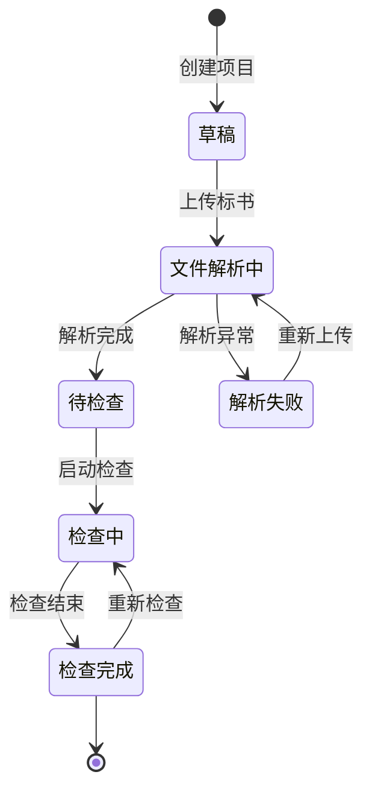

# PRD-1.1: 项目管理模块需求大纲

## 1. 模块概述
### 1.1 模块定位与价值
项目管理模块作为标书检查系统的**核心入口与工作流引擎**，承载了从项目创建、文件管理到结果查看的完整业务闭环。其核心价值在于：
- **统一管理**：集中管理用户的历史投标项目，提供便捷的检索和分类。
- **流程驱动**：串联"文件上传→自动检查→结果分析→风险修复"的业务流。
- **状态可视化**：清晰展示每个项目的检查进度与风险等级，降低用户认知负荷。
- **时间管理**：通过投标日历功能，帮助用户把控项目关键节点，避免延误。

### 1.2 目标用户与场景
- **小微企业投标人**：
  - 场景：快速创建项目 -> 上传标书 -> 查看结果 -> 付费 -> 导出报告。
  - 诉求：操作极简，无需复杂配置，快速出结果。
- **中大企业投标负责人**：
  - 场景：管理多个并行的投标项目，关注高风险项目，进行团队协作。
  - 诉求：高效的列表筛选与排序，风险等级直观可见，支持批量操作。

### 1.3 成功指标
- **创建转化率**：进入首页后成功创建项目的用户比例 > 80%。
- **日历渗透率**：使用投标日历功能的用户占比 > 30%。

## 2. 需求分析
### 2.1 需求优先级矩阵
| 需求 | 用户价值 | 实现难度 | 优先级 |
|------|----------|----------|--------|
| **项目列表** | 高 (核心入口) | 中 | **P0** |
| **项目创建/编辑** | 高 (业务起点) | 低 | **P0** |
| **项目详情页** | 高 (操作中心) | 中 | **P0** |
| **项目删除/恢复** | 中 (容错机制) | 低 | **P1** |
| **投标日历** | 中 (增值服务) | 中 | **P2** |
| **多维度筛选** | 中 (效率提升) | 中 | **P2** |

## 3. 功能设计
### 3.1 状态流转设计
项目状态是项目管理的核心驱动，设计如下：


### 3.2 核心功能详细设计

#### 3.2.1 项目列表 (首页)
- **功能描述**：展示用户所有投标项目，提供搜索、筛选、排序能力。
- **核心要素**：
  - **列表项信息**：项目名称、地区、检查状态、最近更新时间、操作入口(查看/删除)。
  - **筛选条件**：项目状态、创建时间范围。
  - **搜索**：支持按项目名称模糊搜索。
  - **分页**：支持标准分页加载。
- **交互要求**：
  - 状态变化需实时刷新或自动轮询。

#### 3.2.2 项目创建/编辑
- **功能描述**：新建或修改项目基础信息。
- **核心字段**：
  - **项目名称** (必填)：输入限制50字。
  - **所属地区** (必填)：下拉选择（支持省/市级联）。
  - **项目编号** (选填)：辅助识别。
- **业务规则**：
  - 项目名称在同一用户下不可重复（重复时进行错误提示）。
  - 创建成功后自动跳转至项目详情页。

#### 3.2.3 项目详情页 (工作台)
- **功能描述**：单项目的操作中心，整合基础信息、文件管理、检查入口、结果概览。
- **布局建议**：
  - **顶部/左侧信息区**：展示项目名称、地区、截止时间、整体风险等级。
  - **文件管理区**：展示已上传的资信标、经济标、技术标文件(支持Web端大文件上传与解析进度展示)。
  - **功能入口区**：
    - "开始检查"按钮（根据状态置灰或高亮）。
    - 各分项检查结果卡片（资信/经济/技术），点击跳转详细报告。
    - "导出报告"入口。
  - **风险提示栏**：Top风险项的摘要展示。

#### 3.2.4 投标日历
- **功能描述**：以月/周视图展示投标项目的关键时间节点。
- **核心功能**：
  - **日历视图**：在对应日期上标记项目的"投标截止时间"。
  - **今日提醒**：高亮展示今日需截止的项目。
  - **快速跳转**：点击日历事项跳转至对应项目详情页。
- **数据来源**：基于项目中录入的"投标截止时间"。

### 3.3 数据模型
#### 3.3.1 实体关系 (ER图简化)
- **User (用户)** 1:N **Project (项目)**
- **Project (项目)** 1:1 **ProjectConfig (项目配置)** (地区、规则引用等)
- **Project (项目)** 1:N **ProjectFile (项目文件)** (标书文件)
- **Project (项目)** 1:1 **CheckResult (检查结果摘要)**

#### 3.3.2 核心实体定义: Project
| 字段名 | 类型 | 说明 |
|--------|------|------|
| id | String | 项目唯一标识 (UUID) |
| user_id | String | 所属用户ID |
| name | String | 项目名称 |
| region_code | String | 地区编码 |
| deadline | DateTime | 投标截止时间 |
| status | Enum | 状态 (DRAFT, PARSING, READY, CHECKING, FINISHED, FAILED) |
| risk_level | Enum | 风险等级 (HIGH, MEDIUM, LOW, NONE) |
| create_time | DateTime | 创建时间 |
| update_time | DateTime | 更新时间 |
| is_deleted | Boolean | 软删除标记 |

## 4. 交互设计要求
### 4.1 页面结构
采用**左右分栏**或**顶部导航**布局：
- **左侧/顶部导航**：项目中心（首页）、投标日历、回收站、企业空间入口。
- **内容区域**：动态加载列表或详情页。

### 4.2 关键交互流程
**(参见上方状态流转图)**
- **异常状态**：
  - 文件解析失败时，需明确提示错误原因（如格式不支持、文件损坏），并提供"重新上传"按钮。
  - 检查服务超时/失败时，提供"重试"机制，避免用户需重新上传文件。

## 5. 权限设计
- **所有者权限**：
  - 创建者拥有项目的完全控制权（查看、编辑、删除、检查、导出）。
- **企业空间协作** (预留)：
  - 未来支持企业内成员查看或协作编辑项目，需预留`team_id`或`collaborators`字段。

## 6. 技术约束与依赖
- **文件上传**：需支持断点续传和大文件分片上传 (Web端核心体验)。
- **实时性**：检查进度建议采用 WebSocket 或 短轮询 机制更新。
- **接口设计**：
  - `POST /api/projects`: 创建项目
  - `GET /api/projects`: 获取列表
  - `GET /api/projects/{id}`: 获取详情
  - `PUT /api/projects/{id}`: 更新信息
  - `DELETE /api/projects/{id}`: 删除项目
  - `GET /api/projects/calendar`: 获取日历视图数据

## 7. 测试场景
- **场景1：正常全流程**：创建项目 -> 上传文件 -> 解析成功 -> 开始检查 -> 查看结果。
- **场景2：列表筛选**：创建多个不同状态的项目，验证筛选和排序是否准确。
- **场景3：文件异常**：上传损坏文件或非标书文件，验证解析失败提示及重试流程。
- **场景4：边界情况**：项目名称超长、未选择地区提交、无截止时间日历显示。
- **场景5：并发操作**：多个浏览器窗口同时操作同一项目。


### 2.2 竞品分析

| 功能点 | 广联达云清标 | 知也云 | 链企AI | 我们的方案 | 差异化优势 |
|--------|-------------|--------|--------|------------|-----------|
| 项目管理 | ✓ 项目列表+看板视图 | ✓ 项目列表 | ✓ 项目列表 | ✓ 项目列表+日历视图 | **日历视图**更直观 |
| 时间提醒 | ✓ 邮件提醒 | ✗ 无 | ✓ 站内信 | ✓ 站内信提醒 | 提前3天提醒,**可自定义** |
| 文件管理 | ✓ 按标段组织 | ✓ 按单位组织 | ✓ 按单位组织 | ✓ **按版本组织** | **弱化多单位概念**,规避围标嫌疑 |
| 检查结果展示 | ✓ Tab切换 | ✓ 独立页面 | ✓ 卡片聚合 | ✓ **卡片聚合** | 一屏展示所有检查结果 |
| 项目状态 | ✓ 6个状态,手动切换 | ✓ 3个状态,自动判断 | ✓ 5个状态,混合模式 | ✓ **6个状态,自动判断** | 状态细粒度高,**自动化程度高** |
| 历史归档 | ✓ 支持 | ✗ 无 | ✓ 支持 | ✓ 支持,**可取消归档** | 防止误操作 |

**核心差异化策略**:
1. **文件版本管理模式**: 避免直接使用"投标单位"概念,降低合规风险
2. **投标日历**: 提供更直观的时间节点管理,是竞品中较少见的功能
3. **自动状态流转**: 减少用户手动操作,系统智能判断项目状态


**界面设计**:

首页布局为:

```
┌──────────────────────────────────────────────────────────┐
│  [产品主菜单]  |         项目列表          | [投标日历]  │
│                |                           |             │
│  • 标书检查    |  [功能入口卡片区]         |   2月日历   │
│  • AI编标      |  ┌──┐ ┌──┐ ┌──┐         |             │
│  • 标讯        |  │创建│ │我的│ │帮助│         |   🔴10日  │
│  • 企业素材库  |  │项目│ │项目│ │中心│         |   🔴15日  │
│  • 企业库      |  └──┘ └──┘ └──┘         |             │
│  ...           |                           |             │
│                |  [项目列表]                |  [今日待办] │
│                |  ┌─────────────────────┐  |             │
│                |  │项目A - 检查中       │  │  • 项目A   │
│                |  │投标截止:2月10日     │  │  • 项目B   │
│                |  │资信标✓ 技术标⚠     │  │             │
│                |  └─────────────────────┘  |             │
│                |  ┌─────────────────────┐  |             │
│                |  │项目B - 已提交       │  |             │
│                |  │开标时间:2月15日     │  │             │
│                |  └─────────────────────┘  |             │
└──────────────────────────────────────────────────────────┘
```


