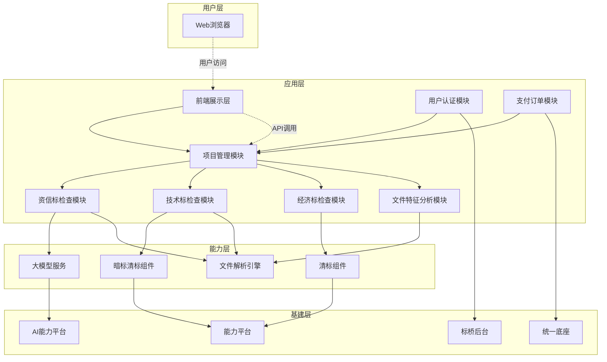
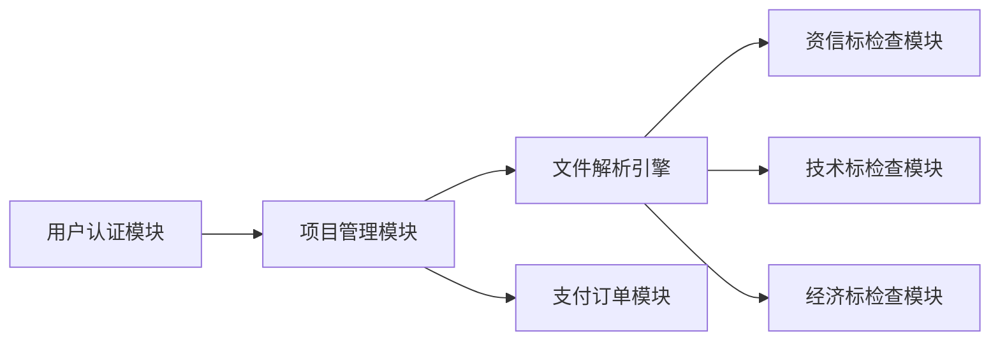
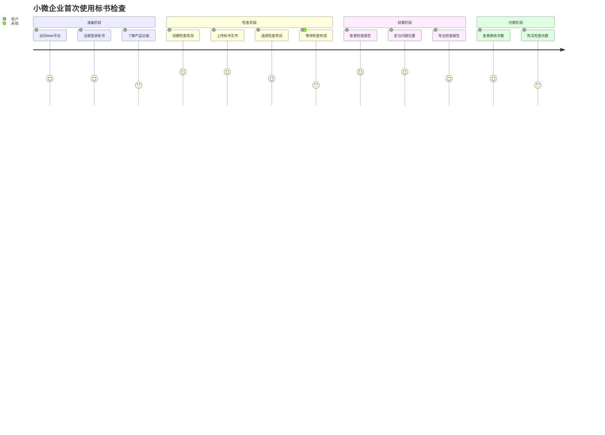
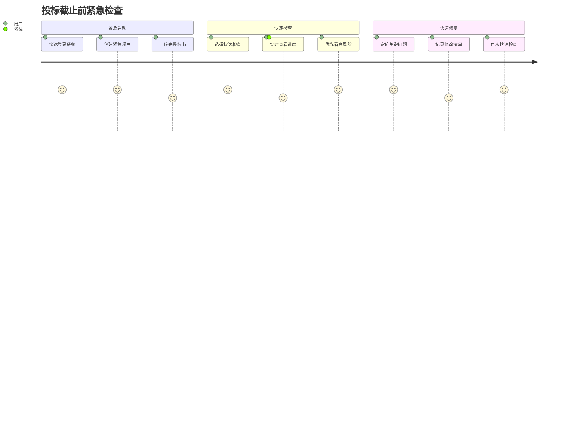

# [阶段1] 标书检查系统PRD总纲

## 1. 阶段目标

### 1.1 本阶段的北极星目标
**打造具备基础合规检查能力的标书检查产品雏形,实现从"单点工具"向"一站式风险管控平台"的转型起点**

- **产品目标**:在2026年5月前完成阶段一产品开发,构建以"项目"为核心的单份文件检查工作流
- **业务目标**:在江苏、安徽、山东三省实现产品落地,完成不少于10个订单的市场验证
- **技术目标**:实现不少于10个资信标AI检查点自动检查,准确率不低于90%

### 1.2 核心价值交付
面向中小微企业提供"保姆式"标书合规检查服务,解决核心痛点:

1. **废标风险兜底**:通过资信标、经济标、技术标三维度检查,确保标书不因硬性规定(过期资质、报价错误、格式问题)而废标
2. **高效自动化初筛**:替代人工基础检查,释放人力资源,降低检查成本
3. **操作极简体验**:提供清晰的问题定位和解释,降低专业门槛
4. **文件特征风控**:支持单标书和多份文件的设备信息特征获取,为后续围串标检测打基础

### 1.3 与整体产品战略的关系

**本阶段是三阶段演进战略的基础层**:

- **当前阶段(阶段一)**:聚焦单份文件合规检查,建立产品框架和基础能力
- **下一阶段(阶段二)**:扩展多版本文件横向比对和查重能力,增加模拟算分功能
- **最终阶段(阶段三)**:深化检查点覆盖,实现技术标智能打分,形成完整的标书智检生态

**战略承接关系**:
- 承接企业空间重构战略,将标书检查、AI编标、企业素材库等产品整合到统一平台
- 为后续私有化部署能力建设奠定技术架构基础
- 通过阶段一市场验证,为后续功能迭代和定价策略优化提供数据支撑

## 2. 范围界定

### 2.1 纳入范围(做什么)

#### 2.1.1 基础设施建设
- **企业空间重构**:完成企业空间架构重构
- **产品整合**:将AI编标、标讯、企业素材库、企业库、标书检查、投标项目管理等产品在企业空间进行形态整合
- **支付体系接入**:接入统一支付、订单和开票体系
- **权限管理**:建立用户权限管理机制

#### 2.1.2 单份文件检查能力
**资信标检查**:
- 实现不少于10个高频检查点的AI自动检查(准确率≥90%)
- 覆盖投标人名称、营业执照、资质证书、安全生产许可证、投标保证金、报价唯一性、开标一览表、投标函、授权书、盖章签字等核心检查项
- 支持招标文件智能解析,提取评审要素

**技术标检查**:
- 暗标格式检查(调用暗标清标组件)
- 技术标敏感信息提取(公司/组织、地名/地址、项目、人员等)
- 技术标敏感图片提取

**经济标检查**:
- 分部分项符合性检查
- 措施项目清单检查
- 其他项目符合性检查
- 材料暂估价/甲供材料检查
- 单位工程汇总表检查
- 计算错误检查、取费检查、单价≤0检查
- 项目结构-清单符合性检查
- 计价锁号、限价检查、不平衡报价检查

#### 2.1.3 文件与设备特征获取
- **单份文件**:支持标书创建码、计算机MAC地址、CPU序列号、文件生成锁号、CA锁状态、硬盘序列号、主板序列号、机器特征码、计算机名、用户名、文件操作来源等信息提取
- **多份文件比对**:支持上述特征信息的横向比对分析

#### 2.1.4 辅助功能
- 检查结果报告导出(PDF格式)
- 项目管理(创建、编辑、删除、历史记录)
- 风险提示汇总

### 2.2 排除范围(不做什么)

#### 2.2.1 阶段二功能(延后至2026年9月)
- ❌ 资信标、经济标、技术标的多版本文件查重能力
- ❌ 多单位经济标模拟算分功能
- ❌ 围串标风险深度分析(内容雷同性比对、签章查重、引用内容查重等)

#### 2.2.2 阶段三功能(延后至2026年12月)
- ❌ 资信标检查点扩展至30个以上
- ❌ 货物、服务类项目评审点支持
- ❌ 技术标内容质量检查(完整性、响应性、符合性、针对性评价)
- ❌ 技术标AI模拟打分
- ❌ 智能辅助评标产品算子包深度集成

#### 2.2.3 本阶段不涉及的功能
- ❌ 私有化部署能力
- ❌ 与企业OA/知识库的深度集成
- ❌ 移动端(iOS/Android)支持
- ❌ 标书内容AI改写优化(仅提供问题检测,不提供修复建议)
- ❌ 投标策略建议(如报价策略、技术方案优化建议)

### 2.3 依赖与前置条件

#### 2.3.1 技术依赖
- **暗标清标组件**:技术标暗标检查依赖现有组件稳定性
- **清标组件**:经济标检查依赖清标组件功能完整性
- **大模型服务**:资信标AI检查依赖大模型API稳定性和准确率
- **标桥后台**:用户账号数据、权限管理依赖标桥后台接口
- **统一底座**:订单、支付、开票依赖统一底座能力

#### 2.3.2 数据依赖
- 江苏、安徽、山东三省评分点评分标准数据已完成收集和统计
- 高频评审规则频次统计结果已完成分析
- 招标文件解析规则库已建立

#### 2.3.3 业务前置条件
- 企业空间用户体系已建立
- 支付通道已打通
- 定价策略已确定(按次收费/套餐包模式)

### 2.4 阶段交付物清单

#### 2.4.1 产品交付物
- Web端检查结果展示页面
- 企业空间重构后的统一工作台
- 标书检查产品使用手册

#### 2.4.2 技术交付物
- 资信标AI检查模型训练报告(含准确率测试数据)
- 接口文档(前端-后端、后端-能力平台)
- 数据库设计文档
- 部署手册

#### 2.4.3 运营交付物
- 产品定价方案
- 用户操作指南(视频+图文)
- 常见问题FAQ
- 销售话术手册

#### 2.4.4 验收标准
- 企业空间框架使用低代码平台完成重构
- 标书检查产品具备基本雏形并实现销售
- 实现不少于10个资信标AI检查点自动检查,准确率不低于90%
- 在江苏、安徽、山东三省完成产品部署
- 完成不少于10个订单的市场验证

## 3. 功能模块清单

### 3.1 模块拓扑图

### 3.2 各模块优先级(P0/P1/P2)

#### P0级模块(核心必备,阻塞上线)

| 模块名称 | 功能描述 | 关键指标 | 负责团队 |
|---------|---------|---------|---------|
| **前端展示层** | Web页面渲染、用户交互、文件上传 | 页面加载<3s | 前端 |
| **项目管理模块** | 项目创建、编辑、删除、历史记录管理 | 支持项目CRUD操作 | 前端+后端 |
| **用户认证模块** | 用户登录、权限验证、会员权益查询 | 登录成功率>99% | 后端 |
| **资信标检查模块** | 实现10个核心检查点的AI自动检查 | 准确率≥90% | AI+后端 |
| **经济标检查模块** | 清单符合性、计算错误、取费检查等 | 覆盖12项基础检查 | 后端 |
| **技术标检查模块** | 暗标格式检查、敏感信息提取 | 格式检查准确率>95% | 后端 |
| **支付订单模块** | 按次购买、订单管理、开票 | 支付成功率>98% | 后端 |
| **文件解析引擎** | 招投标文件解析、结构化提取 | 支持PDF/Word/标书格式 | 后端 |

#### P1级模块(重要增强,影响体验)

| 模块名称 | 功能描述 | 关键指标 | 负责团队 |
|---------|---------|---------|---------|
| **文件特征分析模块** | 单份文件设备信息提取、多份文件比对 | 支持13项特征提取 | 后端 |
| **检查结果导出** | 生成PDF格式检查报告 | 导出成功率>95% | 前端+后端 |
| **风险提示汇总** | 根据检查结果生成风险提示 | 风险分级准确 | 后端 |
| **企业空间整合** | 与AI编标、企业素材库等产品整合 | 统一入口访问 | 前端 |

#### P2级模块(优化增强,可延后)

| 模块名称 | 功能描述 | 关键指标 | 负责团队 |
|---------|---------|---------|---------|
| **投标日历** | 项目时间节点提醒 | 提醒准时率>90% | 前端 |
| **历史记录搜索** | 支持项目名称、时间范围搜索 | 搜索响应<1s | 前端+后端 |
| **批量导入** | 支持批量导入多个项目文件 | 导入成功率>90% | 前端+后端 |

### 3.3 模块间依赖关系

#### 3.3.1 强依赖关系(必须按顺序开发)

**依赖说明**:
1. **用户认证 → 项目管理**: 必须先完成用户登录和权限验证,才能进行项目操作
2. **项目管理 → 文件解析**: 项目创建后才能上传文件并进行解析
3. **文件解析 → 各检查模块**: 文件解析完成后才能进行各维度检查
4. **项目管理 → 支付订单**: 项目创建后才能触发计费和支付流程

#### 3.3.2 弱依赖关系(可并行开发)

| 模块A | 模块B | 依赖类型 | 说明 |
|------|------|---------|------|
| 资信标检查 | 技术标检查 | 数据共享 | 共享文件解析结果,但检查逻辑独立 |
| 资信标检查 | 经济标检查 | 数据共享 | 共享文件解析结果,但检查逻辑独立 |
| 文件特征分析 | 各检查模块 | 功能补充 | 特征分析为独立功能,不影响检查流程 |
| 检查结果导出 | 各检查模块 | 结果消费 | 导出功能依赖检查结果,但不阻塞检查流程 |

#### 3.3.3 外部依赖关系

| 内部模块 | 外部系统 | 依赖内容 | 风险等级 |
|---------|---------|---------|---------|
| 用户认证模块 | 标桥后台 | 用户账号数据、权限信息 | 高 |
| 支付订单模块 | 统一底座 | 支付接口、订单管理、开票 | 高 |
| 资信标检查模块 | AI能力平台 | 大模型API、语义分析 | 高 |
| 技术标检查模块 | 暗标清标组件 | 暗标格式检查规则 | 中 |
| 经济标检查模块 | 清标组件 | 清单检查规则、计算逻辑 | 中 |

**风险应对**:
- **高风险依赖**: 需提前与外部团队对接,确认接口稳定性和SLA
- **中风险依赖**: 建立Mock数据,确保开发测试不受阻

## 4. 用户故事地图

### 4.1 关键用户旅程

#### 旅程1: 首次使用标书检查(小微企业用户)

**用户目标**: 快速完成标书合规性检查,避免因低级错误导致废标

**情绪曲线**: 初次访问谨慎 → 上传文件后期待 → 看到问题时紧张 → 问题可定位后放心

#### 旅程2: 批量检查多个项目(中大企业用户)

**用户目标**: 高效管理多个投标项目,快速识别高风险项目

**情绪曲线**: 专业自信 → 批量操作时高效 → 发现问题时专注 → 完成检查后满意

#### 旅程3: 紧急投标前检查(时间紧迫场景)

**用户目标**: 在有限时间内完成核心风险排查,确保不废标

**情绪曲线**: 焦虑紧张 → 检查快速响应后稍安 → 发现问题时更紧张 → 问题可控后松口气

### 4.2 每个旅程涉及的功能点

#### 4.2.1 旅程1功能点映射(首次使用)

| 旅程阶段 | 用户操作 | 涉及功能模块 | 优先级 | 关键体验指标 |
|---------|---------|-------------|-------|-------------|
| **准备阶段** | | | | |
| 访问平台 | 通过浏览器访问Web平台 | 前端展示层 | P0 | 页面加载<3s |
| 注册登录 | 输入账号密码登录 | 用户认证模块 | P0 | 登录响应<2s |
| 了解功能 | 查看新手引导 | 引导页面 | P1 | 引导完成率>60% |
| **检查阶段** | | | | |
| 创建项目 | 填写项目名称、选择地区 | 项目管理模块 | P0 | 创建成功率>99% |
| 上传文件 | 上传招标文件、投标文件 | 文件解析引擎 | P0 | 上传成功率>95% |
| 选择检查 | 勾选资信标/技术标/经济标 | 检查配置模块 | P0 | 默认全选 |
| 等待检查 | 查看检查进度条 | 任务调度模块 | P0 | 进度实时更新 |
| **结果阶段** | | | | |
| 查看报告 | 查看三维度检查结果 | 结果展示模块 | P0 | 结果加载<3s |
| 定位问题 | 点击问题项跳转原文 | 问题定位功能 | P0 | 定位准确率>90% |
| 导出报告 | 导出PDF格式报告 | 报告导出模块 | P1 | 导出成功率>95% |
| **付费阶段** | | | | |
| 查看次数 | 查看剩余检查次数 | 用户权益模块 | P0 | 实时显示 |
| 购买次数 | 选择套餐并支付 | 支付订单模块 | P0 | 支付成功率>98% |

#### 4.2.2 旅程2功能点映射(批量检查)

| 旅程阶段 | 用户操作 | 涉及功能模块 | 优先级 | 关键体验指标 |
|---------|---------|-------------|-------|-------------|
| **项目管理** | | | | |
| 登录空间 | 登录企业空间 | 用户认证模块 | P0 | 单点登录 |
| 查看历史 | 查看历史项目列表 | 项目管理模块 | P0 | 列表加载<2s |
| 创建项目 | 批量创建多个项目 | 项目管理模块 | P2 | 支持批量操作 |
| **批量检查** | | | | |
| 批量上传 | 一次上传多个文件 | 文件解析引擎 | P2 | 支持拖拽上传 |
| 配置模板 | 保存常用检查配置 | 模板管理模块 | P1 | 支持模板复用 |
| 启动检查 | 批量启动检查任务 | 任务调度模块 | P1 | 并发检查 |
| **结果对比** | | | | |
| 查看风险 | 查看各项目风险等级 | 风险提示模块 | P1 | 风险分级清晰 |
| 对比结果 | 横向对比多个项目 | 结果对比功能 | P2 | 支持表格对比 |
| 批量导出 | 批量导出多份报告 | 报告导出模块 | P2 | 支持批量下载 |
| **团队协作** | | | | |
| 分享结果 | 分享检查结果链接 | 分享功能 | P2 | 生成分享链接 |
| 标记问题 | 标记重点关注问题 | 标注功能 | P2 | 支持备注 |

#### 4.2.3 旅程3功能点映射(紧急检查)

| 旅程阶段 | 用户操作 | 涉及功能模块 | 优先级 | 关键体验指标 |
|---------|---------|-------------|-------|-------------|
| **紧急启动** | | | | |
| 快速登录 | 记住密码快速登录 | 用户认证模块 | P0 | 支持自动登录 |
| 创建项目 | 快速创建项目(最少信息) | 项目管理模块 | P0 | 必填项最少化 |
| 上传标书 | 上传完整标书包 | 文件解析引擎 | P0 | 支持大文件上传 |
| **快速检查** | | | | |
| 快速检查 | 选择快速检查模式 | 检查配置模块 | P1 | 优先检查高风险项 |
| 查看进度 | 实时查看检查进度 | 任务调度模块 | P0 | 进度条实时更新 |
| 优先高风险 | 高风险项优先展示 | 结果展示模块 | P1 | 风险排序 |
| **快速修复** | | | | |
| 定位问题 | 快速定位问题位置 | 问题定位功能 | P0 | 一键跳转 |
| 记录清单 | 记录待修改清单 | 问题标注功能 | P2 | 支持导出清单 |
| 再次检查 | 修改后再次检查 | 项目管理模块 | P0 | 支持版本对比 |

### 4.3 用户故事卡片(核心场景)

#### Story 1: 作为小微企业投标人,我想要快速检查标书是否有废标风险

**用户价值**: 避免因低级错误导致废标,节省人工检查时间

**验收标准**:
- Given 用户上传了完整的投标文件
- When 用户点击"开始检查"按钮
- Then 系统在5分钟内完成资信标、技术标、经济标三维度检查
- And 系统展示风险等级(高/中/低)和问题数量
- And 用户可以点击问题项查看详细说明和原文位置

**涉及模块**: 项目管理、文件解析、资信标检查、技术标检查、经济标检查、结果展示

#### Story 2: 作为中大企业投标负责人,我想要对比多个项目的检查结果

**用户价值**: 快速识别高风险项目,优化资源分配

**验收标准**:
- Given 用户已完成多个项目的检查
- When 用户进入"项目列表"页面
- Then 系统展示所有项目的风险等级和检查状态
- And 用户可以勾选多个项目进行横向对比
- And 系统生成对比表格,展示各项目的关键问题差异

**涉及模块**: 项目管理、结果对比、风险提示

#### Story 3: 作为投标人,我想要在检查后导出报告给领导审阅

**用户价值**: 留存检查记录,便于团队协作和审批

**验收标准**:
- Given 用户已完成标书检查
- When 用户点击"导出报告"按钮
- Then 系统在30秒内生成PDF格式报告
- And 报告包含项目基本信息、检查结果汇总、问题明细、风险提示
- And 报告支持打印和电子存档

**涉及模块**: 报告导出、结果展示

## 5. 验收标准
- 功能完整性标准
- 质量标准(准确率、性能等)
- 业务指标(订单量、收益等)

## 6. 风险与应对
- Top 5 风险
- 应对预案

## 7. 里程碑计划
- 关键时间节点
- 评审点设置